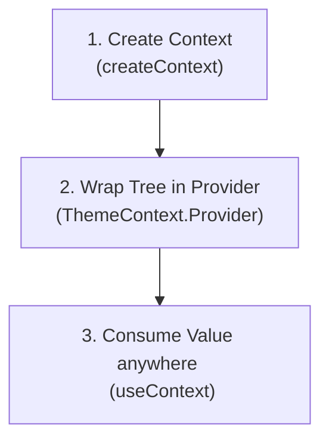

# The `useContext` Hook ⚓

The **`useContext`** Hook is React’s built-in solution for global state management. It allows you to share state, functions, or settings across your entire component tree without having to pass props down manually through every single intermediate level. This problem of passing props down levels that don't need them is called **"Props Drilling."**

### 💡 Real-World Analogy
Imagine a company's broadcast system. 
- **Props Drilling**: The CEO has an announcement. They tell the Director, who tells the Manager, who tells the Supervisor, who finally tells the worker. The intermediate people had to act as messengers even if they didn't care about the message.
- **Context API**: The CEO speaks into a building-wide loudspeaker (**Provider**). Any worker who wants to listen simply turns on their desk speaker (**Consumer / `useContext`**), skipping the middlemen completely.

---

## ⚡ 1. The 3 Steps to Setup Context

To use Context, you must follow a three-step pattern:



1. **Create the Context**: Define the data structure using `createContext()`.
2. **Provide the Context**: Wrap your component tree in `<MyContext.Provider value={data}>` to make values available to all children.
3. **Consume the Context**: Use `useContext(MyContext)` inside any child component to read the shared value.

---

## 🧩 2. Comprehensive Code Example: Theme Switcher

Let's build a fully functioning Theme Provider that manages a `"light"` or `"dark"` theme:

### Step 1 & 2: Create and Provide Context (`ThemeContext.jsx`)
```jsx
import { createContext, useState } from 'react';

// 1. Create the Context
export const ThemeContext = createContext();

// 2. Build the Provider Component
export const ThemeProvider = ({ children }) => {
  const [theme, setTheme] = useState("light");

  const toggleTheme = () => {
    setTheme((prev) => (prev === "light" ? "dark" : "light"));
  };

  return (
    <ThemeContext.Provider value={{ theme, toggleTheme }}>
      {children}
    </ThemeContext.Provider>
  );
};
```

### Step 3: Wrap the App Root (`main.jsx` or `App.jsx`)
```jsx
import React from 'react';
import ReactDOM from 'react-dom/client';
import App from './App';
import { ThemeProvider } from './context/ThemeContext';

ReactDOM.createRoot(document.getElementById('root')).render(
  <React.StrictMode>
    <ThemeProvider>
      <App />
    </ThemeProvider>
  </React.StrictMode>
);
```

### Step 4: Consume in Nested Components (`ThemeButton.jsx`)
```jsx
import { useContext } from 'react';
import { ThemeContext } from './context/ThemeContext';

const ThemeButton = () => {
  // 3. Consume the context using the hook
  const { theme, toggleTheme } = useContext(ThemeContext);

  const containerStyles = {
    padding: "20px",
    backgroundColor: theme === "light" ? "#fff" : "#333",
    color: theme === "light" ? "#000" : "#fff",
    transition: "all 0.3s ease"
  };

  return (
    <div style={containerStyles}>
      <p>The current theme is: <strong>{theme}</strong></p>
      <button onClick={toggleTheme}>Toggle Theme</button>
    </div>
  );
};

export default ThemeButton;
```

---

## 🚀 3. Performance Warning: Context Re-renders

> [!WARNING]
> When a Context Provider's `value` changes, **all** components that consume that context via `useContext` will automatically re-render. This happens regardless of whether they consume only a small part of the state object.

### Best Practices for Optimization:
* **Keep Context Small and Focused**: Do not put your entire application's state into a single global context. Create separate contexts like `AuthContext`, `ThemeContext`, `CartContext`.
* **Split State and Dispatch**: For complex scenarios, create one context for state values and a separate context for action handlers (functions), preventing components that only trigger actions from re-rendering when state changes.

---

## 🧠 Test Your Knowledge

Answer these questions to check your understanding of `useContext`. Click **Reveal Answer** to verify.

### 1. What is "Props Drilling," and why is it considered a bad practice in React?
<details>
  <summary><b>Reveal Answer</b></summary>

  Props drilling is the process of passing props through multiple levels of nested components, down to a deeply nested child that needs the data, while intermediate components do not use it at all. 
  It is bad because it introduces tight coupling, bloats components with redundant parameters, and makes refactoring or moving components in the UI tree difficult.
</details>

### 2. What happens to components consuming a context when the provider's value changes?
<details>
  <summary><b>Reveal Answer</b></summary>

  Every component that calls `useContext(MyContext)` will automatically re-render when the `value` supplied to the provider changes, even if the component doesn't visually rely on the specific sub-property that changed.
</details>

### 3. Can we set a default value in `createContext()`? When is it used?
<details>
  <summary><b>Reveal Answer</b></summary>

  Yes, you can pass a default value: `const MyContext = createContext(defaultValue)`. 
  This default value is used **only** when a component attempts to consume the context using `useContext` but is not wrapped inside a matching `<MyContext.Provider>` ancestor in the tree.
</details>

### 4. Can we use multiple different context providers in a single React application?
<details>
  <summary><b>Reveal Answer</b></summary>

  Yes. You can nest as many providers as you need (e.g. wrapping `<ThemeProvider>` inside `<AuthProvider>`). Components down the tree will have access to all contexts they are wrapped inside.
</details>

### 5. Why is the Context API not a complete replacement for state management tools like Redux or Zustand in large apps?
<details>
  <summary><b>Reveal Answer</b></summary>

  Unlike Redux or Zustand, React Context does not have built-in selectors to prevent unnecessary re-renders when only a slice of a large state updates. In highly dynamic, large applications, this can lead to performance bottlenecks. Context is best suited for low-frequency updates like user themes, localized languages, or user sessions.
</details>

---

## 💻 Practice Exercises

Apply what you learned in your React project:

### 🛠️ Exercise 1: User Authentication Context
1. Create a file `AuthContext.jsx` in your project.
2. Initialize state `user` to `null`.
3. Provide the `user` object, a `login(username)` function (sets user name), and a `logout()` function (resets user to `null`).
4. Wrap your entire application inside `<AuthProvider>` in `main.jsx`.

### 🛠️ Exercise 2: User Status Widget & Header
1. Create a `Header.jsx` component that displays the company logo and a login status message.
2. Consume the `AuthContext` to display "Welcome, [Username]!" if logged in, or "Please log in" if the user is `null`.
3. Create a `LoginPanel.jsx` component containing a text input field and a submit button. When submitted, call the context's `login` function. If already logged in, show a "Logout" button instead.
4. Render both `<Header />` and `<LoginPanel />` in your `App.jsx` to test the integrated login system.
