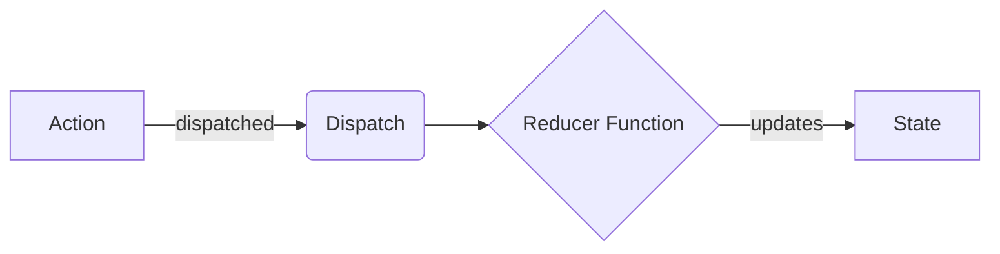

# The `useReducer` Hook ⚓

The **`useReducer`** Hook is React’s preferred solution for managing complex state structures, multi-action states, or state transactions where the next state depends heavily on the previous state. It is the underlying architecture that tools like Redux are built upon.

---

## 📖 Concept & Overview

`useReducer` is a sibling of `useState`. While `useState` is ideal for simple, independent values, `useReducer` shines when your state is a **complex object** with multiple sub-values, or when the **next state depends on the previous state** through several related actions. Instead of scattering many `setState` calls across your component, you centralize *all* update logic into a single, predictable function called the **reducer**.

The signature looks like this:

```jsx
const [state, dispatch] = useReducer(reducer, initialState);
```

- **`initialState`**: the starting value for the state when the component first mounts (e.g. `{ count: 0 }` for a counter app).
- **`reducer`**: a function describing *how* the state should change based on an action. It takes the current `state` and an `action`, and returns the **new** state.
- **`state`**: the current state value you read inside your component (JSX).
- **`dispatch`**: a function you call to *send* an action to the reducer, which then updates the state.

> [!NOTE]
> The reducer **must be a pure function**. Given the same `state` and `action`, it must always return the same result, with **no side effects** (no API calls, no `Math.random()`, no mutating external variables, no `Date.now()` inside the reducer body). Purity is what makes `useReducer` predictable and trivially unit-testable.

> [!WARNING]
> **Never mutate the existing state — always return a brand-new object or array.** Writing `state.count++` or `state.items.push(...)` breaks React’s **referential equality** check, so React won’t detect the change and the UI will silently fail to re-render. Always spread the old state into a new object: `return { ...state, count: state.count + 1 }`.

> [!TIP]
> If your component has many `useState` calls whose updates are tangled together (e.g. a form, a wizard, or a cart), that is your signal to reach for `useReducer`. Consolidating logic into one reducer keeps update rules in a single readable place.

### 💡 Real-World Analogy: The Bank Teller
Imagine you want to deposit money into a bank.
- **`useState`**: You walk directly into the bank vault, pick up cash, and count it yourself. This is fine for simple wallets but dangerous for complex operations.
- **`useReducer`**: You fill out a deposit slip (**Action**), hand it to a bank teller (**Dispatch**), and the teller applies the rules of the bank (**Reducer**) to update your account balance (**State**). You never touch the vault directly.

---

## ⚡ 1. The Core Terminology of Reducers

To work with `useReducer`, you must understand four distinct concepts:



1. **State**: The read-only data representing the current condition of your application.
2. **Action**: A plain JavaScript object that describes *what* occurred. It must have a `type` property (a string constant) and optionally a `payload` (extra data):
   ```javascript
   const action = { type: "ADD_TODO", payload: "Buy milk" };
   ```
3. **Dispatch**: A function provided by React that sends the action object to the reducer.
4. **Reducer**: A **pure function** that receives the current state and the incoming action, and returns the brand-new state:
   ```javascript
   const reducer = (state, action) => { ... return newState; };
   ```

---

## 🔢 2. A Minimal Counter Reducer (from the lesson)

Before the bigger Todo example, here is the simplest possible reducer — a counter. Notice how every case **returns a copy** of the state (`...state`) and never mutates it:

```jsx
import { useReducer } from 'react';

// 1. The initial state is a complex object so we can grow it later
const initialState = { count: 0 };

// 2. The pure reducer: what are we updating, and how?
const reducer = (state, action) => {
  switch (action.type) {
    case 'increment':
      // Copy the whole state, then override only `count`
      return { ...state, count: state.count + 1 };
    case 'decrement':
      return { ...state, count: state.count - 1 };
    case 'reset':
      return { ...state, count: 0 };
    default:
      // Unknown action types must return the state unchanged
      return state;
  }
};

const Counter = () => {
  const [state, dispatch] = useReducer(reducer, initialState);

  return (
    <div>
      <h1>Count: {state.count}</h1>
      {/* dispatch sends an action object to the reducer */}
      <button onClick={() => dispatch({ type: 'increment' })}>+</button>
      <button onClick={() => dispatch({ type: 'decrement' })}>-</button>
      <button onClick={() => dispatch({ type: 'reset' })}>Reset</button>
    </div>
  );
};
```

---

## 🧩 3. Comprehensive Code Example: Todo Management

Let's build a clean Todo component managing additions, toggling completion, and deletion of tasks:

```jsx
import { useReducer, useState } from 'react';

// 1. Define initial state
const initialState = [];

// 2. Define the pure reducer function
const todoReducer = (state, action) => {
  switch (action.type) {
    case 'ADD_TODO':
      return [...state, { id: Date.now(), text: action.payload, completed: false }];
    case 'TOGGLE_TODO':
      return state.map((todo) =>
        todo.id === action.payload ? { ...todo, completed: !todo.completed } : todo
      );
    case 'DELETE_TODO':
      return state.filter((todo) => todo.id !== action.payload);
    default:
      return state;
  }
};

const TodoApp = () => {
  // 3. Initialize useReducer
  const [todos, dispatch] = useReducer(todoReducer, initialState);
  const [inputVal, setInputVal] = useState("");

  const handleSubmit = (e) => {
    e.preventDefault();
    if (!inputVal.trim()) return;
    dispatch({ type: 'ADD_TODO', payload: inputVal });
    setInputVal("");
  };

  return (
    <div>
      <h2>Task Manager (useReducer)</h2>
      <form onSubmit={handleSubmit}>
        <input value={inputVal} onChange={(e) => setInputVal(e.target.value)} />
        <button type="submit">Add Task</button>
      </form>
      <ul>
        {todos.map((todo) => (
          <li key={todo.id} style={{ textDecoration: todo.completed ? "line-through" : "none" }}>
            <span onClick={() => dispatch({ type: 'TOGGLE_TODO', payload: todo.id })}>
              {todo.text}
            </span>
            <button onClick={() => dispatch({ type: 'DELETE_TODO', payload: todo.id })}>X</button>
          </li>
        ))}
      </ul>
    </div>
  );
};
```

> [!TIP]
> Because the action carries a `payload`, the **event handler** is where you do any side-effect work (read an input, call an API, generate an id) *before* dispatching. The reducer itself only receives the clean, finished data — keeping it pure.

---

## 🚀 4. When to use `useState` vs. `useReducer`

| Criteria | `useState` | `useReducer` |
| :--- | :--- | :--- |
| **State Type** | Primitives (number, string, boolean) or simple objects. | Complex objects, arrays, nested structures. |
| **State Logic** | Independent, straightforward updates. | Actions related to each other, conditional state transactions. |
| **Testing** | Harder to test isolated logic without rendering. | Easy. The reducer is a pure JS function you can export and unit test. |
| **Performance** | Excellent for small localized updates. | Better for deep updates where nested callbacks are avoided. |

---

## 🧠 Test Your Knowledge

Answer these questions to check your understanding of `useReducer`. Click **Reveal Answer** to verify.

### 1. Why must the reducer function be a "pure function"?
<details>
  <summary><b>Reveal Answer</b></summary>

  A reducer must be pure because React relies on **referential equality** to detect state changes. If you mutate the current state directly instead of returning a new state object, React will not register the change and will fail to re-render the UI.
</details>

### 2. What happens if you return `undefined` from a reducer function?
<details>
  <summary><b>Reveal Answer</b></summary>

  React will crash because the state is replaced with `undefined`. You must always return a valid state representation, and always include a `default` case in your switch statement that returns the current state unchanged if an unknown action type is received.
</details>

### 3. Can we trigger asynchronous code (like calling `fetch()`) directly inside a reducer function?
<details>
  <summary><b>Reveal Answer</b></summary>

  No. Reducers must be strictly synchronous and pure. If you perform side effects (like calling APIs) inside a reducer, it violates purity, making state behavior unpredictable and impossible to test reliably. Side effects should be triggered in event handlers or `useEffect` before dispatching the clean result payload.
</details>

### 4. What is the role of the `payload` property in an action object?
<details>
  <summary><b>Reveal Answer</b></summary>

  The `payload` is the data container. While `type` tells the reducer *what* action is requested (e.g. `'ADD_TODO'`), the `payload` holds the actual data needed to perform that action (e.g. `'Buy milk'`).
</details>

### 5. Can we initialize state lazily in `useReducer`? How?
<details>
  <summary><b>Reveal Answer</b></summary>

  Yes. You can pass a third argument to `useReducer` called `init` (an initialization function):
  ```javascript
  const [state, dispatch] = useReducer(reducer, initialArg, init);
  ```
  The state will be set to `init(initialArg)`. This is useful for reading initial configurations from storage or performing heavy computation on mount.
</details>

---

## 💻 Practice Exercises

Apply what you learned in your React project:

### 🛠️ Exercise 1: Multi-Step Counter
1. Create a file `counterReducer.js` and inside it define `initialState = { count: 0 }` plus a pure `counterReducer(state, action)` function. Export both.
2. Create a component `AdvancedCounter.jsx` that uses the `useReducer` hook with this reducer.
3. Support five action types:
   - `'INCREMENT'`: adds 1.
   - `'DECREMENT'`: subtracts 1.
   - `'INCREASE_BY'`: adds an amount passed via `payload`.
   - `'DECREASE_BY'`: subtracts an amount passed via `payload`.
   - `'RESET'`: resets count to 0.
4. Render the count value and buttons triggering each of these dispatched actions, including an input field (a `useState` form value) to specify the custom step payloads.
5. **Important:** when dispatching `INCREASE_BY` / `DECREASE_BY`, convert the input string to a number (`Number(inputValue)` or `+inputValue`) and clear the input afterwards by resetting it to `0`.

> [!WARNING]
> In every case of your reducer, return `{ ...state, count: ... }` — never write `state.count++`. Mutating the object directly will stop React from re-rendering.

### 🛠️ Exercise 2: Shopping Cart Manager
1. Create a component `ShoppingCart.jsx`.
2. The initial state should be an array of cart items: `[{ id: 1, name: "Book", quantity: 2, price: 10 }]`.
3. Support the following reducer action types:
   - `'ADD_ITEM'`: If the item already exists in the cart, increment its quantity. Otherwise, append the new item.
   - `'REMOVE_ITEM'`: Remove the item from the cart array using its `id`.
   - `'UPDATE_QUANTITY'`: Update the item's quantity via action payload data (`id` and `quantity`).
   - `'CLEAR_CART'`: Clear the cart back to an empty array.
4. Render the cart list, item quantities, single item prices, a total cart checkout amount, and buttons linking to the dispatched handlers.

> [!TIP]
> For `ADD_ITEM`, use `state.map(...)` to immutably bump the quantity of an existing item, and `[...state, newItem]` to append a new one — both return fresh arrays so React detects the change.
