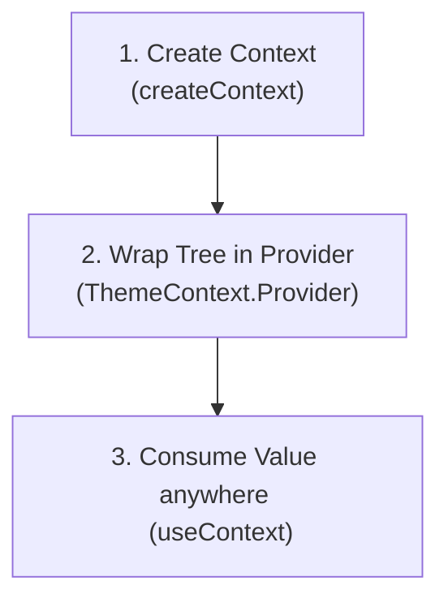

# Hook `useContext` ⚓

Hook **`useContext`** là giải pháp tích hợp sẵn của React cho việc quản lý trạng thái toàn cục (global state management). Nó cho phép bạn chia sẻ state, hàm xử lý hoặc cấu hình cài đặt xuyên suốt cây component mà không cần truyền props thủ công qua từng cấp trung gian. Vấn đề truyền props qua những cấp không cần đến chúng này được gọi là **"Props Drilling"** (Khoan Props).

### 💡 Ví dụ thực tế dễ hiểu
Hãy tưởng tượng hệ thống phát thanh thông báo của một công ty.
- **Props Drilling**: CEO có một thông báo. Họ nói với Giám đốc, người này báo lại cho Trưởng phòng, Trưởng phòng báo cho Tổ trưởng, và cuối cùng Tổ trưởng mới truyền đạt tới nhân viên. Những người trung gian buộc phải đóng vai người đưa tin mặc dù họ không quan tâm đến nội dung thông báo.
- **Context API**: CEO chỉ cần nói trực tiếp qua loa phát thanh toàn tòa nhà (**Provider**). Bất kỳ nhân viên nào muốn nghe chỉ cần bật loa trên bàn làm việc của họ (**Consumer / `useContext`**), bỏ qua hoàn toàn những khâu trung gian.

---

## ⚡ 1. Quy trình 3 bước Thiết lập Context

Để sử dụng Context, bạn phải tuân theo quy trình ba bước sau:



1. **Tạo Context**: Định nghĩa cấu trúc dữ liệu bằng `createContext()`.
2. **Cung cấp Context (Provide)**: Bao bọc cây component của bạn trong `<MyContext.Provider value={data}>` để cung cấp giá trị cho toàn bộ các component con.
3. **Tiêu thụ Context (Consume)**: Sử dụng `useContext(MyContext)` bên trong bất kỳ component con nào để đọc giá trị dùng chung.

---

## 🧩 2. Ví dụ mã nguồn hoàn chỉnh: Trình chuyển đổi giao diện (Theme Switcher)

Hãy xây dựng một Theme Provider hoàn chỉnh để quản lý giao diện `"light"` hoặc `"dark"`:

### Bước 1 & 2: Tạo và Cung cấp Context (`ThemeContext.jsx`)
```jsx
import { createContext, useState } from 'react';

// 1. Create the Context
export const ThemeContext = createContext();

// 2. Build the Provider Component
export const ThemeProvider = ({ children }) => {
  const [theme, setTheme] = useState("light");

  const toggleTheme = () => {
    setTheme((prev) => (prev === "light" ? "dark" : "light"));
  };

  return (
    <ThemeContext.Provider value={{ theme, toggleTheme }}>
      {children}
    </ThemeContext.Provider>
  );
};
```

### Bước 3: Bao bọc component gốc của App (`main.jsx` hoặc `App.jsx`)
```jsx
import React from 'react';
import ReactDOM from 'react-dom/client';
import App from './App';
import { ThemeProvider } from './context/ThemeContext';

ReactDOM.createRoot(document.getElementById('root')).render(
  <React.StrictMode>
    <ThemeProvider>
      <App />
    </ThemeProvider>
  </React.StrictMode>
);
```

### Bước 4: Tiêu thụ Context trong các component lồng nhau (`ThemeButton.jsx`)
```jsx
import { useContext } from 'react';
import { ThemeContext } from './context/ThemeContext';

const ThemeButton = () => {
  // 3. Consume the context using the hook
  const { theme, toggleTheme } = useContext(ThemeContext);

  const containerStyles = {
    padding: "20px",
    backgroundColor: theme === "light" ? "#fff" : "#333",
    color: theme === "light" ? "#000" : "#fff",
    transition: "all 0.3s ease"
  };

  return (
    <div style={containerStyles}>
      <p>The current theme is: <strong>{theme}</strong></p>
      <button onClick={toggleTheme}>Toggle Theme</button>
    </div>
  );
};

export default ThemeButton;
```

---

## 🚀 3. Cảnh báo hiệu năng: Hiện tượng Re-render của Context

> [!WARNING]
> Khi thuộc tính `value` của một Context Provider thay đổi, **tất cả** các component tiêu thụ context đó thông qua `useContext` sẽ tự động bị re-render. Điều này xảy ra bất kể chúng chỉ tiêu thụ một phần nhỏ của đối tượng state hay không.

### Các thực tiễn tốt nhất để tối ưu hóa:
* **Giữ Context nhỏ gọn và tập trung**: Đừng đưa toàn bộ state của ứng dụng vào một context toàn cục duy nhất. Hãy tạo các context riêng biệt như `AuthContext`, `ThemeContext`, `CartContext`.
* **Tách biệt State và Dispatch**: Đối với các tình huống phức tạp, hãy tạo một context cho các giá trị state và một context riêng cho các hàm xử lý hành động (functions), nhằm tránh việc re-render các component vốn chỉ kích hoạt hành động khi state thay đổi.

---

## 🧠 Kiểm tra kiến thức

Trả lời các câu hỏi sau để kiểm tra mức độ hiểu bài của bạn về `useContext`. Nhấp vào **Reveal Answer** để xác nhận.

### 1. "Props Drilling" là gì và tại sao nó được coi là một thực tiễn xấu (bad practice) trong React?
<details>
  <summary><b>Reveal Answer</b></summary>

  Props drilling là quá trình truyền props qua nhiều cấp component lồng nhau, đi xuống một component con ở rất sâu bên dưới vốn cần dữ liệu, trong khi các component trung gian hoàn toàn không sử dụng đến nó.
  Nó là một thực tiễn xấu vì gây ra sự phụ thuộc chặt chẽ (tight coupling), làm phình to các component bằng những tham số dư thừa, và khiến việc tái cấu trúc hoặc di chuyển component trong cây giao diện trở nên khó khăn.
</details>

### 2. Điều gì xảy ra với các component đang tiêu thụ một context khi giá trị value của provider thay đổi?
<details>
  <summary><b>Reveal Answer</b></summary>

  Mọi component gọi `useContext(MyContext)` sẽ tự động re-render khi `value` truyền vào provider thay đổi, ngay cả khi component đó không phụ thuộc về mặt hiển thị vào thuộc tính con cụ thể vừa thay đổi.
</details>

### 3. Chúng ta có thể thiết lập giá trị mặc định trong `createContext()` không? Nó được sử dụng khi nào?
<details>
  <summary><b>Reveal Answer</b></summary>

  Có, bạn có thể truyền vào một giá trị mặc định: `const MyContext = createContext(defaultValue)`.
  Giá trị mặc định này **chỉ** được sử dụng khi một component cố gắng tiêu thụ context bằng `useContext` nhưng lại không được bao bọc bên trong một `<MyContext.Provider>` tổ tiên tương ứng nào trên cây component.
</details>

### 4. Chúng ta có thể dùng nhiều context provider khác nhau trong cùng một ứng dụng React không?
<details>
  <summary><b>Reveal Answer</b></summary>

  Có. Bạn có thể lồng bao nhiêu provider tùy nhu cầu (ví dụ: bao bọc `<ThemeProvider>` bên trong `<AuthProvider>`). Các component bên dưới cây sẽ có quyền truy cập vào tất cả các context mà chúng được bao bọc.
</details>

### 5. Tại sao Context API không phải là sự thay thế hoàn chỉnh cho các công cụ quản lý state như Redux hay Zustand trong các ứng dụng lớn?
<details>
  <summary><b>Reveal Answer</b></summary>

  Không giống như Redux hay Zustand, React Context không có cơ chế selectors tích hợp sẵn để ngăn chặn việc re-render không cần thiết khi chỉ một nhánh nhỏ (slice) của một state lớn được cập nhật. Trong các ứng dụng lớn và có tần suất thay đổi cao, điều này có thể dẫn đến nghẽn hiệu năng. Context phù hợp nhất cho các cập nhật tần suất thấp như giao diện (theme) của người dùng, ngôn ngữ hiển thị, hoặc phiên đăng nhập của người dùng.
</details>

---

## 💻 Bài tập thực hành

Áp dụng những gì bạn đã học vào dự án React của mình:

### 🛠️ Bài tập 1: User Authentication Context
1. Tạo một tệp `AuthContext.jsx` trong dự án của bạn.
2. Khởi tạo state `user` với giá trị `null`.
3. Cung cấp đối tượng `user`, một hàm `login(username)` (đặt tên người dùng), và một hàm `logout()` (đặt lại user về `null`).
4. Bao bọc toàn bộ ứng dụng của bạn bên trong `<AuthProvider>` trong tệp `main.jsx`.

### 🛠️ Bài tập 2: Widget trạng thái người dùng và Header
1. Tạo một component `Header.jsx` hiển thị logo công ty và một thông điệp trạng thái đăng nhập.
2. Tiêu thụ `AuthContext` để hiển thị "Welcome, [Username]!" nếu đã đăng nhập, hoặc "Please log in" nếu user là `null`.
3. Tạo một component `LoginPanel.jsx` gồm một ô nhập văn bản và một nút submit. Khi submit, gọi hàm `login` của context. Nếu đã đăng nhập, hiển thị nút "Logout" thay thế.
4. Render cả `<Header />` và `<LoginPanel />` trong tệp `App.jsx` của bạn để kiểm thử hệ thống đăng nhập tích hợp này.
