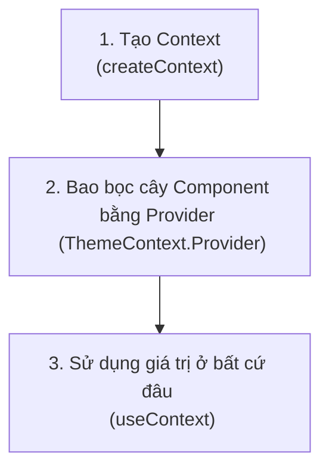

# Hook `useContext` ⚓

Hook **`useContext`** là giải pháp tích hợp sẵn của React cho việc quản lý trạng thái toàn cục (global state management). Nó cho phép bạn chia sẻ trạng thái, hàm xử lý hoặc cấu hình cài đặt xuyên suốt cây component mà không cần truyền props thủ công qua từng cấp trung gian. Vấn đề truyền props qua nhiều cấp không cần thiết này được gọi là **"Props Drilling"** (Khoan Props).

### 💡 Ví dụ thực tế dễ hiểu
Hãy tưởng tượng hệ thống phát thanh thông báo của một công ty.
- **Props Drilling**: Giám đốc điều hành có một thông báo. Họ nói với Giám đốc bộ phận, người này báo lại cho Trưởng phòng, Trưởng phòng báo cho Tổ trưởng, và cuối cùng Tổ trưởng mới truyền đạt tới nhân viên. Những người trung gian bắt buộc phải làm người đưa tin mặc dù họ không cần quan tâm đến nội dung thông báo.
- **Context API**: Giám đốc điều hành chỉ cần nói trực tiếp qua loa phát thanh toàn công ty (**Provider**). Bất kỳ nhân viên nào muốn nghe chỉ cần bật thiết bị thu âm trên bàn của họ (**Consumer / `useContext`**), bỏ qua hoàn toàn tất cả những khâu trung gian.

---

## ⚡ 1. Quy trình 3 bước Thiết lập Context

Để sử dụng Context, bạn cần tuân theo quy trình 3 bước sau:



1. **Tạo Context**: Định nghĩa cấu trúc dữ liệu bằng hàm `createContext()`.
2. **Cung cấp Context (Provide)**: Bao bọc cây component của bạn trong thẻ `<MyContext.Provider value={data}>` để cung cấp dữ liệu cho toàn bộ các component con.
3. **Tiêu thụ Context (Consume)**: Sử dụng hook `useContext(MyContext)` bên trong bất kỳ component con nào để đọc trực tiếp giá trị dùng chung.

---

## 🧩 2. Ví dụ mã nguồn hoàn chỉnh: Trình chuyển đổi giao diện (Theme Switcher)

Chúng ta hãy xây dựng một Theme Provider hoàn chỉnh để quản lý trạng thái giao diện `"light"` (sáng) hoặc `"dark"` (tối):

### Bước 1 & 2: Tạo và Cung cấp Context (`ThemeContext.jsx`)
```jsx
import { createContext, useState } from 'react';

// 1. Tạo Context
export const ThemeContext = createContext();

// 2. Xây dựng Provider Component
export const ThemeProvider = ({ children }) => {
  const [theme, setTheme] = useState("light");

  const toggleTheme = () => {
    setTheme((prev) => (prev === "light" ? "dark" : "light"));
  };

  return (
    <ThemeContext.Provider value={{ theme, toggleTheme }}>
      {children}
    </ThemeContext.Provider>
  );
};
```

### Bước 3: Bao bọc component gốc của App (`main.jsx` hoặc `App.jsx`)
```jsx
import React from 'react';
import ReactDOM from 'react-dom/client';
import App from './App';
import { ThemeProvider } from './context/ThemeContext';

ReactDOM.createRoot(document.getElementById('root')).render(
  <React.StrictMode>
    <ThemeProvider>
      <App />
    </ThemeProvider>
  </React.StrictMode>
);
```

### Bước 4: Tiêu thụ Context trong các component con (`ThemeButton.jsx`)
```jsx
import { useContext } from 'react';
import { ThemeContext } from './context/ThemeContext';

const ThemeButton = () => {
  // 3. Sử dụng context thông qua hook
  const { theme, toggleTheme } = useContext(ThemeContext);

  const containerStyles = {
    padding: "20px",
    backgroundColor: theme === "light" ? "#fff" : "#333",
    color: theme === "light" ? "#000" : "#fff",
    transition: "all 0.3s ease"
  };

  return (
    <div style={containerStyles}>
      <p>Giao diện hiện tại là: <strong>{theme}</strong></p>
      <button onClick={toggleTheme}>Chuyển giao diện</button>
    </div>
  );
};

export default ThemeButton;
```

---

## 🚀 3. Cảnh báo hiệu năng: Hiện tượng Re-render của Context

> [!WARNING]
> Khi thuộc tính `value` của một Context Provider thay đổi, **tất cả** các component tiêu thụ context đó thông qua hàm `useContext` sẽ tự động bị re-render. Việc này xảy ra bất kể component đó có sử dụng phần thuộc tính bị thay đổi của đối tượng state hay không.

### Các thực tiễn tốt nhất để tối ưu hóa hiệu năng:
* **Giữ Context nhỏ và tập trung**: Đừng đưa toàn bộ trạng thái của ứng dụng vào một context toàn cục duy nhất. Hãy chia nhỏ thành nhiều context riêng biệt như `AuthContext`, `ThemeContext`, `CartContext`.
* **Tách biệt State và Dispatch**: Đối với các trường hợp phức tạp, hãy tạo một context riêng để lưu trữ giá trị state và một context khác để lưu trữ các hàm xử lý hành động (dispatch functions), tránh việc re-render các component chỉ cần gọi hàm mà không cần đọc state.

---

## 🧠 Kiểm tra kiến thức

Trả lời các câu hỏi sau để kiểm tra mức độ hiểu bài của bạn về `useContext`. Nhấp vào **Reveal Answer** để xác nhận câu trả lời.

### 1. "Props Drilling" là gì và tại sao nó được coi là một bad practice (thực tiễn xấu) trong React?
<details>
  <summary><b>Reveal Answer</b></summary>

  Props drilling là quá trình truyền dữ liệu props qua nhiều cấp component lồng nhau, đi xuống một component con ở rất sâu bên dưới cần sử dụng dữ liệu, trong khi các component trung gian hoàn toàn không dùng đến dữ liệu đó. 
  Nó là một bad practice vì gây ra sự phụ thuộc chặt chẽ giữa các component (coupling), làm phình to mã nguồn bằng các tham số dư thừa, và khiến việc tái cấu trúc hoặc di chuyển vị trí component trong cây giao diện trở nên rất khó khăn.
</details>

### 2. Điều gì xảy ra với các component đang tiêu thụ một context khi giá trị value của provider thay đổi?
<details>
  <summary><b>Reveal Answer</b></summary>

  Mọi component gọi hàm `useContext(MyContext)` sẽ tự động re-render khi thuộc tính `value` truyền vào provider thay đổi, ngay cả khi component đó không hiển thị trực tiếp dữ liệu thuộc tính con vừa thay đổi.
</details>

### 3. Chúng ta có thể thiết lập giá trị mặc định trong hàm `createContext()` không? Nó được sử dụng khi nào?
<details>
  <summary><b>Reveal Answer</b></summary>

  Có, bạn hoàn toàn có thể truyền giá trị mặc định: `const MyContext = createContext(defaultValue)`. 
  Giá trị mặc định này sẽ được sử dụng **chỉ khi** một component gọi hàm `useContext` để lấy dữ liệu nhưng component đó không nằm bên trong (không được bao bọc bởi) bất kỳ thẻ `<MyContext.Provider>` nào trên cây component.
</details>

### 4. Chúng ta có thể dùng nhiều Context Provider khác nhau trong cùng một ứng dụng React không?
<details>
  <summary><b>Reveal Answer</b></summary>

  Có. Bạn có thể lồng bao nhiêu provider tùy thích (ví dụ: lồng `<ThemeProvider>` bên trong `<AuthProvider>`). Các component con bên dưới sẽ có quyền truy cập vào tất cả các context mà chúng được bao bọc.
</details>

### 5. Tại sao Context API không thể thay thế hoàn toàn các công cụ quản lý state chuyên nghiệp như Redux hay Zustand trong các ứng dụng lớn?
<details>
  <summary><b>Reveal Answer</b></summary>

  Không giống như Redux hay Zustand, React Context không có cơ chế lọc (selectors) tích hợp sẵn để ngăn chặn việc re-render không cần thiết khi chỉ một nhánh nhỏ của một đối tượng state lớn thay đổi. Trong các ứng dụng lớn và có tần suất cập nhật dữ liệu cao, điều này có thể gây nghẽn hiệu năng. Context phù hợp nhất cho các dữ liệu ít khi cập nhật như giao diện (theme), ngôn ngữ hiển thị (localization) hoặc phiên đăng nhập của người dùng.
</details>

---

## 💻 Bài tập thực hành

Áp dụng những gì bạn đã học vào dự án React của mình:

### 🛠️ Bài tập 1: Xây dựng Auth Context (Xác thực đăng nhập)
1. Tạo một tệp `AuthContext.jsx` trong dự án của bạn.
2. Khởi tạo một state `user` có giá trị mặc định là `null`.
3. Cung cấp đối tượng `user`, một hàm `login(username)` (để gán tên đăng nhập cho user), và hàm `logout()` (để đặt trạng thái user về lại `null`).
4. Bao bọc toàn bộ ứng dụng của bạn bằng thẻ `<AuthProvider>` trong tệp `main.jsx`.

### 🛠️ Bài tập 2: Widget thông tin người dùng và Thanh điều hướng
1. Tạo một component `Header.jsx` hiển thị logo công ty và một thông điệp trạng thái đăng nhập.
2. Tiêu thụ `AuthContext` để hiển thị "Xin chào, [Username]!" nếu người dùng đã đăng nhập, hoặc hiển thị "Vui lòng đăng nhập" nếu trạng thái user là `null`.
3. Tạo một component `LoginPanel.jsx` gồm một ô nhập văn bản và một nút bấm submit. Khi submit, gọi hàm `login` của context. Nếu người dùng đã đăng nhập, hiển thị nút "Đăng xuất" (logout) thay thế.
4. Render cả `<Header />` và `<LoginPanel />` vào tệp `App.jsx` để chạy thử nghiệm hệ thống đăng nhập dùng chung này.
