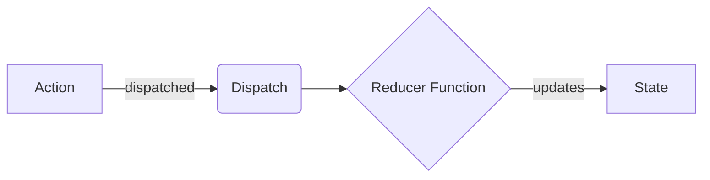

# Hook `useReducer` ⚓

Hook **`useReducer`** là giải pháp ưu tiên của React để quản lý các cấu trúc state phức tạp, các trạng thái có nhiều hành động (multi-action states), hoặc các giao dịch trạng thái mà state tiếp theo phụ thuộc nhiều vào state trước đó. Đây cũng chính là kiến trúc nền tảng mà các công cụ như Redux được xây dựng dựa trên.

---

## 📖 Khái niệm & Tổng quan

`useReducer` là một "người anh em" của `useState`. Trong khi `useState` lý tưởng cho các giá trị đơn giản, độc lập, thì `useReducer` tỏa sáng khi state của bạn là một **object phức tạp** với nhiều giá trị con, hoặc khi **state tiếp theo phụ thuộc vào state trước đó** thông qua một số hành động liên quan với nhau. Thay vì rải rác nhiều lệnh gọi `setState` khắp component, bạn tập trung *toàn bộ* logic cập nhật vào một hàm duy nhất, có thể dự đoán được, gọi là **reducer**.

Chữ ký (signature) trông như sau:

```jsx
const [state, dispatch] = useReducer(reducer, initialState);
```

- **`initialState`**: giá trị khởi đầu của state khi component được mount lần đầu (ví dụ `{ count: 0 }` cho một ứng dụng đếm số).
- **`reducer`**: một hàm mô tả *cách* state nên thay đổi dựa trên một action. Nó nhận vào `state` hiện tại và một `action`, rồi trả về state **mới**.
- **`state`**: giá trị state hiện tại mà bạn đọc bên trong component (JSX).
- **`dispatch`**: một hàm bạn gọi để *gửi* một action tới reducer, sau đó reducer cập nhật state.

> [!NOTE]
> Hàm reducer **bắt buộc phải là một hàm thuần khiết (pure function)**. Với cùng một `state` và `action`, nó phải luôn trả về cùng một kết quả, **không có tác dụng phụ (side effects)** (không gọi API, không `Math.random()`, không chỉnh sửa các biến bên ngoài, không `Date.now()` bên trong thân hàm reducer). Tính thuần khiết chính là điều khiến `useReducer` có thể dự đoán được và dễ dàng viết unit test.

> [!WARNING]
> **Đừng bao giờ chỉnh sửa (mutate) state hiện có — luôn trả về một object hoặc mảng mới hoàn toàn.** Viết `state.count++` hoặc `state.items.push(...)` sẽ phá vỡ cơ chế kiểm tra **so sánh tham chiếu (referential equality)** của React, khiến React không phát hiện được thay đổi và UI sẽ âm thầm không render lại. Hãy luôn trải (spread) state cũ vào một object mới: `return { ...state, count: state.count + 1 }`.

> [!TIP]
> Nếu component của bạn có nhiều lệnh `useState` mà các cập nhật của chúng đan xen với nhau (ví dụ một form, một wizard, hoặc một giỏ hàng), đó là tín hiệu cho thấy bạn nên dùng `useReducer`. Việc gom logic vào một reducer duy nhất giúp các quy tắc cập nhật nằm gọn ở một nơi dễ đọc.

### 💡 Ví dụ thực tế dễ hiểu: Giao dịch viên Ngân hàng
Hãy tưởng tượng bạn muốn gửi tiền vào tài khoản ngân hàng.
- **`useState`**: Bạn đi thẳng vào kho tiền của ngân hàng, tự lấy tiền và đếm tiền. Cách này ổn với những ví tiền đơn giản nhưng cực kỳ nguy hiểm đối với các hoạt động phức tạp.
- **`useReducer`**: Bạn điền vào một phiếu gửi tiền (**Action**), đưa nó cho giao dịch viên ngân hàng (**Dispatch**), và giao dịch viên áp dụng các quy tắc của ngân hàng (**Reducer**) để cập nhật số dư tài khoản của bạn (**State**). Bạn không bao giờ chạm trực tiếp vào kho tiền.

---

## ⚡ 1. Các thuật ngữ cốt lõi của Reducer

Để làm việc với `useReducer`, bạn cần hiểu rõ bốn khái niệm riêng biệt:



1. **State (Trạng thái)**: Dữ liệu chỉ đọc (read-only) đại diện cho tình trạng hiện tại của ứng dụng.
2. **Action (Hành động)**: Một object JavaScript thuần mô tả *những gì* vừa xảy ra. Nó phải có thuộc tính `type` (một hằng số chuỗi) và tùy chọn một `payload` (dữ liệu bổ sung):
   ```javascript
   const action = { type: "ADD_TODO", payload: "Buy milk" };
   ```
3. **Dispatch (Gửi đi)**: Một hàm do React cung cấp dùng để gửi object action tới reducer.
4. **Reducer**: Một **hàm thuần khiết (pure function)** nhận state hiện tại và action vừa đến, rồi trả về state mới hoàn toàn:
   ```javascript
   const reducer = (state, action) => { ... return newState; };
   ```

---

## 🔢 2. Một Reducer đếm số tối giản (từ bài học)

Trước ví dụ Todo lớn hơn, đây là reducer đơn giản nhất có thể — một bộ đếm. Hãy để ý cách mỗi `case` đều **trả về một bản sao** của state (`...state`) và không bao giờ chỉnh sửa trực tiếp nó:

```jsx
import { useReducer } from 'react';

// 1. The initial state is a complex object so we can grow it later
const initialState = { count: 0 };

// 2. The pure reducer: what are we updating, and how?
const reducer = (state, action) => {
  switch (action.type) {
    case 'increment':
      // Copy the whole state, then override only `count`
      return { ...state, count: state.count + 1 };
    case 'decrement':
      return { ...state, count: state.count - 1 };
    case 'reset':
      return { ...state, count: 0 };
    default:
      // Unknown action types must return the state unchanged
      return state;
  }
};

const Counter = () => {
  const [state, dispatch] = useReducer(reducer, initialState);

  return (
    <div>
      <h1>Count: {state.count}</h1>
      {/* dispatch sends an action object to the reducer */}
      <button onClick={() => dispatch({ type: 'increment' })}>+</button>
      <button onClick={() => dispatch({ type: 'decrement' })}>-</button>
      <button onClick={() => dispatch({ type: 'reset' })}>Reset</button>
    </div>
  );
};
```

---

## 🧩 3. Ví dụ mã nguồn hoàn chỉnh: Quản lý công việc (Todo)

Hãy xây dựng một component Todo gọn gàng để quản lý việc thêm mới, đánh dấu hoàn thành và xóa các công việc:

```jsx
import { useReducer, useState } from 'react';

// 1. Define initial state
const initialState = [];

// 2. Define the pure reducer function
const todoReducer = (state, action) => {
  switch (action.type) {
    case 'ADD_TODO':
      return [...state, { id: Date.now(), text: action.payload, completed: false }];
    case 'TOGGLE_TODO':
      return state.map((todo) =>
        todo.id === action.payload ? { ...todo, completed: !todo.completed } : todo
      );
    case 'DELETE_TODO':
      return state.filter((todo) => todo.id !== action.payload);
    default:
      return state;
  }
};

const TodoApp = () => {
  // 3. Initialize useReducer
  const [todos, dispatch] = useReducer(todoReducer, initialState);
  const [inputVal, setInputVal] = useState("");

  const handleSubmit = (e) => {
    e.preventDefault();
    if (!inputVal.trim()) return;
    dispatch({ type: 'ADD_TODO', payload: inputVal });
    setInputVal("");
  };

  return (
    <div>
      <h2>Task Manager (useReducer)</h2>
      <form onSubmit={handleSubmit}>
        <input value={inputVal} onChange={(e) => setInputVal(e.target.value)} />
        <button type="submit">Add Task</button>
      </form>
      <ul>
        {todos.map((todo) => (
          <li key={todo.id} style={{ textDecoration: todo.completed ? "line-through" : "none" }}>
            <span onClick={() => dispatch({ type: 'TOGGLE_TODO', payload: todo.id })}>
              {todo.text}
            </span>
            <button onClick={() => dispatch({ type: 'DELETE_TODO', payload: todo.id })}>X</button>
          </li>
        ))}
      </ul>
    </div>
  );
};
```

> [!TIP]
> Vì action mang theo một `payload`, nên **hàm xử lý sự kiện (event handler)** chính là nơi bạn thực hiện mọi công việc có tác dụng phụ (đọc một input, gọi API, tạo một id) *trước khi* dispatch. Bản thân reducer chỉ nhận dữ liệu sạch, đã hoàn chỉnh — nhờ đó giữ được tính thuần khiết.

---

## 🚀 4. Khi nào nên dùng `useState` vs. `useReducer`

| Tiêu chí | `useState` | `useReducer` |
| :--- | :--- | :--- |
| **Kiểu State** | Kiểu nguyên thủy (số, chuỗi, boolean) hoặc object đơn giản. | Object phức tạp, mảng, cấu trúc lồng nhau. |
| **Logic State** | Cập nhật độc lập, trực tiếp. | Các action liên quan với nhau, các giao dịch trạng thái có điều kiện. |
| **Kiểm thử (Testing)** | Khó kiểm thử logic riêng lẻ mà không render. | Dễ. Reducer là một hàm JS thuần khiết, bạn có thể export ra và viết unit test. |
| **Hiệu năng** | Xuất sắc cho các cập nhật nhỏ, cục bộ. | Tốt hơn cho các cập nhật sâu, nơi tránh được các callback lồng nhau. |

---

## 🧠 Kiểm tra kiến thức

Hãy trả lời các câu hỏi sau để kiểm tra mức độ hiểu bài của bạn về `useReducer`. Nhấp vào **Reveal Answer** để xác nhận.

### 1. Tại sao hàm reducer bắt buộc phải là một "hàm thuần khiết" (pure function)?
<details>
  <summary><b>Reveal Answer</b></summary>

  Reducer phải thuần khiết vì React dựa vào cơ chế **so sánh tham chiếu (referential equality)** để phát hiện các thay đổi của state. Nếu bạn chỉnh sửa trực tiếp (mutate) state hiện tại thay vì trả về một object state mới, React sẽ không ghi nhận thay đổi và sẽ không render lại UI.
</details>

### 2. Điều gì xảy ra nếu bạn trả về `undefined` từ một hàm reducer?
<details>
  <summary><b>Reveal Answer</b></summary>

  React sẽ bị crash vì state bị thay thế bằng `undefined`. Bạn phải luôn trả về một đại diện state hợp lệ, và luôn bao gồm một trường hợp `default` trong câu lệnh switch để trả về state hiện tại nguyên vẹn nếu nhận được một type action không xác định.
</details>

### 3. Chúng ta có thể kích hoạt mã bất đồng bộ (như gọi `fetch()`) trực tiếp bên trong một hàm reducer không?
<details>
  <summary><b>Reveal Answer</b></summary>

  Không. Reducer phải hoàn toàn đồng bộ (synchronous) và thuần khiết. Nếu bạn thực hiện các tác dụng phụ (như gọi API) bên trong reducer, nó sẽ vi phạm tính thuần khiết, khiến hành vi của state trở nên khó dự đoán và không thể kiểm thử một cách đáng tin cậy. Các tác dụng phụ nên được kích hoạt trong các hàm xử lý sự kiện hoặc `useEffect` trước khi dispatch phần payload kết quả đã sạch.
</details>

### 4. Thuộc tính `payload` trong một object action đóng vai trò gì?
<details>
  <summary><b>Reveal Answer</b></summary>

  `payload` là thùng chứa dữ liệu. Trong khi `type` cho reducer biết *hành động nào* được yêu cầu (ví dụ `'ADD_TODO'`), thì `payload` giữ dữ liệu thực tế cần thiết để thực hiện hành động đó (ví dụ `'Buy milk'`).
</details>

### 5. Chúng ta có thể khởi tạo state một cách lười biếng (lazily) trong `useReducer` không? Bằng cách nào?
<details>
  <summary><b>Reveal Answer</b></summary>

  Có. Bạn có thể truyền một tham số thứ ba vào `useReducer` gọi là `init` (một hàm khởi tạo):
  ```javascript
  const [state, dispatch] = useReducer(reducer, initialArg, init);
  ```
  State khi đó sẽ được thiết lập bằng `init(initialArg)`. Điều này hữu ích khi cần đọc cấu hình ban đầu từ bộ nhớ hoặc thực hiện tính toán nặng lúc mount.
</details>

---

## 💻 Bài tập thực hành

Hãy áp dụng những gì bạn đã học vào dự án React của mình:

### 🛠️ Bài tập 1: Bộ đếm nhiều thao tác
1. Tạo một file `counterReducer.js` và bên trong định nghĩa `initialState = { count: 0 }` cùng một hàm thuần khiết `counterReducer(state, action)`. Export cả hai.
2. Tạo một component `AdvancedCounter.jsx` sử dụng hook `useReducer` với reducer này.
3. Hỗ trợ năm loại action:
   - `'INCREMENT'`: cộng 1.
   - `'DECREMENT'`: trừ 1.
   - `'INCREASE_BY'`: cộng một lượng được truyền qua `payload`.
   - `'DECREASE_BY'`: trừ một lượng được truyền qua `payload`.
   - `'RESET'`: đặt lại count về 0.
4. Render giá trị count và các nút bấm kích hoạt từng action dispatch này, bao gồm một ô input (một giá trị form bằng `useState`) để chỉ định lượng bước (step) tùy chỉnh cho payload.
5. **Quan trọng:** khi dispatch `INCREASE_BY` / `DECREASE_BY`, hãy chuyển chuỗi input thành số (`Number(inputValue)` hoặc `+inputValue`) và xóa input sau đó bằng cách đặt lại về `0`.

> [!WARNING]
> Trong mọi case của reducer, hãy trả về `{ ...state, count: ... }` — đừng bao giờ viết `state.count++`. Việc chỉnh sửa trực tiếp object sẽ khiến React không render lại.

### 🛠️ Bài tập 2: Quản lý giỏ hàng (Shopping Cart)
1. Tạo một component `ShoppingCart.jsx`.
2. State ban đầu nên là một mảng các sản phẩm trong giỏ: `[{ id: 1, name: "Book", quantity: 2, price: 10 }]`.
3. Hỗ trợ các loại action reducer sau:
   - `'ADD_ITEM'`: Nếu sản phẩm đã tồn tại trong giỏ, tăng số lượng (quantity) của nó. Ngược lại, thêm sản phẩm mới vào.
   - `'REMOVE_ITEM'`: Xóa sản phẩm khỏi mảng giỏ hàng dựa vào `id` của nó.
   - `'UPDATE_QUANTITY'`: Cập nhật số lượng của sản phẩm qua dữ liệu payload của action (`id` và `quantity`).
   - `'CLEAR_CART'`: Làm trống giỏ hàng trở lại mảng rỗng.
4. Render danh sách giỏ hàng, số lượng từng món, giá của từng món, tổng số tiền thanh toán của giỏ hàng, và các nút bấm liên kết tới các handler đã dispatch.

> [!TIP]
> Với `ADD_ITEM`, hãy dùng `state.map(...)` để tăng số lượng của một sản phẩm đã có theo cách bất biến (immutable), và `[...state, newItem]` để thêm một sản phẩm mới — cả hai đều trả về mảng mới để React phát hiện được thay đổi.
