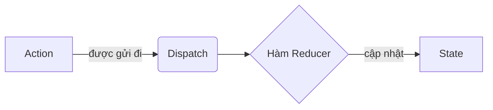

# Hook `useReducer` ⚓

Hook **`useReducer`** là giải pháp ưu tiên của React để quản lý cấu trúc state phức tạp, các trạng thái có nhiều hành động (multi-action states), hoặc các giao dịch trạng thái mà state tiếp theo phụ thuộc nhiều vào state trước đó. Đây cũng là kiến trúc nền tảng mà các công cụ như Redux dựa vào để xây dựng.

### 💡 Ví dụ thực tế dễ hiểu: Giao dịch viên Ngân hàng
Hãy tưởng tượng bạn muốn gửi tiền vào tài khoản ngân hàng.
- **`useState`**: Bạn đi trực tiếp vào kho tiền của ngân hàng, tự lấy tiền và đếm tiền. Cách này ổn với những ví tiền cá nhân đơn giản nhưng cực kỳ nguy hiểm đối với các hoạt động phức tạp của cả ngân hàng.
- **`useReducer`**: Bạn viết một phiếu gửi tiền (**Action**), đưa cho giao dịch viên (**Dispatch**), và người giao dịch sẽ áp dụng các quy tắc nghiệp vụ của ngân hàng (**Reducer**) để cập nhật số dư tài khoản của bạn (**State**). Bạn không bao giờ được chạm trực tiếp vào kho tiền.

---

## ⚡ 1. Các thuật ngữ cốt lõi của Reducer

Để làm việc với `useReducer`, bạn cần nắm rõ 4 khái niệm sau:



1. **State (Trạng thái)**: Dữ liệu chỉ đọc (read-only) đại diện cho tình trạng hiện tại của ứng dụng.
2. **Action (Hành động)**: Một đối tượng JavaScript thuần mô tả *những gì* vừa xảy ra. Nó phải chứa thuộc tính `type` (hằng số chuỗi) và tùy chọn thuộc tính `payload` (dữ liệu đi kèm):
   ```javascript
   const action = { type: "ADD_TODO", payload: "Mua sữa" };
   ```
3. **Dispatch (Gửi đi)**: Một hàm do React cung cấp dùng để gửi đối tượng action tới reducer.
4. **Reducer**: Một **hàm thuần khiết (pure function)** nhận vào state hiện tại và action vừa gửi tới, sau đó trả về một state mới hoàn toàn:
   ```javascript
   const reducer = (state, action) => { ... return newState; };
   ```

---

## 🧩 2. Ví dụ mã nguồn hoàn chỉnh: Quản lý công việc (Todo List)

Hãy xây dựng một component Todo hoàn chỉnh để quản lý việc thêm mới, đánh dấu hoàn thành và xóa các công việc:

```jsx
import { useReducer, useState } from 'react';

// 1. Định nghĩa trạng thái ban đầu (initial state)
const initialState = [];

// 2. Định nghĩa hàm reducer thuần khiết
const todoReducer = (state, action) => {
  switch (action.type) {
    case 'ADD_TODO':
      return [...state, { id: Date.now(), text: action.payload, completed: false }];
    case 'TOGGLE_TODO':
      return state.map((todo) =>
        todo.id === action.payload ? { ...todo, completed: !todo.completed } : todo
      );
    case 'DELETE_TODO':
      return state.filter((todo) => todo.id !== action.payload);
    default:
      return state;
  }
};

const TodoApp = () => {
  // 3. Khởi tạo useReducer
  const [todos, dispatch] = useReducer(todoReducer, initialState);
  const [inputVal, setInputVal] = useState("");

  const handleSubmit = (e) => {
    e.preventDefault();
    if (!inputVal.trim()) return;
    dispatch({ type: 'ADD_TODO', payload: inputVal });
    setInputVal("");
  };

  return (
    <div>
      <h2>Quản lý công việc (useReducer)</h2>
      <form onSubmit={handleSubmit}>
        <input value={inputVal} onChange={(e) => setInputVal(e.target.value)} />
        <button type="submit">Thêm</button>
      </form>
      <ul>
        {todos.map((todo) => (
          <li key={todo.id} style={{ textDecoration: todo.completed ? "line-through" : "none" }}>
            <span onClick={() => dispatch({ type: 'TOGGLE_TODO', payload: todo.id })} style={{ cursor: 'pointer' }}>
              {todo.text}
            </span>
            <button onClick={() => dispatch({ type: 'DELETE_TODO', payload: todo.id })} style={{ marginLeft: '10px' }}>X</button>
          </li>
        ))}
      </ul>
    </div>
  );
};
```

---

## 🚀 3. Khi nào nên dùng `useState` vs. `useReducer`

| Tiêu chí | `useState` | `useReducer` |
| :--- | :--- | :--- |
| **Kiểu dữ liệu của State** | Các kiểu nguyên thủy (số, chuỗi, boolean) hoặc object đơn giản. | Object phức tạp, mảng, cấu trúc lồng nhau. |
| **Logic cập nhật State** | Độc lập, cập nhật trực tiếp và đơn giản. | Các hành động liên quan chặt chẽ đến nhau, thay đổi state có điều kiện. |
| **Kiểm thử (Testing)** | Khó kiểm thử logic xử lý riêng lẻ mà không render component. | Rất dễ. Reducer là hàm JS thuần khiết, có thể export ra ngoài để viết unit test độc lập. |
| **Hiệu năng** | Tối ưu cho các cập nhật nhỏ, mang tính cục bộ. | Tối ưu cho các cập nhật sâu, giúp tránh phải truyền nhiều hàm callback lồng nhau xuống dưới. |

---

## 🧠 Kiểm tra kiến thức

Trả lời các câu hỏi sau để kiểm tra mức độ hiểu bài của bạn về `useReducer`. Nhấp vào **Reveal Answer** để xác nhận câu trả lời.

### 1. Tại sao hàm reducer bắt buộc phải là một "hàm thuần khiết" (pure function)?
<details>
  <summary><b>Reveal Answer</b></summary>

  Hàm reducer phải thuần khiết vì React sử dụng cơ chế **so sánh tham chiếu** để phát hiện các thay đổi của state. Nếu bạn chỉnh sửa trực tiếp (mutate) state hiện tại thay vì trả về một đối tượng state mới hoàn toàn, React sẽ không nhận ra sự thay đổi và sẽ không hiển thị lại giao diện UI.
</details>

### 2. Điều gì xảy ra nếu bạn trả về giá trị `undefined` từ một hàm reducer?
<details>
  <summary><b>Reveal Answer</b></summary>

  React sẽ bị crash vì state bị thay thế bằng giá trị `undefined`. Bạn phải luôn trả về một đối tượng đại diện cho state hợp lệ, và luôn luôn khai báo trường hợp `default` trong câu lệnh switch để trả về chính state hiện tại nếu nhận được một type action lạ.
</details>

### 3. Chúng ta có thể gọi mã bất đồng bộ (như hàm gọi API `fetch()`) trực tiếp bên trong hàm reducer không?
<details>
  <summary><b>Reveal Answer</b></summary>

  Không. Hàm reducer bắt buộc phải đồng bộ (synchronous) và thuần khiết. Nếu bạn thực hiện các tác vụ phụ (side effects) như gọi API bên trong reducer, nó sẽ phá vỡ tính thuần khiết của hàm, làm cho hành vi của state trở nên khó lường và không thể viết unit test một cách đáng tin cậy. Các tác vụ phụ nên được thực hiện trong các hàm xử lý sự kiện hoặc `useEffect` trước khi gửi (dispatch) kết quả cuối cùng.
</details>

### 4. Thuộc tính `payload` trong một đối tượng action đóng vai trò gì?
<details>
  <summary><b>Reveal Answer</b></summary>

  `payload` là thùng chứa dữ liệu đi kèm. Trong khi `type` thông báo cho reducer biết hành động nào được yêu cầu (ví dụ: `'ADD_TODO'`), thì `payload` chứa thông tin thực tế cần thiết để thực hiện hành động đó (ví dụ nội dung công việc: `'Mua sữa'`).
</details>

### 5. Chúng ta có thể khởi tạo state chậm (lazily) trong `useReducer` không? Bằng cách nào?
<details>
  <summary><b>Reveal Answer</b></summary>

  Có. Bạn có thể truyền một tham số thứ ba vào hàm `useReducer` gọi là `init` (hàm khởi tạo):
  ```javascript
  const [state, dispatch] = useReducer(reducer, initialArg, init);
  ```
  Khi đó, giá trị state ban đầu sẽ được thiết lập bằng kết quả của hàm `init(initialArg)`. Điều này rất hữu ích khi bạn cần đọc cấu hình ban đầu từ bộ nhớ hoặc thực hiện các tính toán nặng khi component mount lần đầu.
</details>

---

## 💻 Bài tập thực hành

Áp dụng những gì bạn đã học vào dự án React của mình:

### 🛠️ Bài tập 1: Bộ đếm nâng cao nhiều thao tác
1. Tạo một component `AdvancedCounter.jsx`.
2. Định nghĩa một reducer để quản lý giá trị của bộ đếm (count).
3. Hỗ trợ 5 loại hành động (actions):
   - `'INCREMENT'`: tăng count lên 1.
   - `'DECREMENT'`: giảm count đi 1.
   - `'INCREASE_BY'`: cộng count với giá trị được truyền trong `payload`.
   - `'DECREASE_BY'`: trừ count đi giá trị được truyền trong `payload`.
   - `'RESET'`: đặt lại count về 0.
4. Hiển thị giá trị count và các nút bấm để gửi các action tương ứng lên reducer, thêm một ô nhập để người dùng điền số lượng cộng/trừ tùy chỉnh.

### 🛠️ Bài tập 2: Quản lý giỏ hàng (Shopping Cart)
1. Tạo một component `ShoppingCart.jsx`.
2. State ban đầu là một mảng chứa danh sách sản phẩm: `[{ id: 1, name: "Sách", quantity: 2, price: 10 }]`.
3. Thiết lập reducer hỗ trợ các action sau:
   - `'ADD_ITEM'`: Nếu sản phẩm đã tồn tại trong giỏ hàng, hãy tăng số lượng (quantity) của nó lên 1. Ngược lại, hãy thêm sản phẩm mới đó vào mảng.
   - `'REMOVE_ITEM'`: Xóa sản phẩm khỏi giỏ hàng dựa trên `id` nhận được.
   - `'UPDATE_QUANTITY'`: Cập nhật số lượng của một sản phẩm qua payload chứa (`id` và `quantity` mới).
   - `'CLEAR_CART'`: Làm trống giỏ hàng trở lại mảng rỗng.
4. Hiển thị danh sách giỏ hàng, số lượng, giá tiền mỗi món, tổng số tiền thanh toán của toàn bộ giỏ hàng, và các nút bấm tương tác tương ứng.
