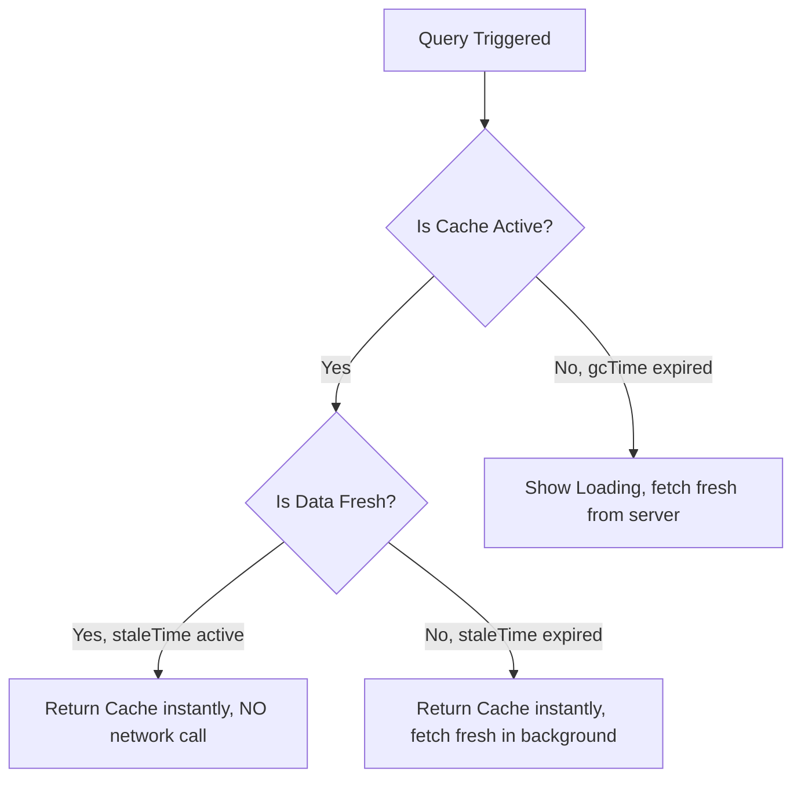

# TanStack Query: Queries & Caching Configurations ⚡

**TanStack Query** (formerly known as **React Query**) is the industry-standard asynchronous state management library for React. It is designed to handle fetching, caching, synchronizing, and updating **server state** (API data) in web applications.

---

## 📖 Concept & Overview

In standard React, data fetching is done manually with `useState` and `useEffect`. That approach forces you to hand-write loading flags, error flags, `try/catch` blocks, race-condition guards, and re-fetch logic in **every** component that touches the network. It works, but it gets messy and repetitive fast.

TanStack Query treats **server state** as a fundamentally different thing from **client state**. Server state lives on a remote machine you don't own, can become outdated at any moment, and is shared across many components. TanStack Query gives you caching, background refetching, request deduplication, polling, and parallel queries — all out of the box.

> [!NOTE]
> TanStack Query is **framework agnostic**. The same core powers adapters for React, Vue, Angular, Svelte, and Solid. In this course we focus on the React adapter (`@tanstack/react-query`), version 5.

> [!TIP]
> TanStack Query is **not** just a data-fetching tool. You can fetch with `fetch`, `axios`, GraphQL, or any function that returns a promise. The library's real value is **managing** that data after it arrives: caching it, knowing when it is stale, and refetching it intelligently.

### 🍱 A Real-World Metaphor: The Restaurant Kitchen

Think of `QueryClient` as a **restaurant kitchen with a pass-through window**:

- A **`queryKey`** is the name on a customer's order ticket (e.g. "Table 4: Pasta").
- The **`queryFn`** is the chef who actually cooks the dish.
- The **cache** is the warming shelf at the pass. If a freshly cooked "Pasta" is already sitting on the shelf and is still warm (**fresh / within `staleTime`**), the next waiter who asks for "Pasta" gets it instantly — the chef is **not** asked to cook it again. This is **deduplication**.
- Once a dish has been sitting for a while it is **stale**: it is still served instantly to keep customers happy, but the chef quietly starts cooking a fresh plate in the background.
- If nobody has ordered "Pasta" for a long time (**`gcTime`**), the kitchen throws the cold plate away to free up shelf space (**garbage collection**).

---

## ⚡ 1. Why TanStack Query?

The video first builds a fetcher the "manual" way so you can feel the pain. With plain React you must:

* Create a `useState` for `data`, `isLoading`, and `error`.
* Write a `useEffect` with a `try / catch / finally` block.
* Guard against **race conditions** when the dependency (like an `id`) changes faster than requests resolve.
* Repeat all of this in every component that fetches.

TanStack Query collapses all of that into a single hook call.

| Concern | Manual `useState` + `useEffect` | TanStack Query |
| :--- | :--- | :--- |
| Loading state | You create & toggle it | `isLoading` / `isPending` given |
| Error state | You create & toggle it | `isError` / `error` given |
| Caching | None (refetch every mount) | Automatic, keyed by `queryKey` |
| Deduplication | None | Automatic |
| Background refetch | Manual | On focus / reconnect / interval |
| Race conditions | You handle them | Handled internally |
| Polling | Manual `setInterval` | `refetchInterval` option |
| Parallel fetches | Multiple effects | `useQueries` |

---

## ⚡ 2. Installation & Store Setup

To install TanStack Query in your React application, run:

```bash
npm install @tanstack/react-query
```

### Wrapping the Application Root (`main.jsx`)
To use queries, you must instantiate a **`QueryClient`** and wrap your components in the **`QueryClientProvider`**:

```jsx
import React from 'react';
import ReactDOM from 'react-dom/client';
import App from './App';
import { QueryClient, QueryClientProvider } from '@tanstack/react-query';

// Create a client (the "heart" of TanStack Query: it holds the cache & config)
const queryClient = new QueryClient();

ReactDOM.createRoot(document.getElementById('root')).render(
  <React.StrictMode>
    <QueryClientProvider client={queryClient}>
      <App />
    </QueryClientProvider>
  </React.StrictMode>
);
```

> [!NOTE]
> The `QueryClientProvider` uses React Context **only** to pass down the client reference. The actual cache lives in the external `QueryClient` instance, not in Context. That is why updating data does not trigger Context-driven re-render storms across your whole tree.

---

## 🧩 3. Fetching Data with `useQuery`

To fetch data, you use the **`useQuery`** hook, which accepts an options object containing:
1. **`queryKey`**: An array that uniquely identifies and caches this query.
2. **`queryFn`**: The asynchronous function (returning a promise) that fetches the data.

```jsx
import { useQuery } from '@tanstack/react-query';

// 1. Define a pure async fetch function
const fetchUsers = async () => {
  const res = await fetch("https://jsonplaceholder.typicode.com/users");
  if (!res.ok) throw new Error("Network response was not ok");
  return res.json();
};

export const UserDirectory = () => {
  // 2. Fetch using the useQuery hook
  const { data: users, isLoading, isError, error } = useQuery({
    queryKey: ['usersList'], // Caching identifier
    queryFn: fetchUsers       // Promise handler
  });

  if (isLoading) return <p>Loading directory...</p>;
  if (isError) return <p style={{ color: "red" }}>Error: {error.message}</p>;

  return (
    <div>
      <h3>User Directory (TanStack Query)</h3>
      <ul>
        {users?.map((user) => (
          <li key={user.id}>{user.name} ({user.email})</li>
        ))}
      </ul>
    </div>
  );
};
```

> [!TIP]
> You can swap the `fetch` call inside `queryFn` for `axios` (`const res = await axios.get(url); return res.data;`) without changing anything else. `useQuery` only cares that `queryFn` returns a promise.

---

## 🔁 4. Automatic Request Deduplication

**Deduplication** means that if multiple parts of your app request the **same data at the same time**, TanStack Query fires **only one** network request and shares that single result with all callers. It avoids asking for the same data over and over.

The key insight from the lesson: the result is keyed by `queryKey`. If a value already exists in the cache for that exact key, the cache hands it back instead of running `queryFn` again.

```jsx
import { useQuery } from '@tanstack/react-query';

// Generate a random number (returns a promise so it behaves like a real fetch)
const getRandomNumber = () => Promise.resolve(Math.random());

export const Deduplication = () => {
  const { data } = useQuery({
    queryKey: ['randomNumber'], // SAME key everywhere
    queryFn: getRandomNumber,
  });

  return <h2>Random number is: {data}</h2>;
};
```

If you render `<Deduplication />` **twice** in your `App`, both instances show the **same** number — not two different random values. Because both share the `['randomNumber']` key, TanStack Query runs `queryFn` once, caches the result, and serves the cached value to the second copy.

```jsx
// App.jsx — two copies, but ONE underlying request thanks to deduplication
export default function App() {
  return (
    <>
      <Deduplication />
      <Deduplication /> {/* Shows the identical number — not a new one */}
    </>
  );
}
```

> [!WARNING]
> Deduplication is driven entirely by the `queryKey`. If you (intentionally or accidentally) pass a **different** key, you get a separate cache entry and a separate request. Conversely, sharing a key across unrelated data will cause one query to overwrite another's cache. Choose keys deliberately.

---

## 🛠️ 5. React Query Devtools

The **React Query Devtools** give you a visual panel to inspect every query: its key, current status (`fresh`, `stale`, `fetching`, `inactive`), the cached data, and how many components are subscribed. It is the fastest way to *see* caching, staleness, and deduplication actually happen.

Install it as a separate package:

```bash
npm install @tanstack/react-query-devtools
```

Then mount it inside the `QueryClientProvider` (the Devtools render their own floating button):

```jsx
import { QueryClient, QueryClientProvider } from '@tanstack/react-query';
import { ReactQueryDevtools } from '@tanstack/react-query-devtools';

const queryClient = new QueryClient();

ReactDOM.createRoot(document.getElementById('root')).render(
  <QueryClientProvider client={queryClient}>
    <App />
    {/* Floating panel; start closed and open it from the corner icon */}
    <ReactQueryDevtools initialIsOpen={false} />
  </QueryClientProvider>
);
```

> [!NOTE]
> The Devtools are **tree-shaken out of production builds** automatically, so leaving `<ReactQueryDevtools />` in your code is safe — it only appears during development. Hover over any query to see whether it is currently `fresh` or `stale`.

---

## 🚀 6. Core Caching Concepts: `staleTime` vs. `gcTime`

Configuring caching behavior is essential for managing network traffic:



### A. `staleTime` (Freshness Threshold)
* **What it is**: The time (in milliseconds) that query data is considered "fresh" after being fetched.
* **Behavior**: While data is fresh, subsequent components requesting the same query key read from cache instantly **without triggering any background refetch requests**.
* **Default**: `0` milliseconds (data is considered stale immediately).
* **Metaphor**: Like browsing a social app for 5 minutes — you keep seeing the data already cached on your device. To force *fresh* data you refresh the page.

### B. `gcTime` (Garbage Collection Time)
* **What it is**: Formerly called `cacheTime`. The time (in milliseconds) that **unused** query data remains in cache memory before being deleted.
* **Behavior**: When no components are subscribed to a query key, a timer starts. Once `gcTime` expires, the data is garbage collected from the cache.
* **Default**: `300000` milliseconds (5 minutes).

### Custom Configuration Example:
```javascript
const { data } = useQuery({
  queryKey: ['usersList'],
  queryFn: fetchUsers,
  staleTime: 5 * 1000,      // Consider data fresh for 5 seconds, then mark it stale
  gcTime: 10 * 60 * 1000,   // Keep unused cache in memory for 10 minutes
});
```

After `staleTime` elapses, hovering over the query in the Devtools flips it from `fresh` to `stale` — your visual proof that the configuration works.

---

## ⏱️ 7. Polling with `refetchInterval`

The **`refetchInterval`** option tells TanStack Query to automatically refetch the data on a fixed timer — a technique known as **polling**. This keeps data fresh **without any user interaction**, which is ideal for dashboards, live scores, or notification counts.

```jsx
import { useQuery } from '@tanstack/react-query';

const fetchTodo = async (id) => {
  const res = await fetch(`https://jsonplaceholder.typicode.com/todos/${id}`);
  if (!res.ok) throw new Error("Network response was not ok");
  return res.json();
};

export const RefetchIntervalDemo = () => {
  const { data, error, isLoading } = useQuery({
    queryKey: ['todo', 1],
    queryFn: () => fetchTodo(1),
    refetchInterval: 5000, // Automatically refetch every 5 seconds (polling)
  });

  if (isLoading) return <h1>Loading...</h1>;
  if (error) return <h1>Error: {error.message}</h1>;

  return (
    <div>
      <h1>To-Do (auto-refreshing every 5s)</h1>
      <pre>{JSON.stringify(data, null, 2)}</pre>
    </div>
  );
};
```

With `refetchInterval: 5000`, the data re-fetches itself every 5 seconds — count *"1, 2, 3, 4, 5"* and the panel updates on its own, no button click required.

> [!WARNING]
> Polling sends a request on **every** interval tick for as long as the component is mounted. A short interval (e.g. `1000`) across many simultaneous queries can hammer your API and rack up costs. Use the longest interval your UX can tolerate, and consider `refetchIntervalInBackground: false` so polling pauses when the tab is hidden.

---

## 🔀 8. Parallel Queries with `useQueries`

Sometimes a single component needs data from **multiple endpoints at once** — for example posts **and** todos **and** comments. The **`useQueries`** hook runs several queries **in parallel** and returns an **array of results**, each with its own independent `data`, `isLoading`, and `error`.

```jsx
import { useQueries } from '@tanstack/react-query';

const fetchTodos = async () => {
  const res = await fetch("https://jsonplaceholder.typicode.com/todos");
  if (!res.ok) throw new Error("Network response was not ok");
  return res.json();
};

const fetchPosts = async () => {
  const res = await fetch("https://jsonplaceholder.typicode.com/posts");
  if (!res.ok) throw new Error("Network response was not ok");
  return res.json();
};

export const FetchFromMultipleEndpoints = () => {
  // useQueries takes a "queries" array, each entry is its own useQuery config
  const results = useQueries({
    queries: [
      { queryKey: ['todos'], queryFn: fetchTodos },
      { queryKey: ['posts'], queryFn: fetchPosts },
    ],
  });

  // Each result is independent — destructure them out
  const [todosQuery, postsQuery] = results;

  // Combine loading/error states however you like
  if (todosQuery.isLoading || postsQuery.isLoading) return <h1>Loading...</h1>;
  if (todosQuery.error || postsQuery.error) {
    return (
      <div>
        An error occurred: {todosQuery.error?.message ?? postsQuery.error?.message}
      </div>
    );
  }

  return (
    <div>
      <h1>Todos</h1>
      <pre>{JSON.stringify(todosQuery.data.slice(0, 3), null, 2)}</pre>
      <hr />
      <h1>Posts</h1>
      <pre>{JSON.stringify(postsQuery.data.slice(0, 3), null, 2)}</pre>
    </div>
  );
};
```

> [!TIP]
> Use `useQueries` (instead of several separate `useQuery` calls) when the **number** of queries is dynamic — for example fetching details for an array of IDs whose length changes. It lets you build the `queries` array programmatically with `.map()`.

---

## 🧠 Test Your Knowledge

Answer these questions to check your understanding of TanStack Query. Click **Reveal Answer** to verify.

### 1. What are "Query Keys" and why are they treated like dependency arrays?
<details>
  <summary><b>Reveal Answer</b></summary>

  Query Keys are arrays that act as unique identifiers for caching query results. If you include dynamic variables in a query key (e.g. `['todos', userId]`), the query key behaves like a dependency array. When `userId` changes, TanStack Query automatically invalidates the old cache, creates a new cache key, and triggers a fresh data refetch.
</details>

### 2. What is "automatic request deduplication" and what drives it?
<details>
  <summary><b>Reveal Answer</b></summary>

  Deduplication means that when multiple components request the same data at the same time, TanStack Query fires **only one** network request and shares that single result with all of them. It is driven entirely by the **`queryKey`**: if a value already exists in the cache for that exact key, the cache returns it instead of running `queryFn` again. This is why two `<Deduplication />` components sharing `['randomNumber']` display the identical number.
</details>

### 3. What is the difference between `staleTime` and `gcTime`?
<details>
  <summary><b>Reveal Answer</b></summary>

  - **`staleTime`** controls how long fetched data is considered **fresh**. While fresh, the same query key is served from cache with **no** background refetch. The default is `0` (instantly stale).
  - **`gcTime`** (formerly `cacheTime`) controls how long **unused** data stays in memory once no component is subscribed, before garbage collection deletes it. The default is `300000` ms (5 minutes).
</details>

### 4. When would you use `refetchInterval`, and what is one risk of setting it too low?
<details>
  <summary><b>Reveal Answer</b></summary>

  `refetchInterval` enables **polling** — automatically refetching data on a fixed timer (e.g. `refetchInterval: 5000` refetches every 5 seconds) without any user interaction. It is ideal for dashboards, live scores, or notification counts. The risk of a very low interval is that it sends a request on every tick for every mounted query, which can overload your API and increase costs. You can also set `refetchIntervalInBackground: false` so polling pauses when the tab is hidden.
</details>

### 5. What does `useQueries` do, and how does its return value differ from `useQuery`?
<details>
  <summary><b>Reveal Answer</b></summary>

  `useQueries` runs **multiple queries in parallel** from a single hook call. You pass a `queries` array where each entry is its own `{ queryKey, queryFn }` config. Unlike `useQuery` (which returns a single result object), `useQueries` returns an **array of result objects** — each with independent `data`, `isLoading`, and `error` — so you can handle every endpoint separately while keeping the queries independent. It is especially useful when the number of queries is dynamic.
</details>

---

## 💻 Practice Exercises

Apply what you learned in your project environment:

### 🛠️ Exercise 1: Dynamic Post Details Fetcher
1. Create a component `PostViewer.tsx` (using the `.tsx` extension).
2. Set up a state variable `postId` initialized to `1`.
3. Write an async query function `fetchPost(id)` that fetches `https://jsonplaceholder.typicode.com/posts/${id}`.
4. Pass `['post', postId]` as the `queryKey` and `() => fetchPost(postId)` as the `queryFn` inside the `useQuery` options.
5. Render the post title and body on screen, plus buttons "Next Post" / "Previous Post" that update `postId`.
6. **Verify caching:** install and mount `<ReactQueryDevtools initialIsOpen={false} />`. Open the panel and watch a new query key (`['post', 1]`, `['post', 2]`, ...) appear each time you advance. Going **back** to a previously visited post should load it **instantly** from cache — confirm the Devtools show that key as already populated.

### 🛠️ Exercise 2: Live Dashboard with Polling + Parallel Queries
1. Create a component `Dashboard.tsx`.
2. Use **`useQueries`** to fetch **two** endpoints in parallel:
   - `['todos']` → `https://jsonplaceholder.typicode.com/todos`
   - `['posts']` → `https://jsonplaceholder.typicode.com/posts`
3. Destructure the returned array into `todosQuery` and `postsQuery`. Show a single combined "Loading..." while **either** is loading, and a combined error message if **either** fails.
4. Add `refetchInterval: 10000` to the todos query so it **polls** every 10 seconds. Open the Devtools and watch the `['todos']` query flip to `fetching` on each tick.
5. **Stretch goal:** add `staleTime: 30000` to the posts query and observe in the Devtools that posts stay `fresh` for 30 seconds (no background refetch on remount) while todos keep polling — proving `staleTime`, `refetchInterval`, and `useQueries` work together.
