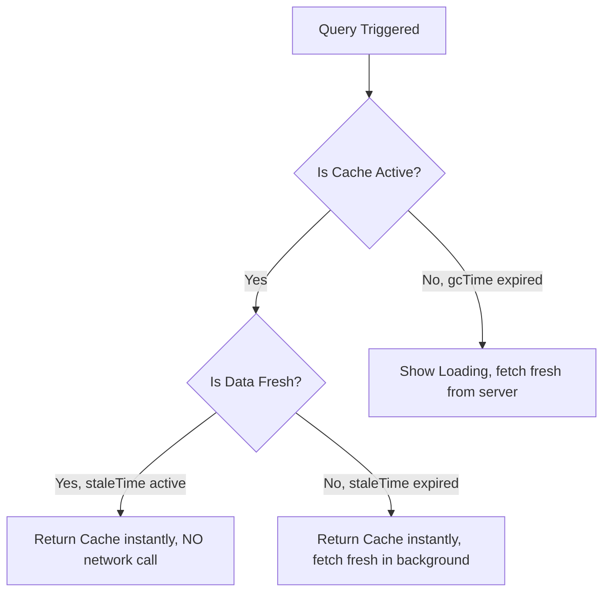

# TanStack Query: Queries & Caching Configurations ⚡

**TanStack Query** (formerly known as **React Query**) is the industry-standard asynchronous state management library for React. It is designed to handle fetching, caching, synchronizing, and updating **server state** (API data) in web applications.

---

## ⚡ 1. Why TanStack Query?

In standard React, fetching data is done using `useState` and `useEffect`. However, this lacks advanced features like caching, background fetching, deduplication, automatic refetching on focus, or loading status states.

TanStack Query manages server state automatically, treating it separately from client state.

---

## ⚡ 2. Installation & Store Setup

To install TanStack Query in your React application, run:

```bash
npm install @tanstack/react-query
```

### Wrapping the Application Root (`main.jsx`)
To use the queries, you must instantiate a **`QueryClient`** and wrap your components in the **`QueryClientProvider`**:

```jsx
import React from 'react';
import ReactDOM from 'react-dom/client';
import App from './App';
import { QueryClient, QueryClientProvider } from '@tanstack/react-query';

// Create a client
const queryClient = new QueryClient();

ReactDOM.createRoot(document.getElementById('root')).render(
  <React.StrictMode>
    <QueryClientProvider client={queryClient}>
      <App />
    </QueryClientProvider>
  </React.StrictMode>
);
```

---

## 🧩 3. Fetching Data with `useQuery`

To fetch data, you use the **`useQuery`** hook, which accepts an options object containing:
1. **`queryKey`**: An array that uniquely identifies and caches this query.
2. **`queryFn`**: The asynchronous function (returning a promise) that fetches the data.

```jsx
import { useQuery } from '@tanstack/react-query';

// 1. Define pure async fetch function
const fetchUsers = async () => {
  const res = await fetch("https://jsonplaceholder.typicode.com/users");
  if (!res.ok) throw new Error("Network response was not ok");
  return res.json();
};

export const UserDirectory = () => {
  // 2. Fetch using useQuery hook
  const { data: users, isLoading, isError, error } = useQuery({
    queryKey: ['usersList'], // Caching identifier
    queryFn: fetchUsers       // Promise handler
  });

  if (isLoading) return <p>Loading directory...</p>;
  if (isError) return <p style={{ color: "red" }}>Error: {error.message}</p>;

  return (
    <div>
      <h3>User Directory (TanStack Query)</h3>
      <ul>
        {users?.map((user) => (
          <li key={user.id}>{user.name} ({user.email})</li>
        ))}
      </ul>
    </div>
  );
};
```

---

## 🚀 4. Core Caching Concepts: `staleTime` vs. `gcTime`

Configuring caching behaviors is essential for managing network traffic:



### A. `staleTime` (Freshness Threshold)
* **What it is**: The time (in milliseconds) that query data is considered "fresh" after being fetched.
* **Behavior**: While data is fresh, subsequent components requesting the same query key read from cache instantly **without triggering any background refetch requests**.
* **Default**: `0` milliseconds (data is instantly considered stale).

### B. `gcTime` (Garbage Collection Time)
* **What it is**: Formerly called `cacheTime`. The time (in milliseconds) that unused query data remains in the cache memory before being deleted.
* **Behavior**: If no components are subscribing to a query key, the timer starts. Once `gcTime` expires, the data is garbage collected from cache.
* **Default**: `300000` milliseconds (5 minutes).

### Custom Configuration Example:
```javascript
const { data } = useQuery({
  queryKey: ['usersList'],
  queryFn: fetchUsers,
  staleTime: 60 * 1000, // Consider data fresh for 1 minute
  gcTime: 10 * 60 * 1000, // Keep unused cache in memory for 10 minutes
});
```

---

## 🧠 Test Your Knowledge

Answer these questions to check your understanding of TanStack Query. Click **Reveal Answer** to verify.

### 1. What are "Query Keys" and why are they treated like dependency arrays?
<details>
  <summary><b>Reveal Answer</b></summary>

  Query Keys are arrays that act as unique identifiers for caching query results. If you include dynamic variables in a query key (e.g. `['todos', userId]`), the query key acts like a dependency array. When `userId` changes, TanStack Query automatically invalidates the old cache, creates a new cache key, and triggers a fresh data refetch.
</details>

### 2. What does `staleTime: 5000` (5 seconds) accomplish?
<details>
  <summary><b>Reveal Answer</b></summary>

  It flags the fetched data as "fresh" for 5 seconds. If any components request the same query key within those 5 seconds, TanStack Query returns the cached data immediately and does **not** trigger any background API requests.
</details>

### 3. What is the difference between `isLoading` and `isFetching`?
<details>
  <summary><b>Reveal Answer</b></summary>

  - **`isLoading`** is true only during the **initial mount** fetch when there is no cached data available in memory (hard loading state).
  - **`isFetching`** is true **every time** a network request is running in the background, regardless of whether cached data is already displayed on screen.
</details>

### 4. What is "Refetch on Window Focus" and how do you disable it?
<details>
  <summary><b>Reveal Answer</b></summary>

  It is a built-in feature where TanStack Query automatically triggers a background data refetch whenever the user switches browser tabs and focuses back on the application window. To disable this globally or per-query, set `refetchOnWindowFocus: false` in the options object.
</details>

### 5. Why doesn't TanStack Query use a global React Context provider to store and share data values?
<details>
  <summary><b>Reveal Answer</b></summary>

  TanStack Query uses an external cache memory class (`QueryClient`). It uses React Context *only* to share this client reference. Component hooks communicate directly with the external client cache. This prevents context-driven re-render loops and enables highly performant state synchronization.
</details>

---

## 💻 Practice Exercises

Apply what you learned in your project environment:

### 🛠️ Exercise 1: Dynamic Post Details Fetcher
1. Create a component `PostViewer.tsx` (using `.tsx` extension).
2. Set up a state variable `postId` initialized to `1`.
3. Write an async query function `fetchPost(id)` fetching `https://jsonplaceholder.typicode.com/posts/${id}`.
4. Pass `['post', postId]` as the `queryKey` and `() => fetchPost(postId)` as the `queryFn` inside the `useQuery` options.
5. Render the post title and body on screen, and buttons "Next Post" / "Previous Post" updating `postId`. Observe that going back to previously visited posts loads them instantly because of query key caching!
