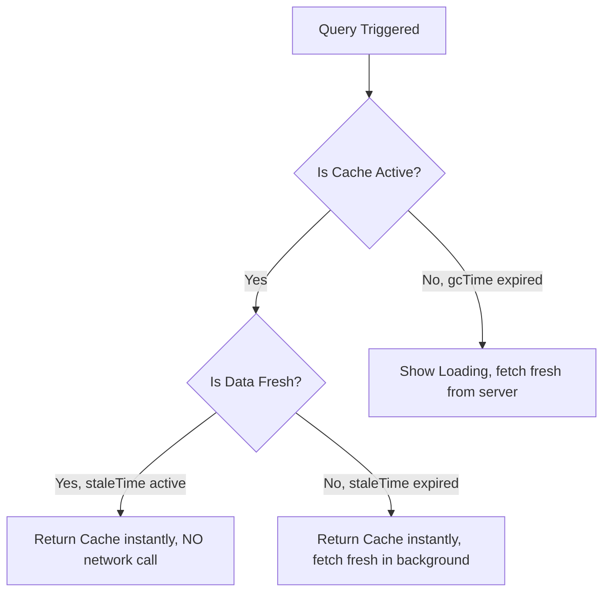

# TanStack Query: Queries & Cấu hình Caching ⚡

**TanStack Query** (trước đây gọi là **React Query**) là thư viện quản lý trạng thái bất đồng bộ (asynchronous state management) tiêu chuẩn của ngành dành cho React. Nó được thiết kế để xử lý việc fetching, caching, đồng bộ hóa và cập nhật **server state** (dữ liệu API) trong các ứng dụng web.

---

## 📖 Khái niệm & Tổng quan

Trong React thông thường, việc fetch dữ liệu được thực hiện thủ công bằng `useState` và `useEffect`. Cách tiếp cận đó buộc bạn phải tự tay viết các cờ loading, cờ error, các khối `try/catch`, các đoạn phòng vệ race-condition, và logic re-fetch trong **mọi** component có chạm tới mạng. Nó hoạt động được, nhưng nhanh chóng trở nên rối rắm và lặp đi lặp lại.

TanStack Query coi **server state** là một thứ về cơ bản khác biệt so với **client state**. Server state nằm trên một máy từ xa mà bạn không sở hữu, có thể trở nên lỗi thời bất cứ lúc nào, và được chia sẻ giữa nhiều component. TanStack Query cung cấp cho bạn caching, refetch ngầm dưới nền, khử trùng lặp request, polling, và parallel queries — tất cả đều có sẵn ngay từ đầu.

> [!NOTE]
> TanStack Query là **framework agnostic** (độc lập với framework). Cùng một lõi core hỗ trợ các adapter cho React, Vue, Angular, Svelte, và Solid. Trong khóa học này chúng ta tập trung vào adapter cho React (`@tanstack/react-query`), phiên bản 5.

> [!TIP]
> TanStack Query **không** chỉ là một công cụ fetch dữ liệu. Bạn có thể fetch bằng `fetch`, `axios`, GraphQL, hay bất kỳ hàm nào trả về một promise. Giá trị thực sự của thư viện nằm ở việc **quản lý** dữ liệu đó sau khi nó về: caching nó, biết khi nào nó stale, và refetch nó một cách thông minh.

### 🍱 Một phép ẩn dụ thực tế: Căn bếp nhà hàng

Hãy hình dung `QueryClient` như một **căn bếp nhà hàng với một ô cửa chuyền món (pass-through window)**:

- Một **`queryKey`** là tên ghi trên phiếu order của khách (ví dụ "Table 4: Pasta").
- **`queryFn`** là người đầu bếp thực sự nấu món ăn.
- **cache** là kệ giữ nóng tại ô chuyền món. Nếu một đĩa "Pasta" vừa nấu đã sẵn trên kệ và vẫn còn nóng (**fresh / trong khoảng `staleTime`**), người phục vụ tiếp theo hỏi "Pasta" sẽ nhận được ngay lập tức — đầu bếp **không** bị yêu cầu nấu lại. Đây là **deduplication** (khử trùng lặp).
- Một khi đĩa ăn đã nằm đó một lúc thì nó trở nên **stale**: nó vẫn được phục vụ ngay lập tức để giữ khách hài lòng, nhưng đầu bếp âm thầm bắt đầu nấu một đĩa mới ở dưới nền.
- Nếu không ai gọi "Pasta" trong một thời gian dài (**`gcTime`**), căn bếp vứt bỏ đĩa nguội đi để giải phóng chỗ trên kệ (**garbage collection**).

---

## ⚡ 1. Tại sao chọn TanStack Query?

Video trước tiên xây dựng một bộ fetcher theo cách "thủ công" để cảm nhận nỗi đau. Với React thuần, bạn phải:

* Tạo một `useState` cho `data`, `isLoading`, và `error`.
* Viết một `useEffect` với khối `try / catch / finally`.
* Phòng vệ trước các **race condition** khi dependency (như một `id`) thay đổi nhanh hơn tốc độ các request được giải quyết.
* Lặp lại tất cả những điều này trong mọi component có fetch dữ liệu.

TanStack Query gom tất cả những thứ đó vào một lời gọi hook duy nhất.

| Mối quan tâm | `useState` + `useEffect` thủ công | TanStack Query |
| :--- | :--- | :--- |
| Trạng thái loading | Bạn tạo & bật/tắt nó | Cung cấp sẵn `isLoading` / `isPending` |
| Trạng thái error | Bạn tạo & bật/tắt nó | Cung cấp sẵn `isError` / `error` |
| Caching | Không (refetch mỗi lần mount) | Tự động, phân khóa theo `queryKey` |
| Deduplication | Không | Tự động |
| Refetch ngầm dưới nền | Thủ công | Khi focus / reconnect / theo interval |
| Race condition | Bạn tự xử lý | Được xử lý nội bộ |
| Polling | `setInterval` thủ công | Tùy chọn `refetchInterval` |
| Fetch song song | Nhiều effect | `useQueries` |

---

## ⚡ 2. Cài đặt & Thiết lập Store

Để cài đặt TanStack Query vào ứng dụng React của bạn, chạy lệnh:

```bash
npm install @tanstack/react-query
```

### Bao bọc gốc ứng dụng (`main.jsx`)
Để sử dụng các query, bạn phải khởi tạo một **`QueryClient`** và bao bọc các component của mình trong **`QueryClientProvider`**:

```jsx
import React from 'react';
import ReactDOM from 'react-dom/client';
import App from './App';
import { QueryClient, QueryClientProvider } from '@tanstack/react-query';

// Create a client (the "heart" of TanStack Query: it holds the cache & config)
const queryClient = new QueryClient();

ReactDOM.createRoot(document.getElementById('root')).render(
  <React.StrictMode>
    <QueryClientProvider client={queryClient}>
      <App />
    </QueryClientProvider>
  </React.StrictMode>
);
```

> [!NOTE]
> `QueryClientProvider` sử dụng React Context **chỉ** để truyền xuống tham chiếu tới client. Cache thực sự nằm trong thực thể `QueryClient` bên ngoài, chứ không phải trong Context. Đó là lý do việc cập nhật dữ liệu không kích hoạt những cơn bão re-render do Context gây ra trên toàn bộ cây component của bạn.

---

## 🧩 3. Fetch dữ liệu với `useQuery`

Để fetch dữ liệu, bạn dùng hook **`useQuery`**, hook này nhận vào một đối tượng options chứa:
1. **`queryKey`**: Một mảng định danh duy nhất và cache query này.
2. **`queryFn`**: Hàm bất đồng bộ (trả về một promise) thực hiện fetch dữ liệu.

```jsx
import { useQuery } from '@tanstack/react-query';

// 1. Define a pure async fetch function
const fetchUsers = async () => {
  const res = await fetch("https://jsonplaceholder.typicode.com/users");
  if (!res.ok) throw new Error("Network response was not ok");
  return res.json();
};

export const UserDirectory = () => {
  // 2. Fetch using the useQuery hook
  const { data: users, isLoading, isError, error } = useQuery({
    queryKey: ['usersList'], // Caching identifier
    queryFn: fetchUsers       // Promise handler
  });

  if (isLoading) return <p>Loading directory...</p>;
  if (isError) return <p style={{ color: "red" }}>Error: {error.message}</p>;

  return (
    <div>
      <h3>User Directory (TanStack Query)</h3>
      <ul>
        {users?.map((user) => (
          <li key={user.id}>{user.name} ({user.email})</li>
        ))}
      </ul>
    </div>
  );
};
```

> [!TIP]
> Bạn có thể thay lời gọi `fetch` bên trong `queryFn` bằng `axios` (`const res = await axios.get(url); return res.data;`) mà không cần thay đổi bất cứ thứ gì khác. `useQuery` chỉ quan tâm rằng `queryFn` trả về một promise.

---

## 🔁 4. Tự động khử trùng lặp Request (Deduplication)

**Deduplication** nghĩa là nếu nhiều phần khác nhau trong ứng dụng của bạn cùng yêu cầu **cùng một dữ liệu tại cùng một thời điểm**, TanStack Query chỉ phát ra **một** network request duy nhất và chia sẻ kết quả đơn lẻ đó cho tất cả các bên gọi. Nó tránh việc hỏi đi hỏi lại cùng một dữ liệu.

Điểm mấu chốt từ bài học: kết quả được phân khóa theo `queryKey`. Nếu một giá trị đã tồn tại trong cache cho đúng khóa đó, cache sẽ trả lại nó thay vì chạy `queryFn` lần nữa.

```jsx
import { useQuery } from '@tanstack/react-query';

// Generate a random number (returns a promise so it behaves like a real fetch)
const getRandomNumber = () => Promise.resolve(Math.random());

export const Deduplication = () => {
  const { data } = useQuery({
    queryKey: ['randomNumber'], // SAME key everywhere
    queryFn: getRandomNumber,
  });

  return <h2>Random number is: {data}</h2>;
};
```

Nếu bạn render `<Deduplication />` **hai lần** trong `App` của mình, cả hai instance đều hiển thị **cùng một** con số — chứ không phải hai giá trị ngẫu nhiên khác nhau. Bởi vì cả hai cùng chia sẻ khóa `['randomNumber']`, TanStack Query chạy `queryFn` một lần, cache kết quả, và phục vụ giá trị đã cache cho bản sao thứ hai.

```jsx
// App.jsx — two copies, but ONE underlying request thanks to deduplication
export default function App() {
  return (
    <>
      <Deduplication />
      <Deduplication /> {/* Shows the identical number — not a new one */}
    </>
  );
}
```

> [!WARNING]
> Deduplication được điều khiển hoàn toàn bởi `queryKey`. Nếu bạn (cố ý hoặc vô tình) truyền một khóa **khác**, bạn sẽ nhận được một mục cache riêng và một request riêng. Ngược lại, việc chia sẻ một khóa giữa các dữ liệu không liên quan sẽ khiến một query ghi đè lên cache của query khác. Hãy chọn khóa một cách có chủ đích.

---

## 🛠️ 5. React Query Devtools

**React Query Devtools** cung cấp cho bạn một bảng trực quan để kiểm tra mọi query: khóa của nó, trạng thái hiện tại (`fresh`, `stale`, `fetching`, `inactive`), dữ liệu đã cache, và bao nhiêu component đang đăng ký lắng nghe. Đây là cách nhanh nhất để *thấy* caching, staleness, và deduplication thực sự diễn ra.

Cài đặt nó như một package riêng:

```bash
npm install @tanstack/react-query-devtools
```

Sau đó gắn nó vào bên trong `QueryClientProvider` (Devtools tự render nút bấm nổi riêng của nó):

```jsx
import { QueryClient, QueryClientProvider } from '@tanstack/react-query';
import { ReactQueryDevtools } from '@tanstack/react-query-devtools';

const queryClient = new QueryClient();

ReactDOM.createRoot(document.getElementById('root')).render(
  <QueryClientProvider client={queryClient}>
    <App />
    {/* Floating panel; start closed and open it from the corner icon */}
    <ReactQueryDevtools initialIsOpen={false} />
  </QueryClientProvider>
);
```

> [!NOTE]
> Devtools được **tree-shake loại bỏ khỏi các bản build production** một cách tự động, vì vậy việc để lại `<ReactQueryDevtools />` trong code của bạn là an toàn — nó chỉ xuất hiện trong quá trình phát triển. Di chuột qua bất kỳ query nào để xem nó hiện đang `fresh` hay `stale`.

---

## 🚀 6. Khái niệm Caching cốt lõi: `staleTime` vs. `gcTime`

Cấu hình hành vi caching là điều thiết yếu để quản lý lưu lượng mạng:



### A. `staleTime` (Ngưỡng độ mới)
* **Nó là gì**: Khoảng thời gian (tính bằng mili-giây) mà dữ liệu query được coi là "fresh" sau khi được fetch.
* **Hành vi**: Trong khi dữ liệu còn fresh, các component tiếp theo yêu cầu cùng query key sẽ đọc từ cache ngay lập tức **mà không kích hoạt bất kỳ request refetch ngầm nào dưới nền**.
* **Mặc định**: `0` mili-giây (dữ liệu lập tức bị coi là stale).
* **Phép ẩn dụ**: Giống như lướt một ứng dụng mạng xã hội trong 5 phút — bạn vẫn liên tục thấy dữ liệu đã được cache sẵn trên thiết bị của mình. Để buộc lấy dữ liệu *fresh* bạn phải refresh lại trang.

### B. `gcTime` (Thời gian Garbage Collection)
* **Nó là gì**: Trước đây gọi là `cacheTime`. Khoảng thời gian (tính bằng mili-giây) mà dữ liệu query **không sử dụng** vẫn nằm trong bộ nhớ cache trước khi bị xóa.
* **Hành vi**: Khi không còn component nào đăng ký lắng nghe một query key, một bộ đếm thời gian bắt đầu chạy. Một khi `gcTime` hết hạn, dữ liệu được garbage collect khỏi cache.
* **Mặc định**: `300000` mili-giây (5 phút).

### Ví dụ cấu hình tùy chỉnh:
```javascript
const { data } = useQuery({
  queryKey: ['usersList'],
  queryFn: fetchUsers,
  staleTime: 5 * 1000,      // Consider data fresh for 5 seconds, then mark it stale
  gcTime: 10 * 60 * 1000,   // Keep unused cache in memory for 10 minutes
});
```

Sau khi `staleTime` trôi qua, việc di chuột qua query trong Devtools sẽ chuyển nó từ `fresh` sang `stale` — đây là bằng chứng trực quan rằng cấu hình hoạt động.

---

## ⏱️ 7. Polling với `refetchInterval`

Tùy chọn **`refetchInterval`** bảo TanStack Query tự động refetch dữ liệu theo một bộ đếm thời gian cố định — được gọi là **polling**. Điều này giữ cho dữ liệu luôn fresh **mà không cần bất kỳ tương tác nào từ người dùng**, lý tưởng cho các dashboard, tỷ số trực tiếp, hoặc số lượng thông báo.

```jsx
import { useQuery } from '@tanstack/react-query';

const fetchTodo = async (id) => {
  const res = await fetch(`https://jsonplaceholder.typicode.com/todos/${id}`);
  if (!res.ok) throw new Error("Network response was not ok");
  return res.json();
};

export const RefetchIntervalDemo = () => {
  const { data, error, isLoading } = useQuery({
    queryKey: ['todo', 1],
    queryFn: () => fetchTodo(1),
    refetchInterval: 5000, // Automatically refetch every 5 seconds (polling)
  });

  if (isLoading) return <h1>Loading...</h1>;
  if (error) return <h1>Error: {error.message}</h1>;

  return (
    <div>
      <h1>To-Do (auto-refreshing every 5s)</h1>
      <pre>{JSON.stringify(data, null, 2)}</pre>
    </div>
  );
};
```

Với `refetchInterval: 5000`, dữ liệu tự re-fetch chính nó mỗi 5 giây — đếm *"1, 2, 3, 4, 5"* và bảng panel tự cập nhật, không cần bấm nút nào.

> [!WARNING]
> Polling gửi một request trên **mỗi** nhịp interval trong suốt thời gian component còn được mount. Một interval ngắn (ví dụ `1000`) trên nhiều query đồng thời có thể dội bom API của bạn và đội chi phí lên. Hãy dùng interval dài nhất mà UX của bạn có thể chấp nhận được, và cân nhắc `refetchIntervalInBackground: false` để polling tạm dừng khi tab bị ẩn.

---

## 🔀 8. Parallel Queries với `useQueries`

Đôi khi một component duy nhất cần dữ liệu từ **nhiều endpoint cùng lúc** — ví dụ posts **và** todos **và** comments. Hook **`useQueries`** chạy nhiều query **song song** và trả về một **mảng các kết quả**, mỗi kết quả có `data`, `isLoading`, và `error` độc lập riêng.

```jsx
import { useQueries } from '@tanstack/react-query';

const fetchTodos = async () => {
  const res = await fetch("https://jsonplaceholder.typicode.com/todos");
  if (!res.ok) throw new Error("Network response was not ok");
  return res.json();
};

const fetchPosts = async () => {
  const res = await fetch("https://jsonplaceholder.typicode.com/posts");
  if (!res.ok) throw new Error("Network response was not ok");
  return res.json();
};

export const FetchFromMultipleEndpoints = () => {
  // useQueries takes a "queries" array, each entry is its own useQuery config
  const results = useQueries({
    queries: [
      { queryKey: ['todos'], queryFn: fetchTodos },
      { queryKey: ['posts'], queryFn: fetchPosts },
    ],
  });

  // Each result is independent — destructure them out
  const [todosQuery, postsQuery] = results;

  // Combine loading/error states however you like
  if (todosQuery.isLoading || postsQuery.isLoading) return <h1>Loading...</h1>;
  if (todosQuery.error || postsQuery.error) {
    return (
      <div>
        An error occurred: {todosQuery.error?.message ?? postsQuery.error?.message}
      </div>
    );
  }

  return (
    <div>
      <h1>Todos</h1>
      <pre>{JSON.stringify(todosQuery.data.slice(0, 3), null, 2)}</pre>
      <hr />
      <h1>Posts</h1>
      <pre>{JSON.stringify(postsQuery.data.slice(0, 3), null, 2)}</pre>
    </div>
  );
};
```

> [!TIP]
> Hãy dùng `useQueries` (thay vì nhiều lời gọi `useQuery` riêng lẻ) khi **số lượng** query là động — ví dụ fetch chi tiết cho một mảng các ID mà độ dài thay đổi. Nó cho phép bạn xây dựng mảng `queries` theo lập trình bằng `.map()`.

---

## 🧠 Kiểm tra kiến thức

Trả lời các câu hỏi sau để kiểm tra mức độ hiểu của bạn về TanStack Query. Nhấp vào **Reveal Answer** để xác nhận.

### 1. "Query Keys" là gì và tại sao chúng được đối xử giống như mảng dependency?
<details>
  <summary><b>Reveal Answer</b></summary>

  Query Keys là các mảng đóng vai trò làm định danh duy nhất để cache kết quả query. Nếu bạn đưa các biến động vào trong query key (ví dụ `['todos', userId]`), query key hoạt động giống như một mảng dependency. Khi `userId` thay đổi, TanStack Query tự động vô hiệu hóa cache cũ, tạo một khóa cache mới, và kích hoạt một lần refetch dữ liệu mới.
</details>

### 2. "Automatic request deduplication" là gì và điều gì điều khiển nó?
<details>
  <summary><b>Reveal Answer</b></summary>

  Deduplication nghĩa là khi nhiều component cùng yêu cầu cùng một dữ liệu tại cùng một thời điểm, TanStack Query chỉ phát ra **một** network request duy nhất và chia sẻ kết quả đơn lẻ đó cho tất cả chúng. Nó được điều khiển hoàn toàn bởi **`queryKey`**: nếu một giá trị đã tồn tại trong cache cho đúng khóa đó, cache sẽ trả lại nó thay vì chạy `queryFn` lần nữa. Đây là lý do tại sao hai component `<Deduplication />` cùng chia sẻ `['randomNumber']` lại hiển thị con số y hệt nhau.
</details>

### 3. Sự khác biệt giữa `staleTime` và `gcTime` là gì?
<details>
  <summary><b>Reveal Answer</b></summary>

  - **`staleTime`** kiểm soát dữ liệu đã fetch được coi là **fresh** trong bao lâu. Trong khi còn fresh, cùng một query key được phục vụ từ cache **không** kèm refetch ngầm dưới nền. Mặc định là `0` (lập tức stale).
  - **`gcTime`** (trước đây là `cacheTime`) kiểm soát dữ liệu **không sử dụng** nằm trong bộ nhớ bao lâu một khi không còn component nào đăng ký lắng nghe, trước khi garbage collection xóa nó đi. Mặc định là `300000` ms (5 phút).
</details>

### 4. Khi nào bạn sẽ dùng `refetchInterval`, và một rủi ro của việc đặt nó quá thấp là gì?
<details>
  <summary><b>Reveal Answer</b></summary>

  `refetchInterval` bật **polling** — tự động refetch dữ liệu theo một bộ đếm thời gian cố định (ví dụ `refetchInterval: 5000` refetch mỗi 5 giây) mà không cần bất kỳ tương tác nào từ người dùng. Nó lý tưởng cho các dashboard, tỷ số trực tiếp, hoặc số lượng thông báo. Rủi ro của một interval rất thấp là nó gửi một request trên mỗi nhịp cho mỗi query đang được mount, điều này có thể làm quá tải API của bạn và tăng chi phí. Bạn cũng có thể đặt `refetchIntervalInBackground: false` để polling tạm dừng khi tab bị ẩn.
</details>

### 5. `useQueries` làm gì, và giá trị trả về của nó khác `useQuery` như thế nào?
<details>
  <summary><b>Reveal Answer</b></summary>

  `useQueries` chạy **nhiều query song song** từ một lời gọi hook duy nhất. Bạn truyền vào một mảng `queries` trong đó mỗi mục là một cấu hình `{ queryKey, queryFn }` riêng của nó. Không giống `useQuery` (vốn trả về một đối tượng kết quả duy nhất), `useQueries` trả về một **mảng các đối tượng kết quả** — mỗi cái có `data`, `isLoading`, và `error` độc lập — nên bạn có thể xử lý từng endpoint riêng biệt trong khi vẫn giữ các query độc lập với nhau. Nó đặc biệt hữu ích khi số lượng query là động.
</details>

---

## 💻 Bài tập thực hành

Áp dụng những gì bạn đã học vào môi trường dự án của mình:

### 🛠️ Bài tập 1: Trình Tải chi tiết Bài viết theo ID động
1. Tạo một component `PostViewer.tsx` (dùng đuôi `.tsx`).
2. Thiết lập một biến state `postId` khởi tạo bằng `1`.
3. Viết một hàm query bất đồng bộ `fetchPost(id)` fetch từ `https://jsonplaceholder.typicode.com/posts/${id}`.
4. Truyền `['post', postId]` làm `queryKey` và `() => fetchPost(postId)` làm `queryFn` bên trong options của `useQuery`.
5. Render tiêu đề và nội dung bài viết lên màn hình, cùng các nút "Next Post" / "Previous Post" để cập nhật `postId`.
6. **Kiểm chứng caching:** cài đặt và gắn `<ReactQueryDevtools initialIsOpen={false} />`. Mở bảng panel và quan sát một query key mới (`['post', 1]`, `['post', 2]`, ...) xuất hiện mỗi lần bạn tiến tới. Việc quay **trở lại** một bài viết đã thăm trước đó nên tải nó **ngay lập tức** từ cache — xác nhận rằng Devtools cho thấy khóa đó đã được điền sẵn dữ liệu.

### 🛠️ Bài tập 2: Dashboard trực tiếp với Polling + Parallel Queries
1. Tạo một component `Dashboard.tsx`.
2. Dùng **`useQueries`** để fetch **hai** endpoint song song:
   - `['todos']` → `https://jsonplaceholder.typicode.com/todos`
   - `['posts']` → `https://jsonplaceholder.typicode.com/posts`
3. Destructure mảng trả về thành `todosQuery` và `postsQuery`. Hiển thị một dòng "Loading..." gộp chung trong khi **một trong hai** đang loading, và một thông báo lỗi gộp chung nếu **một trong hai** thất bại.
4. Thêm `refetchInterval: 10000` vào query todos để nó **poll** mỗi 10 giây. Mở Devtools và quan sát query `['todos']` chuyển sang `fetching` trên mỗi nhịp.
5. **Mục tiêu nâng cao:** thêm `staleTime: 30000` vào query posts và quan sát trong Devtools rằng posts giữ trạng thái `fresh` trong 30 giây (không refetch ngầm dưới nền khi remount) trong khi todos vẫn tiếp tục poll — chứng minh `staleTime`, `refetchInterval`, và `useQueries` hoạt động cùng nhau.
