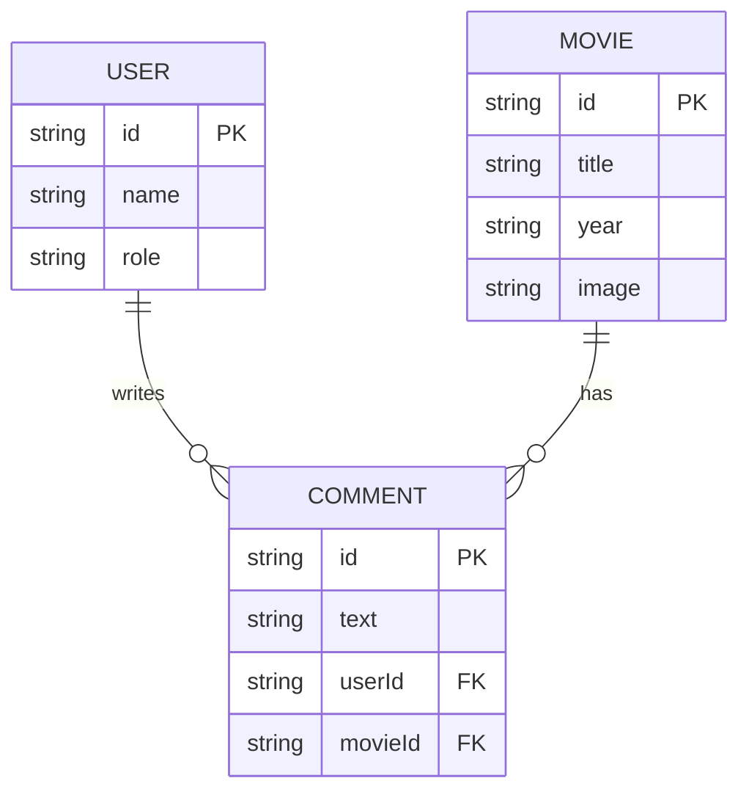

# FullStack Enterprise Dashboard Integration 🌐

The final milestone of this course brings together every concept we have learned—React 19, TypeScript, state management (Redux Toolkit), styling, and API integration—into a production-grade **FullStack Enterprise Dashboard**.

In this lesson, we will cover the architectural design, API integration layer (RTK Query), and component implementations for real-time analytics.

---

## ⚡ 1. System Architecture & Relational Schema

An enterprise dashboard is driven by structured data. For this project, our dashboard monitors three core resources: **Users**, **Movies**, and **Comments**.



### Key Technical Challenges Covered:
1. **State Synchronization**: Automatically updating UI counters when additions/deletions occur.
2. **Real-Time Polling**: Keeping visitor statistics synchronized with the database in real-time.
3. **Authentication Lifecycles**: Managing route guards, sessions, and secure API requests.

---

## ⚡ 2. The API Query Layer (RTK Query)

To manage caching, loading states, and network updates efficiently, we use Redux Toolkit Query (RTKQ). Below is our core API slice representing the frontend gateway to the backend.

```typescript
// src/store/apiSlice.ts
import { createApi, fetchBaseQuery } from '@reduxjs/toolkit/query/react';

export interface User {
  id: string;
  name: string;
  role: string;
}

export interface Movie {
  id: string;
  name: string;
  year: number;
  image: string;
  reviewsCount: number;
}

export const dashboardApi = createApi({
  reducerPath: 'dashboardApi',
  baseQuery: fetchBaseQuery({ baseUrl: 'https://api.my-dashboard.com/v1/' }),
  tagTypes: ['Users', 'Movies'],
  endpoints: (builder) => ({
    getUsers: builder.query<User[], void>({
      query: () => 'users',
      providesTags: ['Users'],
    }),
    getMovies: builder.query<Movie[], void>({
      query: () => 'movies',
      providesTags: ['Movies'],
    }),
    addMovie: builder.mutation<Movie, Partial<Movie>>({
      query: (newMovie) => ({
        url: 'movies',
        method: 'POST',
        body: newMovie,
      }),
      invalidatesTags: ['Movies'], // Automatically forces re-fetching of getMovies query!
    }),
  }),
});

export const { useGetUsersQuery, useGetMoviesQuery, useAddMovieMutation } = dashboardApi;
```

> [!TIP]
> RTK Query's caching automatically deletes data when components unmount. To customize this behavior, configure options like `keepUnusedDataFor` (in seconds) or use `refetchOnMountOrArgChange` to control network calls.

---

## 🎨 3. Dashboard UI Components

Our dashboard layout uses cards to represent real-time database counts (Users, Comments, Movies) dynamically styled with CSS gradients.

### 1. The KPI Metric Card (`SecondaryCard.tsx`)
This reusable component receives gradients, content, and pill headers to display data metrics:

```tsx
// src/components/SecondaryCard.tsx
import React from 'react';

interface SecondaryCardProps {
  pill: string;
  content: string | number;
  info: string;
  gradient: string; // e.g. "from-green-500 to-lime-400"
}

export const SecondaryCard: React.FC<SecondaryCardProps> = ({ pill, content, info, gradient }) => {
  return (
    <div className={`p-6 rounded-2xl text-white bg-gradient-to-br ${gradient} shadow-lg transition-transform hover:scale-105`}>
      <span className="text-xs font-bold uppercase bg-white/20 px-2 py-1 rounded-full">{pill}</span>
      <h3 className="text-3xl font-extrabold mt-3">{content}</h3>
      <p className="text-sm opacity-90 mt-1">{info}</p>
    </div>
  );
};
```

### 2. The Real-Time Polling Widget (`RealTimeCard.tsx`)
To monitor online visitors, we configure RTK Query to **poll** the server every 5 seconds:

```tsx
// src/components/RealTimeCard.tsx
import React from 'react';
import { useGetUsersQuery } from '../store/apiSlice';

export const RealTimeCard: React.FC = () => {
  // poll user endpoint every 5000ms
  const { data: visitors, isLoading, error } = useGetUsersQuery(undefined, {
    pollingInterval: 5000,
  });

  if (isLoading) return <div className="animate-pulse p-4">Loading active sessions...</div>;
  if (error) return <div className="text-red-500">Failed to link socket.</div>;

  return (
    <div className="bg-slate-900 border border-slate-800 p-6 rounded-2xl shadow-xl">
      <div className="flex items-center justify-between">
        <div>
          <h4 className="text-slate-400 text-xs font-semibold uppercase tracking-wider">Real-Time Activity</h4>
          <p className="text-slate-500 text-xs mt-1">Updates live every 5s</p>
        </div>
        <span className="flex h-3 w-3 relative">
          <span className="animate-ping absolute inline-flex h-full w-full rounded-full bg-green-400 opacity-75"></span>
          <span className="relative inline-flex rounded-full h-3 w-3 bg-green-500"></span>
        </span>
      </div>
      <div className="mt-4">
        <h2 className="text-white text-4xl font-extrabold">{visitors?.length || 0}</h2>
        <span className="text-green-400 text-xs font-semibold">Active Visitors Online</span>
      </div>
    </div>
  );
};
```

---

## 🔒 4. Protected Route & Auth Lifecycles

To prevent unauthorized access to administrative panels, we wrap routing segments in an Auth Guard component using global state slices.

```tsx
// src/components/ProtectedRoute.tsx
import React from 'react';
import { Navigate, Outlet } from 'react-router-dom';
import { useSelector } from 'react-redux';
import { selectCurrentUserToken } from '../store/authSlice';

export const ProtectedRoute: React.FC = () => {
  const token = useSelector(selectCurrentUserToken);

  if (!token) {
    // Redirect to login if user is not authenticated
    return <Navigate to="/login" replace />;
  }

  // Render children components (nested routes)
  return <Outlet />;
};
```

> [!WARNING]
> Storing authentication tokens in `localStorage` leaves your app vulnerable to Cross-Site Scripting (XSS) attacks. For secure production enterprise projects, handle auth sessions using secure, `httpOnly` cookies managed directly by the backend database API.

---

## 🧠 Test Your Knowledge

Answer these questions to check your understanding. Click **Reveal Answer** to verify.

### 1. How does RTK Query's tag invalidation mechanism improve state synchronization?
<details>
  <summary><b>Reveal Answer</b></summary>

  When a mutation (like `addMovie`) executes, it declares that it invalidates specific tags (e.g. `['Movies']`). RTK Query matches this invalidation against active queries providing that tag (like `getMovies`). It automatically triggers a re-fetch in the background to update the data cache, synchronization of UI components, and state values without writing manual dispatches or state mutations.
</details>

### 2. What is the difference between `pollingInterval` and WebSockets for real-time updates?
<details>
  <summary><b>Reveal Answer</b></summary>

  - **Polling** uses regular, timed HTTP queries (e.g. every 5s) to request new data. It is easy to configure and works over standard HTTP, but it consumes more bandwidth.
  - **WebSockets** establish a single, persistent two-way connection where the server pushes updates instantly. It is ideal for rapid updates (chat, stock ticks), but requires more complex backend management.
</details>

### 3. Why is `<Navigate to="/login" replace />` preferred over simple window navigation changes?
<details>
  <summary><b>Reveal Answer</b></summary>

  The `replace` property overwrites the current entry in the history stack rather than adding a new one. This ensures that if the user logs out and hits the browser's "Back" button, they are not redirected back to the protected admin screen they just logged out of.
</details>

### 4. What are the loading states provided by RTK Query's hook returns?
<details>
  <summary><b>Reveal Answer</b></summary>

  RTK Query hooks return boolean flags representing API request status:
  - `isLoading`: True during the very first request (no cached data is available yet).
  - `isFetching`: True on subsequent queries (data is being updated in the background).
  - `isSuccess`: True if the request successfully resolved.
  - `isError`: True if the request failed.
</details>

### 5. Why should React Context not be used for heavy real-time data sync in dashboards?
<details>
  <summary><b>Reveal Answer</b></summary>

  React Context triggers a re-render on **all** consumer components whenever the context value object changes. In a fast-updating, real-time dashboard, this leads to significant performance degradation. State libraries like Redux or Zustand use selective subscription models, where components only re-render if the specific properties they depend on are updated.
</details>

---

## 💻 Practice Exercises

### 🛠️ Exercise 1: Build a Mutative Movie Form
1. Create a React component `AddMovieForm.tsx`.
2. Implement form controls (inputs for title, year, image) using state management.
3. Integrate the `useAddMovieMutation` hook.
4. Verify that when you submit the form, the parent movie list component automatically re-fetches and displays the new movie instantly.

### 🛠️ Exercise 2: Implementing Polling Toggler
1. Update `RealTimeCard.tsx` to include a button toggling active polling.
2. Hint: Pass a dynamic `pollingInterval` state (e.g., `5000` when enabled, `0` when disabled) to the query hook.
3. Verify that disabling the toggle stops network requests in your browser Developer Console's Network tab.
