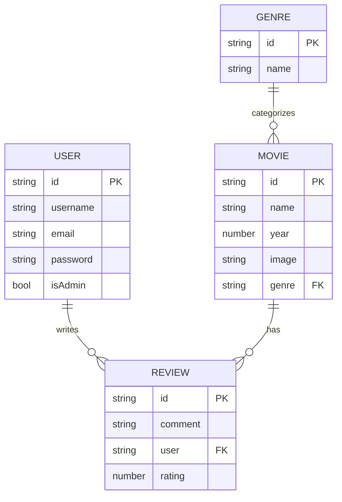

# FullStack Enterprise Dashboard Integration 🌐

The final milestone of this course brings together every concept we have learned—React 19, TypeScript, state management (Redux Toolkit), styling, and API integration—into a production-grade **FullStack Movie Dashboard**.

In this lesson, we build the project end-to-end: an **Express + MongoDB** backend (authentication, movies, genres, reviews) and a **React + RTK Query** frontend that consumes it, including a protected admin dashboard. This is a long lesson by design—treat each section as a buildable checkpoint.

---

## 🧭 Concept & Overview

A fullstack dashboard is two cooperating applications: a **frontend** that renders the UI and a **backend** that owns the data and the rules. The frontend never talks to the database directly—it asks the backend, and the backend decides who is allowed to do what. Authentication, validation, and authorization all live on the server because the client can be tampered with.

Think of the system like a **members-only cinema**. The backend is the building: the ticket desk (login/register), the security guard at the screening-room door (auth middleware), the manager who alone can change the schedule (admin authorization), and the archive of films and reviews (the database). The frontend is the lobby and posters everyone sees. A guest can browse posters, but only ticket-holders can leave reviews, and only the manager can add or delete films.

> [!NOTE]
> We run **two processes**: the backend (Express on port 3000) and the frontend (Vite dev server). The `concurrently` package lets a single `npm run fullstack` command boot both at once, while a Vite **proxy** forwards `/api/*` calls to the backend so the browser sees one origin.

> [!TIP]
> Keep the secret stuff on the server. The JWT signing secret, the Mongo connection string, and password hashing all live in the backend. The frontend only ever holds a short-lived session reference (in our case, an `httpOnly` cookie the browser sends automatically).

### Frontend vs Backend responsibilities

| Concern | Backend (Express/Mongo) | Frontend (React/RTK Query) |
| --- | --- | --- |
| Data ownership | Mongoose models + MongoDB | Cached copies via RTK Query |
| Authentication | Hash passwords, sign JWT, set cookie | Stores user info, sends cookie |
| Authorization | `authenticate` + `authorizeAdmin` middleware | Hides/guards admin routes in UI |
| Validation | Required fields, uniqueness, error codes | Friendly form checks + toasts |
| Source of truth | Yes — final say on every write | No — optimistic, re-fetches on invalidation |

---

## ⚡ 1. System Architecture & Relational Schema

Our dashboard monitors three core resources: **Users**, **Movies**, and **Reviews/Comments**, with **Genres** categorizing movies.



### Backend folder structure

```bash
my-movies/
├── backend/
│   ├── config/
│   │   └── db.js            # Mongoose connection
│   ├── controllers/
│   │   ├── userController.js
│   │   ├── genreController.js
│   │   └── movieController.js
│   ├── middlewares/
│   │   ├── asyncHandler.js  # wraps async controllers
│   │   └── authMiddleware.js# authenticate + authorizeAdmin
│   ├── models/
│   │   ├── User.js
│   │   ├── Movie.js
│   │   └── Genre.js
│   ├── routes/
│   │   ├── userRoutes.js
│   │   ├── genreRoutes.js
│   │   └── movieRoutes.js
│   ├── utils/
│   │   └── createToken.js   # signs JWT + sets cookie
│   └── index.js             # Express entry point
└── frontend/                # Vite + React app
```

---

## 🏗️ 2. Backend Setup: Express, Mongoose & Concurrency

First initialize the Node project at the project root (not inside `frontend`/`backend`) and install the backend dependencies.

```bash
# From the project root (e.g. my-movies/)
npm init -y

# Backend dependencies
npm i bcryptjs body-parser concurrently cookie-parser dotenv \
      express jsonwebtoken mongoose multer

# nodemon for auto-reload during development
npm i -D nodemon
```

In the root `package.json`, set `"type": "module"` so we can use ES module `import` syntax, then wire up the scripts that run frontend and backend together.

```json
// package.json (root)
{
  "type": "module",
  "scripts": {
    "frontend": "cd frontend && npm run dev",
    "backend": "nodemon backend/index.js",
    "fullstack": "concurrently \"npm run backend\" \"npm run frontend\""
  }
}
```

Create the environment file. **Never commit `.env`**—add `node_modules` and `.env` to `.gitignore`.

```bash
# .env
PORT=3000
MONGO_URI='mongodb+srv://<user>:<pass>@cluster.mongodb.net/movies-app'
JWT_SECRET='replace-with-a-long-random-string'
NODE_ENV=development
```

### MongoDB connection (`config/db.js`)

```js
// backend/config/db.js
import mongoose from "mongoose";

// Connect to MongoDB using the URI from environment variables
const connectDB = async () => {
  try {
    await mongoose.connect(process.env.MONGO_URI);
    console.log("Successfully connected to MongoDB 👍");
  } catch (error) {
    console.error(`Error: ${error.message}`);
    process.exit(1); // Stop the app if the database is unreachable
  }
};

export default connectDB;
```

### Express entry point (`index.js`)

```js
// backend/index.js
import express from "express";
import dotenv from "dotenv";
import cookieParser from "cookie-parser";
import connectDB from "./config/db.js";
import userRoutes from "./routes/userRoutes.js";
import genreRoutes from "./routes/genreRoutes.js";
import movieRoutes from "./routes/movieRoutes.js";

// Configuration
dotenv.config();
connectDB();

const app = express();

// Middlewares: parse JSON bodies, URL-encoded data, and cookies
app.use(express.json());
app.use(express.urlencoded({ extended: true }));
app.use(cookieParser());

const PORT = process.env.PORT || 3000;

// Routes
app.use("/api/v1/users", userRoutes);
app.use("/api/v1/genre", genreRoutes);
app.use("/api/v1/movies", movieRoutes);

app.listen(PORT, () => console.log(`Server is running on port ${PORT}`));
```

> [!WARNING]
> The order of middleware matters. `express.json()` must run **before** your routes, otherwise `req.body` will be `undefined` when a controller tries to read it. Likewise, register `cookieParser()` before any route that reads `req.cookies`.

Boot the backend on its own first to confirm the database connects:

```bash
npm run backend
# => Server is running on port 3000
# => Successfully connected to MongoDB 👍
```

---

## 👤 3. The User Model & Password Hashing

The user schema stores credentials and an `isAdmin` flag. Mongoose `timestamps: true` auto-adds `createdAt`/`updatedAt`.

```js
// backend/models/User.js
import mongoose from "mongoose";

const userSchema = mongoose.Schema(
  {
    username: { type: String, required: true },
    email: { type: String, required: true, unique: true },
    password: { type: String, required: true },
    isAdmin: { type: Boolean, required: true, default: false },
  },
  { timestamps: true } // adds createdAt & updatedAt automatically
);

const User = mongoose.model("User", userSchema);
export default User;
```

> [!WARNING]
> **Never store plaintext passwords.** We hash with `bcryptjs` before saving. Hashing is one-way: even if the database leaks, the original passwords cannot be recovered, and we verify logins by re-hashing the attempt and comparing.

---

## 🔑 4. JWT Token Generation in an httpOnly Cookie

When a user registers or logs in, we sign a JWT containing their id and store it in an `httpOnly` cookie. The browser then sends it on every request automatically—no manual header juggling, and JavaScript cannot read it (XSS-resistant).

```js
// backend/utils/createToken.js
import jwt from "jsonwebtoken";

const generateToken = (res, userId) => {
  // Sign a token with the user id; expires in 30 days
  const token = jwt.sign({ userId }, process.env.JWT_SECRET, {
    expiresIn: "30d",
  });

  // Set the token as an httpOnly cookie
  res.cookie("jwt", token, {
    httpOnly: true,                                  // JS in the browser cannot read it
    secure: process.env.NODE_ENV !== "development",  // HTTPS only in production
    sameSite: "strict",                              // CSRF protection
    maxAge: 30 * 24 * 60 * 60 * 1000,                // 30 days in ms
  });

  return token;
};

export default generateToken;
```

---

## 🛡️ 5. Auth Middleware: `authenticate` & `authorizeAdmin`

We wrap async controllers in a small `asyncHandler` so we don't repeat `try/catch` everywhere, then build two guards.

```js
// backend/middlewares/asyncHandler.js
const asyncHandler = (fn) => (req, res, next) => {
  Promise.resolve(fn(req, res, next)).catch((error) => {
    res.status(500).json({ message: error.message });
  });
};

export default asyncHandler;
```

```js
// backend/middlewares/authMiddleware.js
import jwt from "jsonwebtoken";
import User from "../models/User.js";
import asyncHandler from "./asyncHandler.js";

// Check that the request carries a valid JWT cookie
const authenticate = asyncHandler(async (req, res, next) => {
  const token = req.cookies.jwt; // read the cookie we set on login

  if (token) {
    try {
      const decoded = jwt.verify(token, process.env.JWT_SECRET);
      // Attach the user (without the password) to the request
      req.user = await User.findById(decoded.userId).select("-password");
      next();
    } catch (error) {
      res.status(401);
      throw new Error("Not authorized, token failed.");
    }
  } else {
    res.status(401);
    throw new Error("Not authorized, no token.");
  }
});

// Allow only admins past this point
const authorizeAdmin = (req, res, next) => {
  if (req.user && req.user.isAdmin) {
    next();
  } else {
    res.status(401).send("Not authorized as an admin.");
  }
};

export { authenticate, authorizeAdmin };
```

> [!NOTE]
> Middleware composes left to right. A route like `router.route("/").get(authenticate, authorizeAdmin, getAllUsers)` means: first prove you are logged in, then prove you are an admin, and only then run the handler. A regular user trips the second guard and gets `Not authorized as an admin`.

---

## 🎬 6. Movie & Review Schemas with References

Reviews are embedded inside a movie, each referencing the `User` who wrote it. The movie references its `Genre`.

```js
// backend/models/Movie.js
import mongoose from "mongoose";
const { ObjectId } = mongoose.Schema;

// A review is embedded in a movie and points back to its author
const reviewSchema = mongoose.Schema(
  {
    name: { type: String, required: true },
    rating: { type: Number, required: true },
    comment: { type: String, required: true },
    user: { type: ObjectId, ref: "User", required: true }, // reference
  },
  { timestamps: true }
);

const movieSchema = mongoose.Schema(
  {
    name: { type: String, required: true },
    image: { type: String },
    year: { type: Number, required: true },
    genre: { type: ObjectId, ref: "Genre", required: true }, // reference
    detail: { type: String, required: true },
    cast: [{ type: String }],
    reviews: [reviewSchema],     // embedded reviews
    numReviews: { type: Number, required: true, default: 0 },
  },
  { timestamps: true }
);

const Movie = mongoose.model("Movie", movieSchema);
export default Movie;
```

```js
// backend/models/Genre.js
import mongoose from "mongoose";

const genreSchema = mongoose.Schema({
  name: {
    type: String,
    trim: true,
    required: true,
    maxLength: 32,
    unique: true,
  },
});

export default mongoose.model("Genre", genreSchema);
```

> [!TIP]
> `ObjectId` + `ref` is a relational link, not a join. To pull in the referenced user/genre data in a query, chain `.populate("user")` or `.populate("genre")` so the response contains the full sub-document instead of just the id.

---

## 🧩 7. CRUD Controllers & Routes

### User register & login (with validation)

```js
// backend/controllers/userController.js
import User from "../models/User.js";
import bcrypt from "bcryptjs";
import asyncHandler from "../middlewares/asyncHandler.js";
import createToken from "../utils/createToken.js";

const createUser = asyncHandler(async (req, res) => {
  const { username, email, password } = req.body;

  // 1. Validate required fields
  if (!username || !email || !password) {
    throw new Error("Please fill all the input fields.");
  }

  // 2. Reject duplicate emails
  const userExists = await User.findOne({ email });
  if (userExists) return res.status(400).send("User already exists.");

  // 3. Hash the password before saving
  const salt = await bcrypt.genSalt(10);
  const hashedPassword = await bcrypt.hash(password, salt);

  const newUser = new User({ username, email, password: hashedPassword });

  try {
    await newUser.save();
    createToken(res, newUser._id); // sign JWT + set cookie
    res.status(201).json({
      _id: newUser._id,
      username: newUser.username,
      email: newUser.email,
      isAdmin: newUser.isAdmin,
    });
  } catch (error) {
    res.status(400);
    throw new Error("Invalid user data.");
  }
});

const loginUser = asyncHandler(async (req, res) => {
  const { email, password } = req.body;

  const existingUser = await User.findOne({ email });
  if (existingUser) {
    // Compare the plaintext attempt against the stored hash
    const isPasswordValid = await bcrypt.compare(password, existingUser.password);
    if (isPasswordValid) {
      createToken(res, existingUser._id);
      return res.status(200).json({
        _id: existingUser._id,
        username: existingUser.username,
        email: existingUser.email,
        isAdmin: existingUser.isAdmin,
      });
    }
    return res.status(401).json({ message: "Invalid password" });
  }
  res.status(401).json({ message: "User not found" });
});

const logoutCurrentUser = asyncHandler(async (req, res) => {
  // Clear the cookie by overwriting it with an expired one
  res.cookie("jwt", "", { httpOnly: true, expires: new Date(0) });
  res.status(200).json({ message: "Logged out successfully" });
});

const getAllUsers = asyncHandler(async (req, res) => {
  const users = await User.find({});
  res.json(users);
});

const updateCurrentUserProfile = asyncHandler(async (req, res) => {
  const user = await User.findById(req.user._id);
  if (user) {
    user.username = req.body.username || user.username;
    user.email = req.body.email || user.email;
    if (req.body.password) {
      const salt = await bcrypt.genSalt(10);
      user.password = await bcrypt.hash(req.body.password, salt);
    }
    const updatedUser = await user.save();
    res.json({
      _id: updatedUser._id,
      username: updatedUser.username,
      email: updatedUser.email,
      isAdmin: updatedUser.isAdmin,
    });
  } else {
    res.status(404);
    throw new Error("User not found.");
  }
});

export {
  createUser,
  loginUser,
  logoutCurrentUser,
  getAllUsers,
  updateCurrentUserProfile,
};
```

```js
// backend/routes/userRoutes.js
import express from "express";
import {
  createUser,
  loginUser,
  logoutCurrentUser,
  getAllUsers,
  updateCurrentUserProfile,
} from "../controllers/userController.js";
import { authenticate, authorizeAdmin } from "../middlewares/authMiddleware.js";

const router = express.Router();

router
  .route("/")
  .post(createUser)                          // register (public)
  .get(authenticate, authorizeAdmin, getAllUsers); // admin only

router.post("/auth", loginUser);             // login
router.post("/logout", logoutCurrentUser);   // logout

router
  .route("/profile")
  .put(authenticate, updateCurrentUserProfile); // logged-in user only

export default router;
```

### Genre CRUD

```js
// backend/controllers/genreController.js
import Genre from "../models/Genre.js";
import asyncHandler from "../middlewares/asyncHandler.js";

const createGenre = asyncHandler(async (req, res) => {
  try {
    const { name } = req.body;
    if (!name) return res.json({ error: "Name is required" });

    const existingGenre = await Genre.findOne({ name });
    if (existingGenre) return res.json({ error: "Already exists" });

    const genre = await new Genre({ name }).save();
    res.json(genre);
  } catch (error) {
    return res.status(400).json(error);
  }
});

const updateGenre = asyncHandler(async (req, res) => {
  try {
    const { name } = req.body;
    const { id } = req.params;

    const genre = await Genre.findOne({ _id: id });
    if (!genre) return res.status(404).json({ error: "Genre not found" });

    genre.name = name;
    const updatedGenre = await genre.save();
    res.json(updatedGenre);
  } catch (error) {
    res.status(500).json({ error: "Internal server error" });
  }
});

const removeGenre = asyncHandler(async (req, res) => {
  try {
    const removed = await Genre.findByIdAndDelete(req.params.id);
    if (!removed) return res.status(404).json({ error: "Genre not found" });
    res.json(removed);
  } catch (error) {
    res.status(500).json({ error: "Internal server error" });
  }
});

const listGenres = asyncHandler(async (req, res) => {
  try {
    const all = await Genre.find({});
    res.json(all);
  } catch (error) {
    return res.status(400).json(error.message);
  }
});

const readGenre = asyncHandler(async (req, res) => {
  try {
    const genre = await Genre.findOne({ _id: req.params.id });
    res.json(genre);
  } catch (error) {
    return res.status(400).json(error.message);
  }
});

export { createGenre, updateGenre, removeGenre, listGenres, readGenre };
```

```js
// backend/routes/genreRoutes.js
import express from "express";
import {
  createGenre, updateGenre, removeGenre, listGenres, readGenre,
} from "../controllers/genreController.js";
import { authenticate, authorizeAdmin } from "../middlewares/authMiddleware.js";

const router = express.Router();

router.route("/").post(authenticate, authorizeAdmin, createGenre);
router.route("/:id").put(authenticate, authorizeAdmin, updateGenre);
router.route("/:id").delete(authenticate, authorizeAdmin, removeGenre);
router.route("/genres").get(listGenres);
router.route("/:id").get(readGenre);

export default router;
```

### Movie CRUD + review creation

```js
// backend/controllers/movieController.js
import Movie from "../models/Movie.js";
import asyncHandler from "../middlewares/asyncHandler.js";

const createMovie = asyncHandler(async (req, res) => {
  try {
    const newMovie = new Movie(req.body);
    const savedMovie = await newMovie.save();
    res.json(savedMovie);
  } catch (error) {
    res.status(500).json(error.message);
  }
});

const getAllMovies = asyncHandler(async (req, res) => {
  try {
    // populate replaces the genre ObjectId with the full genre document
    const movies = await Movie.find({}).populate("genre");
    res.json(movies);
  } catch (error) {
    res.status(500).json(error.message);
  }
});

const getSpecificMovie = asyncHandler(async (req, res) => {
  try {
    const movie = await Movie.findById(req.params.id);
    if (!movie) return res.status(404).json({ message: "Movie not found" });
    res.json(movie);
  } catch (error) {
    res.status(500).json(error.message);
  }
});

const updateMovie = asyncHandler(async (req, res) => {
  try {
    const updated = await Movie.findByIdAndUpdate(req.params.id, req.body, {
      new: true, // return the updated document, not the old one
    });
    res.json(updated);
  } catch (error) {
    res.status(500).json(error.message);
  }
});

const deleteMovie = asyncHandler(async (req, res) => {
  try {
    const deleted = await Movie.findByIdAndDelete(req.params.id);
    res.json(deleted);
  } catch (error) {
    res.status(500).json(error.message);
  }
});

const createReview = asyncHandler(async (req, res) => {
  try {
    const { rating, comment } = req.body;
    const movie = await Movie.findById(req.params.id);
    if (!movie) return res.status(404).json({ message: "Movie not found" });

    // Prevent a user from reviewing the same movie twice
    const alreadyReviewed = movie.reviews.find(
      (r) => r.user.toString() === req.user._id.toString()
    );
    if (alreadyReviewed) {
      res.status(400);
      throw new Error("Movie already reviewed");
    }

    const review = {
      name: req.user.username,
      rating: Number(rating),
      comment,
      user: req.user._id,
    };
    movie.reviews.push(review);
    movie.numReviews = movie.reviews.length;
    await movie.save();
    res.status(201).json({ message: "Review added" });
  } catch (error) {
    res.status(400).json(error.message);
  }
});

export {
  createMovie, getAllMovies, getSpecificMovie,
  updateMovie, deleteMovie, createReview,
};
```

```js
// backend/routes/movieRoutes.js
import express from "express";
import {
  createMovie, getAllMovies, getSpecificMovie,
  updateMovie, deleteMovie, createReview,
} from "../controllers/movieController.js";
import { authenticate, authorizeAdmin } from "../middlewares/authMiddleware.js";

const router = express.Router();

// Public reads
router.get("/all-movies", getAllMovies);
router.get("/specific-movie/:id", getSpecificMovie);

// Logged-in users can review
router.post("/:id/reviews", authenticate, createReview);

// Admin-only writes
router.post("/create-movie", authenticate, authorizeAdmin, createMovie);
router.put("/update-movie/:id", authenticate, authorizeAdmin, updateMovie);
router.delete("/delete-movie/:id", authenticate, authorizeAdmin, deleteMovie);

export default router;
```

---

## ⚡ 8. Frontend: RTK Query Integration

### Vite proxy & constants

Because the cookie is `httpOnly` and same-site, the frontend must look like the same origin. Configure a Vite proxy so `/api` forwards to the backend.

```js
// frontend/vite.config.js
export default {
  server: {
    proxy: {
      "/api": "http://localhost:3000",
      "/uploads": "http://localhost:3000",
    },
  },
};
```

```js
// frontend/src/redux/constants.js
export const BASE_URL = "";                 // empty — the proxy handles it
export const USERS_URL = "/api/v1/users";
export const GENRE_URL = "/api/v1/genre";
export const MOVIES_URL = "/api/v1/movies";
```

### The apiSlice baseQuery

```js
// frontend/src/redux/api/apiSlice.js
import { fetchBaseQuery, createApi } from "@reduxjs/toolkit/query/react";
import { BASE_URL } from "../constants";

const baseQuery = fetchBaseQuery({ baseUrl: BASE_URL });

export const apiSlice = createApi({
  baseQuery,
  tagTypes: ["User", "Movie", "Genre"], // cache tags for invalidation
  endpoints: () => ({}),                // endpoints injected from other files
});
```

### Injected endpoints — queries vs mutations

A **query** reads data and provides a cache tag. A **mutation** writes data and invalidates tags so dependent queries auto-refetch.

```js
// frontend/src/redux/api/users.js
import { apiSlice } from "./apiSlice";
import { USERS_URL } from "../constants";

export const userApiSlice = apiSlice.injectEndpoints({
  endpoints: (builder) => ({
    // Mutations: change server state
    login: builder.mutation({
      query: (data) => ({ url: `${USERS_URL}/auth`, method: "POST", body: data }),
    }),
    register: builder.mutation({
      query: (data) => ({ url: USERS_URL, method: "POST", body: data }),
    }),
    logout: builder.mutation({
      query: () => ({ url: `${USERS_URL}/logout`, method: "POST" }),
    }),
    profile: builder.mutation({
      query: (data) => ({ url: `${USERS_URL}/profile`, method: "PUT", body: data }),
    }),
  }),
});

export const {
  useLoginMutation,
  useRegisterMutation,
  useLogoutMutation,
  useProfileMutation,
} = userApiSlice;
```

```js
// frontend/src/redux/api/genre.js
import { apiSlice } from "./apiSlice";
import { GENRE_URL } from "../constants";

export const genreApiSlice = apiSlice.injectEndpoints({
  endpoints: (builder) => ({
    createGenre: builder.mutation({
      query: (newGenre) => ({ url: GENRE_URL, method: "POST", body: newGenre }),
      invalidatesTags: ["Genre"], // forces fetchGenres to re-run
    }),
    updateGenre: builder.mutation({
      query: ({ id, updateGenre }) => ({
        url: `${GENRE_URL}/${id}`, method: "PUT", body: updateGenre,
      }),
      invalidatesTags: ["Genre"],
    }),
    deleteGenre: builder.mutation({
      query: (id) => ({ url: `${GENRE_URL}/${id}`, method: "DELETE" }),
      invalidatesTags: ["Genre"],
    }),
    fetchGenres: builder.query({
      query: () => `${GENRE_URL}/genres`,
      providesTags: ["Genre"], // this query carries the "Genre" tag
    }),
  }),
});

export const {
  useCreateGenreMutation,
  useUpdateGenreMutation,
  useDeleteGenreMutation,
  useFetchGenresQuery,
} = genreApiSlice;
```

### Wiring the store

```js
// frontend/src/redux/store.js
import { configureStore } from "@reduxjs/toolkit";
import { setupListeners } from "@reduxjs/toolkit/query/react";
import { apiSlice } from "./api/apiSlice";
import authReducer from "./features/auth/authSlice";

const store = configureStore({
  reducer: {
    [apiSlice.reducerPath]: apiSlice.reducer, // RTK Query cache reducer
    auth: authReducer,
  },
  // The RTK Query middleware enables caching, polling, and invalidation
  middleware: (getDefaultMiddleware) =>
    getDefaultMiddleware().concat(apiSlice.middleware),
  devTools: true,
});

setupListeners(store.dispatch);
export default store;
```

### The auth slice (persisted to localStorage)

```js
// frontend/src/redux/features/auth/authSlice.js
import { createSlice } from "@reduxjs/toolkit";

const initialState = {
  userInfo: localStorage.getItem("userInfo")
    ? JSON.parse(localStorage.getItem("userInfo"))
    : null,
};

const authSlice = createSlice({
  name: "auth",
  initialState,
  reducers: {
    setCredentials: (state, action) => {
      state.userInfo = action.payload;
      localStorage.setItem("userInfo", JSON.stringify(action.payload));
    },
    logout: (state) => {
      state.userInfo = null;
      localStorage.clear();
    },
  },
});

export const { setCredentials, logout } = authSlice.actions;
export default authSlice.reducer;
```

> [!TIP]
> RTK Query hooks expose loading flags: `isLoading` is `true` only on the very first fetch (no cached data yet), while `isFetching` is `true` on background refetches. Use `isLoading` for a full-screen spinner and `isFetching` for a subtle "updating" indicator.

> [!WARNING]
> We store only **non-sensitive** user info (id, username, email, isAdmin) in `localStorage` for UI convenience. The actual session credential is the `httpOnly` JWT cookie, which JavaScript cannot read—so even if `localStorage` is read by malicious script, no token is exposed.

---

## 🔒 9. Protected Routes & Admin Guard

A `PrivateRoute` blocks logged-out users; an `AdminRoute` additionally requires `isAdmin`.

```jsx
// frontend/src/pages/Auth/PrivateRoute.jsx
import { Navigate, Outlet } from "react-router-dom";
import { useSelector } from "react-redux";

const PrivateRoute = () => {
  const { userInfo } = useSelector((state) => state.auth);
  // Render nested routes if logged in, otherwise redirect to login
  return userInfo ? <Outlet /> : <Navigate to="/login" replace />;
};

export default PrivateRoute;
```

```jsx
// frontend/src/pages/Admin/AdminRoute.jsx
import { Navigate, Outlet } from "react-router-dom";
import { useSelector } from "react-redux";

const AdminRoute = () => {
  const { userInfo } = useSelector((state) => state.auth);
  // Must be logged in AND an admin to reach admin pages
  return userInfo && userInfo.isAdmin ? (
    <Outlet />
  ) : (
    <Navigate to="/login" replace />
  );
};

export default AdminRoute;
```

```jsx
// frontend/src/main.jsx (route configuration)
import { createBrowserRouter, RouterProvider, Route,
         createRoutesFromElements } from "react-router-dom";

const router = createBrowserRouter(
  createRoutesFromElements(
    <Route path="/" element={<App />}>
      <Route index element={<Home />} />
      <Route path="login" element={<Login />} />
      <Route path="register" element={<Register />} />

      {/* Logged-in users only */}
      <Route element={<PrivateRoute />}>
        <Route path="profile" element={<Profile />} />
      </Route>

      {/* Admins only */}
      <Route element={<AdminRoute />}>
        <Route path="admin/movies/genre" element={<GenreList />} />
        <Route path="admin/movies/dashboard" element={<Dashboard />} />
      </Route>
    </Route>
  )
);
```

> [!NOTE]
> `<Navigate replace />` overwrites the current history entry instead of pushing a new one. After redirecting a logged-out user to `/login`, the browser Back button won't bounce them back into the protected page they were just kicked out of.

---

## 🧠 Test Your Knowledge

Answer these questions to check your understanding. Click **Reveal Answer** to verify.

### 1. Why must password hashing and JWT signing happen on the backend, never on the frontend?

<details>
  <summary><b>Reveal Answer</b></summary>

  The frontend runs on the user's machine and can be inspected or tampered with—any secret shipped to the browser is effectively public. Password hashing must use `bcrypt` server-side so the plaintext never leaves the request body unhashed in the DB, and the JWT must be signed with `process.env.JWT_SECRET`, which only the server knows. If the secret lived in frontend code, anyone could forge valid tokens and impersonate any user, including admins.
</details>

### 2. What does storing the JWT in an `httpOnly` cookie protect against, and how is it sent on each request?

<details>
  <summary><b>Reveal Answer</b></summary>

  An `httpOnly` cookie cannot be read by client-side JavaScript, which mitigates **XSS** token theft (a malicious script can't `document.cookie` your token out). Combined with `sameSite: "strict"` it also reduces CSRF risk. The browser automatically attaches the cookie to every same-origin request, so the frontend never manually adds an `Authorization` header—`req.cookies.jwt` is read by the `authenticate` middleware on the server.
</details>

### 3. In RTK Query, how do `providesTags` and `invalidatesTags` cooperate to keep the UI in sync?

<details>
  <summary><b>Reveal Answer</b></summary>

  A **query** declares the cache tags it owns via `providesTags` (e.g. `fetchGenres` provides `["Genre"]`). A **mutation** declares which tags it dirties via `invalidatesTags` (e.g. `createGenre` invalidates `["Genre"]`). When the mutation succeeds, RTK Query finds every active query providing the invalidated tag and automatically refetches it—so the genre list updates instantly after a create/update/delete with no manual `dispatch` or refetch call.
</details>

### 4. Why does `router.route("/").get(authenticate, authorizeAdmin, getAllUsers)` use two middlewares in that specific order?

<details>
  <summary><b>Reveal Answer</b></summary>

  Middleware runs in sequence. `authenticate` runs first: it verifies the JWT cookie and attaches `req.user`. Only if that succeeds does `authorizeAdmin` run, and it relies on `req.user.isAdmin` having been set by the previous step. If you reversed them, `authorizeAdmin` would read `req.user` before it exists (undefined) and reject everyone. The order encodes the rule "you must be logged in *before* we can check whether you're an admin."
</details>

### 5. The `createReview` controller checks `alreadyReviewed` before pushing a review. Why is this server-side validation necessary even if the UI hides the review form after submitting?

<details>
  <summary><b>Reveal Answer</b></summary>

  UI checks are convenience, not security. A user can replay the API request directly (e.g. via Postman or a script) and bypass any frontend guard. The backend is the single source of truth, so it must independently enforce business rules—here, scanning `movie.reviews` for a matching `user._id` and rejecting duplicates with a `400`. Never trust the client to enforce integrity constraints.
</details>

---

## 💻 Practice Exercises

### 🛠️ Exercise 1: Add the Movie endpoints to RTK Query and build an Add-Movie form

1. Create `frontend/src/redux/api/movies.js` and inject endpoints against `MOVIES_URL`:
   - `getAllMovies` as a **query** (`/all-movies`) with `providesTags: ["Movie"]`.
   - `createMovie` as a **mutation** (`/create-movie`, `POST`) with `invalidatesTags: ["Movie"]`.
   - `updateMovie` and `deleteMovie` mutations that also invalidate `["Movie"]`.
   Export the generated hooks (`useGetAllMoviesQuery`, `useCreateMovieMutation`, etc.).
2. Build `CreateMovie.jsx`: controlled inputs for `name`, `year`, `image`, `detail`, `cast`, and a `<select>` populated from `useFetchGenresQuery`.
3. On submit, call `useCreateMovieMutation`, then show a `toast.success`. Because the create mutation invalidates `["Movie"]`, confirm the movie list re-fetches automatically with no manual refetch.
4. **Verify**: open the Network tab, submit the form, and watch a `POST /api/v1/movies/create-movie` followed automatically by a `GET /api/v1/movies/all-movies`.

### 🛠️ Exercise 2: Wire up the Genre management page with a modal

1. In `GenreList.jsx`, read all genres with `useFetchGenresQuery` and render each as a button.
2. Use `useCreateGenreMutation` for a "create" form, and on clicking an existing genre, open a modal (`setModalVisible(true)`) seeded with `setSelectedGenre(genre)` and `setUpdatingName(genre.name)`.
3. Inside the modal, reuse a `GenreForm` component to call `useUpdateGenreMutation({ id, updateGenre: { name } })` and `useDeleteGenreMutation(id)`.
4. Guard the page behind `AdminRoute`. **Verify**: log in as a non-admin and confirm you are redirected to `/login`; log in as an admin (set `isAdmin: true` in MongoDB) and confirm create/update/delete all reflect instantly in the list thanks to tag invalidation.
