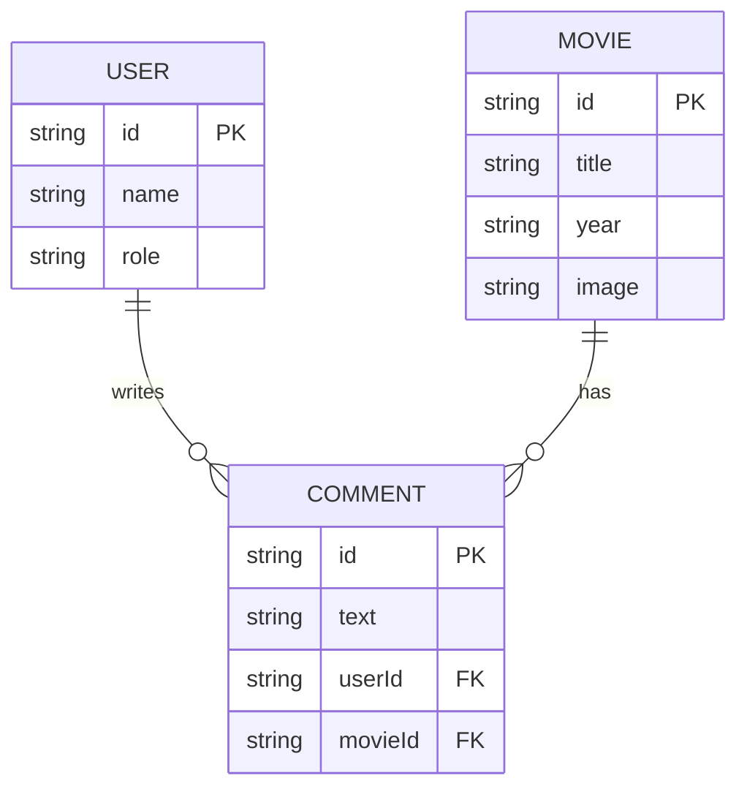

# Tích hợp Giao diện Quản trị Doanh nghiệp FullStack 🌐

Cột mốc cuối cùng của khóa học này sẽ tập hợp mọi khái niệm chúng ta đã học—React 19, TypeScript, quản lý trạng thái (Redux Toolkit), styling, và tích hợp API—vào một **Hệ thống Quản trị Doanh nghiệp FullStack (FullStack Enterprise Dashboard)** sẵn sàng cho môi trường production.

Trong bài học này, chúng ta sẽ tìm hiểu về thiết kế kiến trúc, lớp tích hợp API (RTK Query), và cách triển khai các component phân tích dữ liệu thời gian thực.

---

## ⚡ 1. Kiến trúc Hệ thống & Lược đồ Quan hệ

Một trang quản trị doanh nghiệp hoạt động dựa trên dữ liệu có cấu trúc. Đối với dự án này, hệ thống của chúng ta giám sát ba nguồn tài nguyên chính: **Users (Người dùng)**, **Movies (Phim)**, và **Comments (Bình luận)**.



### Các thách thức kỹ thuật cốt lõi cần giải quyết:
1. **Đồng bộ hóa Trạng thái (State Synchronization)**: Tự động cập nhật các bộ đếm trên UI khi có hành động thêm/xóa dữ liệu xảy ra.
2. **Truy vấn thăm dò Thời gian thực (Real-Time Polling)**: Giữ cho các chỉ số thống kê lượt truy cập đồng bộ với cơ sở dữ liệu theo thời gian thực.
3. **Vòng đời Xác thực (Authentication Lifecycles)**: Quản lý các bộ bảo vệ tuyến đường (route guards), phiên làm việc (sessions), và bảo mật các yêu cầu API.

---

## ⚡ 2. Lớp Truy vấn API (RTK Query)

Để quản lý bộ nhớ đệm (caching), trạng thái tải (loading states), và cập nhật mạng hiệu quả, chúng ta sử dụng Redux Toolkit Query (RTKQ). Dưới đây là cấu hình API slice cốt lõi đóng vai trò làm cổng kết nối frontend với backend:

```typescript
// src/store/apiSlice.ts
import { createApi, fetchBaseQuery } from '@reduxjs/toolkit/query/react';

export interface User {
  id: string;
  name: string;
  role: string;
}

export interface Movie {
  id: string;
  name: string;
  year: number;
  image: string;
  reviewsCount: number;
}

export const dashboardApi = createApi({
  reducerPath: 'dashboardApi',
  baseQuery: fetchBaseQuery({ baseUrl: 'https://api.my-dashboard.com/v1/' }),
  tagTypes: ['Users', 'Movies'],
  endpoints: (builder) => ({
    getUsers: builder.query<User[], void>({
      query: () => 'users',
      providesTags: ['Users'],
    }),
    getMovies: builder.query<Movie[], void>({
      query: () => 'movies',
      providesTags: ['Movies'],
    }),
    addMovie: builder.mutation<Movie, Partial<Movie>>({
      query: (newMovie) => ({
        url: 'movies',
        method: 'POST',
        body: newMovie,
      }),
      invalidatesTags: ['Movies'], // Tự động buộc truy vấn getMovies thực hiện tải lại dữ liệu mới!
    }),
  }),
});

export const { useGetUsersQuery, useGetMoviesQuery, useAddMovieMutation } = dashboardApi;
```

> [!TIP]
> Cơ chế lưu trữ đệm của RTK Query tự động xóa dữ liệu khi các component bị hủy bỏ (unmount). Để tùy biến hành vi này, hãy cấu hình các tùy chọn như `keepUnusedDataFor` (tính bằng giây) hoặc sử dụng `refetchOnMountOrArgChange` để kiểm soát các cuộc gọi mạng.

---

## 🎨 3. Các Component Giao diện Dashboard

Bố cục dashboard của chúng ta sử dụng các thẻ card để hiển thị số lượng dữ liệu thời gian thực (Người dùng, Bình luận, Phim) được định dạng đẹp mắt bằng các dải màu CSS (CSS gradients).

### 1. Thẻ hiển thị chỉ số KPI (`SecondaryCard.tsx`)
Component tái sử dụng này nhận vào các dải màu, nội dung hiển thị, và tiêu đề dạng pill để hiển thị các chỉ số dữ liệu:

```tsx
// src/components/SecondaryCard.tsx
import React from 'react';

interface SecondaryCardProps {
  pill: string;
  content: string | number;
  info: string;
  gradient: string; // ví dụ: "from-green-500 to-lime-400"
}

export const SecondaryCard: React.FC<SecondaryCardProps> = ({ pill, content, info, gradient }) => {
  return (
    <div className={`p-6 rounded-2xl text-white bg-gradient-to-br ${gradient} shadow-lg transition-transform hover:scale-105`}>
      <span className="text-xs font-bold uppercase bg-white/20 px-2 py-1 rounded-full">{pill}</span>
      <h3 className="text-3xl font-extrabold mt-3">{content}</h3>
      <p className="text-sm opacity-90 mt-1">{info}</p>
    </div>
  );
};
```

### 2. Widget theo dõi thời gian thực với cơ chế Polling (`RealTimeCard.tsx`)
Để giám sát lượng khách truy cập đang trực tuyến, chúng ta cấu hình RTK Query để **thăm dò (poll)** máy chủ mỗi 5 giây:

```tsx
// src/components/RealTimeCard.tsx
import React from 'react';
import { useGetUsersQuery } from '../store/apiSlice';

export const RealTimeCard: React.FC = () => {
  // thăm dò API users mỗi 5000ms
  const { data: visitors, isLoading, error } = useGetUsersQuery(undefined, {
    pollingInterval: 5000,
  });

  if (isLoading) return <div className="animate-pulse p-4">Loading active sessions...</div>;
  if (error) return <div className="text-red-500">Failed to link socket.</div>;

  return (
    <div className="bg-slate-900 border border-slate-800 p-6 rounded-2xl shadow-xl">
      <div className="flex items-center justify-between">
        <div>
          <h4 className="text-slate-400 text-xs font-semibold uppercase tracking-wider">Real-Time Activity</h4>
          <p className="text-slate-500 text-xs mt-1">Updates live every 5s</p>
        </div>
        <span className="flex h-3 w-3 relative">
          <span className="animate-ping absolute inline-flex h-full w-full rounded-full bg-green-400 opacity-75"></span>
          <span className="relative inline-flex rounded-full h-3 w-3 bg-green-500"></span>
        </span>
      </div>
      <div className="mt-4">
        <h2 className="text-white text-4xl font-extrabold">{visitors?.length || 0}</h2>
        <span className="text-green-400 text-xs font-semibold">Active Visitors Online</span>
      </div>
    </div>
  );
};
```

---

## 🔒 4. Tuyến đường Bảo vệ (Protected Route) & Vòng đời Xác thực

Để ngăn chặn truy cập trái phép vào các bảng điều khiển quản trị, chúng ta bao bọc các phân đoạn tuyến đường trong một component Bảo vệ (Auth Guard) sử dụng các lát cắt trạng thái toàn cục (global state slices).

```tsx
// src/components/ProtectedRoute.tsx
import React from 'react';
import { Navigate, Outlet } from 'react-router-dom';
import { useSelector } from 'react-redux';
import { selectCurrentUserToken } from '../store/authSlice';

export const ProtectedRoute: React.FC = () => {
  const token = useSelector(selectCurrentUserToken);

  if (!token) {
    // Chuyển hướng về trang đăng nhập nếu người dùng chưa xác thực
    return <Navigate to="/login" replace />;
  }

  // Render các component con (các tuyến đường lồng nhau)
  return <Outlet />;
};
```

> [!WARNING]
> Lưu trữ token xác thực trong `localStorage` khiến ứng dụng của bạn dễ bị tấn công XSS (Cross-Site Scripting). Đối với các ứng dụng doanh nghiệp bảo mật thực tế, hãy xử lý phiên đăng nhập bằng cookie bảo mật `httpOnly` được quản lý trực tiếp bởi máy chủ backend database API.

---

## 🧠 Kiểm tra Kiến thức

Trả lời các câu hỏi sau để kiểm tra mức độ hiểu bài của bạn. Nhấp vào **Reveal Answer** để xác minh câu trả lời.

### 1. Cơ chế tag invalidation của RTK Query giúp cải thiện đồng bộ hóa trạng thái như thế nào?
<details>
  <summary><b>Reveal Answer</b></summary>

  Khi một hành động ghi dữ liệu (mutation - ví dụ: `addMovie`) được thực thi, nó khai báo rằng nó sẽ vô hiệu hóa (invalidate) các tag cụ thể (ví dụ: `['Movies']`). RTK Query sẽ đối chiếu sự vô hiệu hóa này với các câu lệnh truy vấn đang hoạt động có cung cấp tag đó (ví dụ: `getMovies`). Nó sẽ tự động kích hoạt một cuộc gọi lấy dữ liệu mới trong nền để cập nhật bộ nhớ cache, đồng bộ hóa các component UI và các giá trị trạng thái mà không cần lập trình viên viết code dispatch thủ công.
</details>

### 2. Sự khác biệt giữa `pollingInterval` và WebSockets đối với cập nhật thời gian thực là gì?
<details>
  <summary><b>Reveal Answer</b></summary>

  - **Polling (Thăm dò)** sử dụng các yêu cầu HTTP định kỳ theo thời gian (ví dụ: mỗi 5 giây) để yêu cầu dữ liệu mới. Cơ chế này dễ cấu hình và chạy tốt trên hạ tầng HTTP tiêu chuẩn, nhưng tiêu tốn nhiều băng thông hơn.
  - **WebSockets** thiết lập một kết nối hai chiều duy nhất, liên tục và bền bỉ, nơi máy chủ có thể chủ động đẩy dữ liệu cập nhật ngay lập tức. Đây là lựa chọn lý tưởng cho các cập nhật tần suất cao (chat, biểu đồ chứng khoán), nhưng yêu cầu xử lý phía backend phức tạp hơn.
</details>

### 3. Tại sao `<Navigate to="/login" replace />` được ưa chuộng hơn việc thay đổi URL thông thường của cửa sổ trình duyệt?
<details>
  <summary><b>Reveal Answer</b></summary>

  Thuộc tính `replace` sẽ ghi đè lên mục nhập hiện tại trong lịch sử duyệt web (history stack) thay vì thêm một mục nhập mới. Điều này đảm bảo rằng khi người dùng đăng xuất và nhấn nút "Quay lại" (Back) trên trình duyệt, họ sẽ không bị chuyển hướng ngược trở lại trang quản trị vốn yêu cầu bảo mật mà họ vừa đăng xuất.
</details>

### 4. Các trạng thái tải (loading states) được trả về từ hook của RTK Query bao gồm những gì?
<details>
  <summary><b>Reveal Answer</b></summary>

  Các hook của RTK Query trả về các cờ boolean biểu thị trạng thái yêu cầu API:
  - `isLoading`: Trả về true trong yêu cầu đầu tiên (khi chưa có dữ liệu đệm nào).
  - `isFetching`: Trả về true ở các yêu cầu tiếp theo (dữ liệu đang được tải lại trong nền).
  - `isSuccess`: Trả về true nếu yêu cầu thành công.
  - `isError`: Trả về true nếu yêu cầu thất bại.
</details>

### 5. Tại sao không nên sử dụng React Context cho việc đồng bộ dữ liệu thời gian thực tần suất cao trong dashboard?
<details>
  <summary><b>Reveal Answer</b></summary>

  React Context sẽ kích hoạt render lại (re-render) trên **tất cả** các component tiêu thụ (consumers) bất cứ khi nào giá trị đối tượng context thay đổi. Trong một dashboard cập nhật liên tục với tốc độ cao, điều này dẫn tới suy giảm hiệu năng nghiêm trọng. Các thư viện quản lý trạng thái như Redux hay Zustand sử dụng mô hình đăng ký chọn lọc (selective subscription), trong đó component chỉ render lại nếu các thuộc tính cụ thể mà chúng phụ thuộc thực sự thay đổi.
</details>

---

## 💻 Bài tập Thực hành

### 🛠️ Bài tập 1: Xây dựng Form Thêm Phim Mới
1. Tạo một React component `AddMovieForm.tsx`.
2. Thiết lập các input điều khiển (title, year, image) sử dụng quản lý state.
3. Tích hợp hook `useAddMovieMutation`.
4. Xác minh rằng khi bạn gửi form, danh sách phim của component cha tự động tải lại và hiển thị bộ phim mới ngay lập tức.

### 🛠️ Bài tập 2: Tự động Bật/Tắt Cơ chế Polling
1. Cập nhật `RealTimeCard.tsx` để thêm một nút bấm bật/tắt tính năng thăm dò (polling).
2. Gợi ý: Truyền một giá trị trạng thái `pollingInterval` động (ví dụ: `5000` khi bật, `0` khi tắt) vào hook truy vấn.
3. Xác minh rằng việc tắt tính năng này sẽ dừng các yêu cầu mạng trong tab Network của Console Developer trên trình duyệt.
