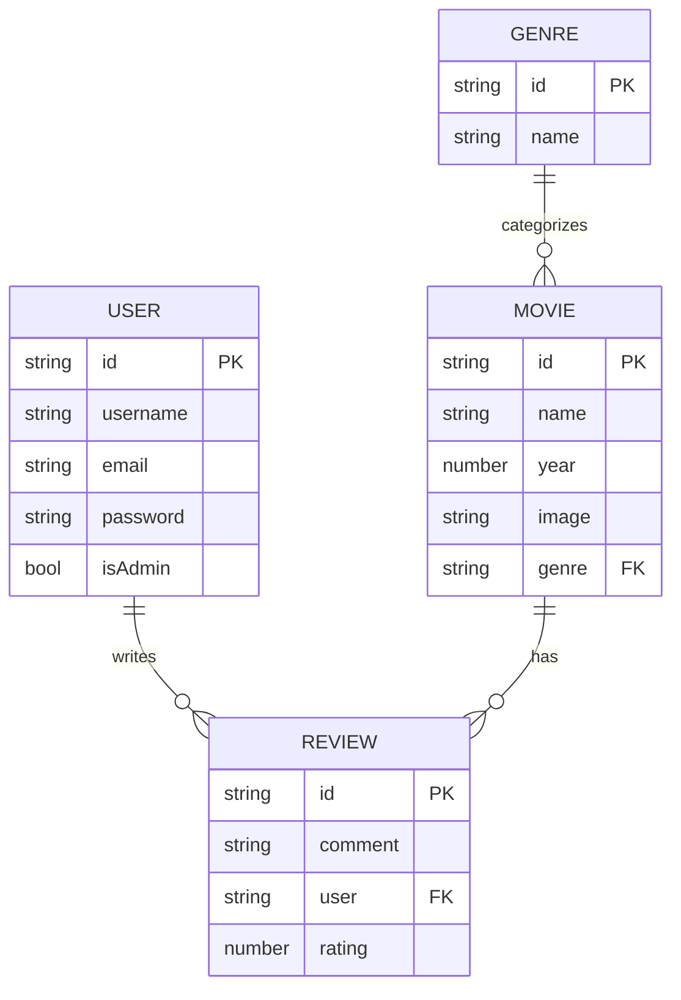

# Tích hợp Dashboard Doanh nghiệp FullStack 🌐

Cột mốc cuối cùng của khóa học này tập hợp mọi khái niệm chúng ta đã học—React 19, TypeScript, quản lý state (Redux Toolkit), styling, và tích hợp API—vào một **Movie Dashboard FullStack** đạt chuẩn production.

Trong bài học này, chúng ta xây dựng dự án từ đầu đến cuối: một backend **Express + MongoDB** (authentication, movies, genres, reviews) và một frontend **React + RTK Query** gọi đến nó, bao gồm cả một dashboard admin được bảo vệ. Đây là một bài học dài có chủ đích—hãy xem mỗi phần như một checkpoint mà bạn có thể xây dựng và chạy thử trước khi đi tiếp.

---

## 🧭 Khái niệm & Tổng quan

Một dashboard fullstack là hai ứng dụng phối hợp với nhau: một **frontend** render giao diện và một **backend** sở hữu dữ liệu cùng các quy tắc. Frontend không bao giờ giao tiếp trực tiếp với database—nó hỏi backend, và backend quyết định ai được phép làm gì. Authentication, validation, và authorization đều nằm trên server vì client có thể bị can thiệp.

Hãy hình dung hệ thống như một **rạp chiếu phim chỉ dành cho thành viên**. Backend là tòa nhà: quầy vé (login/register), nhân viên bảo vệ ở cửa phòng chiếu (auth middleware), người quản lý duy nhất có quyền thay đổi lịch chiếu (admin authorization), và kho lưu trữ phim cùng các đánh giá (database). Frontend là sảnh chờ và các poster mà mọi người đều thấy. Khách có thể xem poster, nhưng chỉ người có vé mới được để lại review, và chỉ người quản lý mới được thêm hoặc xóa phim.

> [!NOTE]
> Chúng ta chạy **hai tiến trình**: backend (Express trên port 3000) và frontend (Vite dev server). Package `concurrently` cho phép một lệnh `npm run fullstack` duy nhất khởi động cả hai cùng lúc, trong khi một **proxy** của Vite chuyển tiếp các lời gọi `/api/*` đến backend để trình duyệt chỉ thấy một origin duy nhất.

> [!TIP]
> Giữ các thông tin bí mật ở server. JWT signing secret, chuỗi kết nối Mongo, và việc băm mật khẩu đều nằm ở backend. Frontend chỉ luôn giữ một tham chiếu phiên (trong trường hợp của chúng ta là một cookie `httpOnly` mà trình duyệt tự động gửi đi).

### Trách nhiệm của Frontend và Backend

| Khía cạnh | Backend (Express/Mongo) | Frontend (React/RTK Query) |
| --- | --- | --- |
| Sở hữu dữ liệu | Mongoose models + MongoDB | Bản sao được cache qua RTK Query |
| Authentication | Băm mật khẩu, ký JWT, set cookie | Lưu thông tin user, gửi cookie |
| Authorization | Middleware `authenticate` + `authorizeAdmin` | Ẩn/bảo vệ các route admin trong UI |
| Validation | Trường bắt buộc, tính duy nhất, mã lỗi | Kiểm tra form thân thiện + toasts |
| Nguồn dữ liệu gốc | Có — có tiếng nói cuối cùng cho mọi lần ghi | Không — cập nhật lạc quan, re-fetch khi tag bị invalidate |

---

## ⚡ 1. Kiến trúc Hệ thống & Lược đồ Quan hệ

Dashboard của chúng ta giám sát ba tài nguyên cốt lõi: **Users**, **Movies**, và **Reviews/Comments**, với **Genres** phân loại các phim.



### Cấu trúc thư mục backend

```bash
my-movies/
├── backend/
│   ├── config/
│   │   └── db.js            # Mongoose connection
│   ├── controllers/
│   │   ├── userController.js
│   │   ├── genreController.js
│   │   └── movieController.js
│   ├── middlewares/
│   │   ├── asyncHandler.js  # wraps async controllers
│   │   └── authMiddleware.js# authenticate + authorizeAdmin
│   ├── models/
│   │   ├── User.js
│   │   ├── Movie.js
│   │   └── Genre.js
│   ├── routes/
│   │   ├── userRoutes.js
│   │   ├── genreRoutes.js
│   │   └── movieRoutes.js
│   ├── utils/
│   │   └── createToken.js   # signs JWT + sets cookie
│   └── index.js             # Express entry point
└── frontend/                # Vite + React app
```

---

## 🏗️ 2. Thiết lập Backend: Express, Mongoose & Concurrency

Đầu tiên khởi tạo dự án Node ở thư mục gốc của dự án (không phải bên trong `frontend`/`backend`) và cài đặt các dependency của backend.

```bash
# From the project root (e.g. my-movies/)
npm init -y

# Backend dependencies
npm i bcryptjs body-parser concurrently cookie-parser dotenv \
      express jsonwebtoken mongoose multer

# nodemon for auto-reload during development
npm i -D nodemon
```

Trong file `package.json` ở thư mục gốc, đặt `"type": "module"` để chúng ta có thể dùng cú pháp `import` của ES module, sau đó cấu hình các script chạy frontend và backend cùng nhau.

```json
// package.json (root)
{
  "type": "module",
  "scripts": {
    "frontend": "cd frontend && npm run dev",
    "backend": "nodemon backend/index.js",
    "fullstack": "concurrently \"npm run backend\" \"npm run frontend\""
  }
}
```

Tạo file môi trường. **Không bao giờ commit `.env`**—thêm `node_modules` và `.env` vào `.gitignore`.

```bash
# .env
PORT=3000
MONGO_URI='mongodb+srv://<user>:<pass>@cluster.mongodb.net/movies-app'
JWT_SECRET='replace-with-a-long-random-string'
NODE_ENV=development
```

### Kết nối MongoDB (`config/db.js`)

```js
// backend/config/db.js
import mongoose from "mongoose";

// Connect to MongoDB using the URI from environment variables
const connectDB = async () => {
  try {
    await mongoose.connect(process.env.MONGO_URI);
    console.log("Successfully connected to MongoDB 👍");
  } catch (error) {
    console.error(`Error: ${error.message}`);
    process.exit(1); // Stop the app if the database is unreachable
  }
};

export default connectDB;
```

### Điểm vào của Express (`index.js`)

```js
// backend/index.js
import express from "express";
import dotenv from "dotenv";
import cookieParser from "cookie-parser";
import connectDB from "./config/db.js";
import userRoutes from "./routes/userRoutes.js";
import genreRoutes from "./routes/genreRoutes.js";
import movieRoutes from "./routes/movieRoutes.js";

// Configuration
dotenv.config();
connectDB();

const app = express();

// Middlewares: parse JSON bodies, URL-encoded data, and cookies
app.use(express.json());
app.use(express.urlencoded({ extended: true }));
app.use(cookieParser());

const PORT = process.env.PORT || 3000;

// Routes
app.use("/api/v1/users", userRoutes);
app.use("/api/v1/genre", genreRoutes);
app.use("/api/v1/movies", movieRoutes);

app.listen(PORT, () => console.log(`Server is running on port ${PORT}`));
```

> [!WARNING]
> Thứ tự của middleware rất quan trọng. `express.json()` phải chạy **trước** các route của bạn, nếu không `req.body` sẽ là `undefined` khi một controller cố đọc nó. Tương tự, đăng ký `cookieParser()` trước bất kỳ route nào đọc `req.cookies`.

Khởi động backend riêng trước để xác nhận database kết nối được:

```bash
npm run backend
# => Server is running on port 3000
# => Successfully connected to MongoDB 👍
```

---

## 👤 3. User Model & Băm Mật khẩu

User schema lưu trữ thông tin đăng nhập và một cờ `isAdmin`. `timestamps: true` của Mongoose tự động thêm `createdAt`/`updatedAt`.

```js
// backend/models/User.js
import mongoose from "mongoose";

const userSchema = mongoose.Schema(
  {
    username: { type: String, required: true },
    email: { type: String, required: true, unique: true },
    password: { type: String, required: true },
    isAdmin: { type: Boolean, required: true, default: false },
  },
  { timestamps: true } // adds createdAt & updatedAt automatically
);

const User = mongoose.model("User", userSchema);
export default User;
```

> [!WARNING]
> **Không bao giờ lưu mật khẩu dạng plaintext.** Chúng ta băm bằng `bcryptjs` trước khi lưu. Băm là một chiều: ngay cả khi database bị rò rỉ, mật khẩu gốc cũng không thể khôi phục được, và chúng ta xác minh đăng nhập bằng cách băm lại lần nhập và so sánh.

---

## 🔑 4. Tạo JWT Token trong Cookie httpOnly

Khi một user đăng ký hoặc đăng nhập, chúng ta ký một JWT chứa id của họ và lưu nó trong một cookie `httpOnly`. Sau đó trình duyệt tự động gửi nó kèm theo mọi request—không phải tự thêm header thủ công—và JavaScript không thể đọc được nó (nhờ vậy chống được tấn công XSS).

```js
// backend/utils/createToken.js
import jwt from "jsonwebtoken";

const generateToken = (res, userId) => {
  // Sign a token with the user id; expires in 30 days
  const token = jwt.sign({ userId }, process.env.JWT_SECRET, {
    expiresIn: "30d",
  });

  // Set the token as an httpOnly cookie
  res.cookie("jwt", token, {
    httpOnly: true,                                  // JS in the browser cannot read it
    secure: process.env.NODE_ENV !== "development",  // HTTPS only in production
    sameSite: "strict",                              // CSRF protection
    maxAge: 30 * 24 * 60 * 60 * 1000,                // 30 days in ms
  });

  return token;
};

export default generateToken;
```

---

## 🛡️ 5. Auth Middleware: `authenticate` & `authorizeAdmin`

Chúng ta bọc các async controller trong một `asyncHandler` nhỏ để không phải lặp lại `try/catch` ở khắp nơi, sau đó xây dựng hai bộ bảo vệ dựa trên nó.

```js
// backend/middlewares/asyncHandler.js
const asyncHandler = (fn) => (req, res, next) => {
  Promise.resolve(fn(req, res, next)).catch((error) => {
    res.status(500).json({ message: error.message });
  });
};

export default asyncHandler;
```

```js
// backend/middlewares/authMiddleware.js
import jwt from "jsonwebtoken";
import User from "../models/User.js";
import asyncHandler from "./asyncHandler.js";

// Check that the request carries a valid JWT cookie
const authenticate = asyncHandler(async (req, res, next) => {
  const token = req.cookies.jwt; // read the cookie we set on login

  if (token) {
    try {
      const decoded = jwt.verify(token, process.env.JWT_SECRET);
      // Attach the user (without the password) to the request
      req.user = await User.findById(decoded.userId).select("-password");
      next();
    } catch (error) {
      res.status(401);
      throw new Error("Not authorized, token failed.");
    }
  } else {
    res.status(401);
    throw new Error("Not authorized, no token.");
  }
});

// Allow only admins past this point
const authorizeAdmin = (req, res, next) => {
  if (req.user && req.user.isAdmin) {
    next();
  } else {
    res.status(401).send("Not authorized as an admin.");
  }
};

export { authenticate, authorizeAdmin };
```

> [!NOTE]
> Middleware kết hợp từ trái sang phải. Một route như `router.route("/").get(authenticate, authorizeAdmin, getAllUsers)` có nghĩa là: trước tiên chứng minh bạn đã đăng nhập, sau đó chứng minh bạn là admin, và chỉ khi đó mới chạy handler. Một user thường sẽ vượt qua được bộ bảo vệ đầu tiên nhưng vấp phải bộ bảo vệ thứ hai và nhận `Not authorized as an admin`.

---

## 🎬 6. Movie & Review Schema với References

Reviews được nhúng bên trong một movie, mỗi review tham chiếu đến `User` đã viết nó, còn bản thân movie thì tham chiếu đến `Genre` của nó.

```js
// backend/models/Movie.js
import mongoose from "mongoose";
const { ObjectId } = mongoose.Schema;

// A review is embedded in a movie and points back to its author
const reviewSchema = mongoose.Schema(
  {
    name: { type: String, required: true },
    rating: { type: Number, required: true },
    comment: { type: String, required: true },
    user: { type: ObjectId, ref: "User", required: true }, // reference
  },
  { timestamps: true }
);

const movieSchema = mongoose.Schema(
  {
    name: { type: String, required: true },
    image: { type: String },
    year: { type: Number, required: true },
    genre: { type: ObjectId, ref: "Genre", required: true }, // reference
    detail: { type: String, required: true },
    cast: [{ type: String }],
    reviews: [reviewSchema],     // embedded reviews
    numReviews: { type: Number, required: true, default: 0 },
  },
  { timestamps: true }
);

const Movie = mongoose.model("Movie", movieSchema);
export default Movie;
```

```js
// backend/models/Genre.js
import mongoose from "mongoose";

const genreSchema = mongoose.Schema({
  name: {
    type: String,
    trim: true,
    required: true,
    maxLength: 32,
    unique: true,
  },
});

export default mongoose.model("Genre", genreSchema);
```

> [!TIP]
> `ObjectId` + `ref` là một liên kết quan hệ, không phải một phép join tự động. Để kéo dữ liệu user hoặc genre được tham chiếu vào trong kết quả của một query, hãy nối thêm `.populate("user")` hoặc `.populate("genre")` để response chứa toàn bộ sub-document thay vì chỉ id.

---

## 🧩 7. CRUD Controllers & Routes

### Đăng ký & đăng nhập User (kèm validation)

```js
// backend/controllers/userController.js
import User from "../models/User.js";
import bcrypt from "bcryptjs";
import asyncHandler from "../middlewares/asyncHandler.js";
import createToken from "../utils/createToken.js";

const createUser = asyncHandler(async (req, res) => {
  const { username, email, password } = req.body;

  // 1. Validate required fields
  if (!username || !email || !password) {
    throw new Error("Please fill all the input fields.");
  }

  // 2. Reject duplicate emails
  const userExists = await User.findOne({ email });
  if (userExists) return res.status(400).send("User already exists.");

  // 3. Hash the password before saving
  const salt = await bcrypt.genSalt(10);
  const hashedPassword = await bcrypt.hash(password, salt);

  const newUser = new User({ username, email, password: hashedPassword });

  try {
    await newUser.save();
    createToken(res, newUser._id); // sign JWT + set cookie
    res.status(201).json({
      _id: newUser._id,
      username: newUser.username,
      email: newUser.email,
      isAdmin: newUser.isAdmin,
    });
  } catch (error) {
    res.status(400);
    throw new Error("Invalid user data.");
  }
});

const loginUser = asyncHandler(async (req, res) => {
  const { email, password } = req.body;

  const existingUser = await User.findOne({ email });
  if (existingUser) {
    // Compare the plaintext attempt against the stored hash
    const isPasswordValid = await bcrypt.compare(password, existingUser.password);
    if (isPasswordValid) {
      createToken(res, existingUser._id);
      return res.status(200).json({
        _id: existingUser._id,
        username: existingUser.username,
        email: existingUser.email,
        isAdmin: existingUser.isAdmin,
      });
    }
    return res.status(401).json({ message: "Invalid password" });
  }
  res.status(401).json({ message: "User not found" });
});

const logoutCurrentUser = asyncHandler(async (req, res) => {
  // Clear the cookie by overwriting it with an expired one
  res.cookie("jwt", "", { httpOnly: true, expires: new Date(0) });
  res.status(200).json({ message: "Logged out successfully" });
});

const getAllUsers = asyncHandler(async (req, res) => {
  const users = await User.find({});
  res.json(users);
});

const updateCurrentUserProfile = asyncHandler(async (req, res) => {
  const user = await User.findById(req.user._id);
  if (user) {
    user.username = req.body.username || user.username;
    user.email = req.body.email || user.email;
    if (req.body.password) {
      const salt = await bcrypt.genSalt(10);
      user.password = await bcrypt.hash(req.body.password, salt);
    }
    const updatedUser = await user.save();
    res.json({
      _id: updatedUser._id,
      username: updatedUser.username,
      email: updatedUser.email,
      isAdmin: updatedUser.isAdmin,
    });
  } else {
    res.status(404);
    throw new Error("User not found.");
  }
});

export {
  createUser,
  loginUser,
  logoutCurrentUser,
  getAllUsers,
  updateCurrentUserProfile,
};
```

```js
// backend/routes/userRoutes.js
import express from "express";
import {
  createUser,
  loginUser,
  logoutCurrentUser,
  getAllUsers,
  updateCurrentUserProfile,
} from "../controllers/userController.js";
import { authenticate, authorizeAdmin } from "../middlewares/authMiddleware.js";

const router = express.Router();

router
  .route("/")
  .post(createUser)                          // register (public)
  .get(authenticate, authorizeAdmin, getAllUsers); // admin only

router.post("/auth", loginUser);             // login
router.post("/logout", logoutCurrentUser);   // logout

router
  .route("/profile")
  .put(authenticate, updateCurrentUserProfile); // logged-in user only

export default router;
```

### Genre CRUD

```js
// backend/controllers/genreController.js
import Genre from "../models/Genre.js";
import asyncHandler from "../middlewares/asyncHandler.js";

const createGenre = asyncHandler(async (req, res) => {
  try {
    const { name } = req.body;
    if (!name) return res.json({ error: "Name is required" });

    const existingGenre = await Genre.findOne({ name });
    if (existingGenre) return res.json({ error: "Already exists" });

    const genre = await new Genre({ name }).save();
    res.json(genre);
  } catch (error) {
    return res.status(400).json(error);
  }
});

const updateGenre = asyncHandler(async (req, res) => {
  try {
    const { name } = req.body;
    const { id } = req.params;

    const genre = await Genre.findOne({ _id: id });
    if (!genre) return res.status(404).json({ error: "Genre not found" });

    genre.name = name;
    const updatedGenre = await genre.save();
    res.json(updatedGenre);
  } catch (error) {
    res.status(500).json({ error: "Internal server error" });
  }
});

const removeGenre = asyncHandler(async (req, res) => {
  try {
    const removed = await Genre.findByIdAndDelete(req.params.id);
    if (!removed) return res.status(404).json({ error: "Genre not found" });
    res.json(removed);
  } catch (error) {
    res.status(500).json({ error: "Internal server error" });
  }
});

const listGenres = asyncHandler(async (req, res) => {
  try {
    const all = await Genre.find({});
    res.json(all);
  } catch (error) {
    return res.status(400).json(error.message);
  }
});

const readGenre = asyncHandler(async (req, res) => {
  try {
    const genre = await Genre.findOne({ _id: req.params.id });
    res.json(genre);
  } catch (error) {
    return res.status(400).json(error.message);
  }
});

export { createGenre, updateGenre, removeGenre, listGenres, readGenre };
```

```js
// backend/routes/genreRoutes.js
import express from "express";
import {
  createGenre, updateGenre, removeGenre, listGenres, readGenre,
} from "../controllers/genreController.js";
import { authenticate, authorizeAdmin } from "../middlewares/authMiddleware.js";

const router = express.Router();

router.route("/").post(authenticate, authorizeAdmin, createGenre);
router.route("/:id").put(authenticate, authorizeAdmin, updateGenre);
router.route("/:id").delete(authenticate, authorizeAdmin, removeGenre);
router.route("/genres").get(listGenres);
router.route("/:id").get(readGenre);

export default router;
```

### Movie CRUD + tạo review

```js
// backend/controllers/movieController.js
import Movie from "../models/Movie.js";
import asyncHandler from "../middlewares/asyncHandler.js";

const createMovie = asyncHandler(async (req, res) => {
  try {
    const newMovie = new Movie(req.body);
    const savedMovie = await newMovie.save();
    res.json(savedMovie);
  } catch (error) {
    res.status(500).json(error.message);
  }
});

const getAllMovies = asyncHandler(async (req, res) => {
  try {
    // populate replaces the genre ObjectId with the full genre document
    const movies = await Movie.find({}).populate("genre");
    res.json(movies);
  } catch (error) {
    res.status(500).json(error.message);
  }
});

const getSpecificMovie = asyncHandler(async (req, res) => {
  try {
    const movie = await Movie.findById(req.params.id);
    if (!movie) return res.status(404).json({ message: "Movie not found" });
    res.json(movie);
  } catch (error) {
    res.status(500).json(error.message);
  }
});

const updateMovie = asyncHandler(async (req, res) => {
  try {
    const updated = await Movie.findByIdAndUpdate(req.params.id, req.body, {
      new: true, // return the updated document, not the old one
    });
    res.json(updated);
  } catch (error) {
    res.status(500).json(error.message);
  }
});

const deleteMovie = asyncHandler(async (req, res) => {
  try {
    const deleted = await Movie.findByIdAndDelete(req.params.id);
    res.json(deleted);
  } catch (error) {
    res.status(500).json(error.message);
  }
});

const createReview = asyncHandler(async (req, res) => {
  try {
    const { rating, comment } = req.body;
    const movie = await Movie.findById(req.params.id);
    if (!movie) return res.status(404).json({ message: "Movie not found" });

    // Prevent a user from reviewing the same movie twice
    const alreadyReviewed = movie.reviews.find(
      (r) => r.user.toString() === req.user._id.toString()
    );
    if (alreadyReviewed) {
      res.status(400);
      throw new Error("Movie already reviewed");
    }

    const review = {
      name: req.user.username,
      rating: Number(rating),
      comment,
      user: req.user._id,
    };
    movie.reviews.push(review);
    movie.numReviews = movie.reviews.length;
    await movie.save();
    res.status(201).json({ message: "Review added" });
  } catch (error) {
    res.status(400).json(error.message);
  }
});

export {
  createMovie, getAllMovies, getSpecificMovie,
  updateMovie, deleteMovie, createReview,
};
```

```js
// backend/routes/movieRoutes.js
import express from "express";
import {
  createMovie, getAllMovies, getSpecificMovie,
  updateMovie, deleteMovie, createReview,
} from "../controllers/movieController.js";
import { authenticate, authorizeAdmin } from "../middlewares/authMiddleware.js";

const router = express.Router();

// Public reads
router.get("/all-movies", getAllMovies);
router.get("/specific-movie/:id", getSpecificMovie);

// Logged-in users can review
router.post("/:id/reviews", authenticate, createReview);

// Admin-only writes
router.post("/create-movie", authenticate, authorizeAdmin, createMovie);
router.put("/update-movie/:id", authenticate, authorizeAdmin, updateMovie);
router.delete("/delete-movie/:id", authenticate, authorizeAdmin, deleteMovie);

export default router;
```

---

## ⚡ 8. Frontend: Tích hợp RTK Query

### Vite proxy & constants

Vì cookie là `httpOnly` và same-site, frontend phải tỏ ra như đang dùng chung origin với backend. Cấu hình một Vite proxy để các request `/api` được chuyển tiếp đến backend.

```js
// frontend/vite.config.js
export default {
  server: {
    proxy: {
      "/api": "http://localhost:3000",
      "/uploads": "http://localhost:3000",
    },
  },
};
```

```js
// frontend/src/redux/constants.js
export const BASE_URL = "";                 // empty — the proxy handles it
export const USERS_URL = "/api/v1/users";
export const GENRE_URL = "/api/v1/genre";
export const MOVIES_URL = "/api/v1/movies";
```

### baseQuery của apiSlice

```js
// frontend/src/redux/api/apiSlice.js
import { fetchBaseQuery, createApi } from "@reduxjs/toolkit/query/react";
import { BASE_URL } from "../constants";

const baseQuery = fetchBaseQuery({ baseUrl: BASE_URL });

export const apiSlice = createApi({
  baseQuery,
  tagTypes: ["User", "Movie", "Genre"], // cache tags for invalidation
  endpoints: () => ({}),                // endpoints injected from other files
});
```

### Các endpoint được inject — queries và mutations

Một **query** đọc dữ liệu và cung cấp một cache tag. Một **mutation** ghi dữ liệu và làm vô hiệu (invalidate) các tag để các query phụ thuộc tự động re-fetch.

```js
// frontend/src/redux/api/users.js
import { apiSlice } from "./apiSlice";
import { USERS_URL } from "../constants";

export const userApiSlice = apiSlice.injectEndpoints({
  endpoints: (builder) => ({
    // Mutations: change server state
    login: builder.mutation({
      query: (data) => ({ url: `${USERS_URL}/auth`, method: "POST", body: data }),
    }),
    register: builder.mutation({
      query: (data) => ({ url: USERS_URL, method: "POST", body: data }),
    }),
    logout: builder.mutation({
      query: () => ({ url: `${USERS_URL}/logout`, method: "POST" }),
    }),
    profile: builder.mutation({
      query: (data) => ({ url: `${USERS_URL}/profile`, method: "PUT", body: data }),
    }),
  }),
});

export const {
  useLoginMutation,
  useRegisterMutation,
  useLogoutMutation,
  useProfileMutation,
} = userApiSlice;
```

```js
// frontend/src/redux/api/genre.js
import { apiSlice } from "./apiSlice";
import { GENRE_URL } from "../constants";

export const genreApiSlice = apiSlice.injectEndpoints({
  endpoints: (builder) => ({
    createGenre: builder.mutation({
      query: (newGenre) => ({ url: GENRE_URL, method: "POST", body: newGenre }),
      invalidatesTags: ["Genre"], // forces fetchGenres to re-run
    }),
    updateGenre: builder.mutation({
      query: ({ id, updateGenre }) => ({
        url: `${GENRE_URL}/${id}`, method: "PUT", body: updateGenre,
      }),
      invalidatesTags: ["Genre"],
    }),
    deleteGenre: builder.mutation({
      query: (id) => ({ url: `${GENRE_URL}/${id}`, method: "DELETE" }),
      invalidatesTags: ["Genre"],
    }),
    fetchGenres: builder.query({
      query: () => `${GENRE_URL}/genres`,
      providesTags: ["Genre"], // this query carries the "Genre" tag
    }),
  }),
});

export const {
  useCreateGenreMutation,
  useUpdateGenreMutation,
  useDeleteGenreMutation,
  useFetchGenresQuery,
} = genreApiSlice;
```

### Kết nối store

```js
// frontend/src/redux/store.js
import { configureStore } from "@reduxjs/toolkit";
import { setupListeners } from "@reduxjs/toolkit/query/react";
import { apiSlice } from "./api/apiSlice";
import authReducer from "./features/auth/authSlice";

const store = configureStore({
  reducer: {
    [apiSlice.reducerPath]: apiSlice.reducer, // RTK Query cache reducer
    auth: authReducer,
  },
  // The RTK Query middleware enables caching, polling, and invalidation
  middleware: (getDefaultMiddleware) =>
    getDefaultMiddleware().concat(apiSlice.middleware),
  devTools: true,
});

setupListeners(store.dispatch);
export default store;
```

### Auth slice (được lưu vào localStorage)

```js
// frontend/src/redux/features/auth/authSlice.js
import { createSlice } from "@reduxjs/toolkit";

const initialState = {
  userInfo: localStorage.getItem("userInfo")
    ? JSON.parse(localStorage.getItem("userInfo"))
    : null,
};

const authSlice = createSlice({
  name: "auth",
  initialState,
  reducers: {
    setCredentials: (state, action) => {
      state.userInfo = action.payload;
      localStorage.setItem("userInfo", JSON.stringify(action.payload));
    },
    logout: (state) => {
      state.userInfo = null;
      localStorage.clear();
    },
  },
});

export const { setCredentials, logout } = authSlice.actions;
export default authSlice.reducer;
```

> [!TIP]
> Các hook của RTK Query cung cấp hai cờ loading: `isLoading` chỉ là `true` ở đúng lần fetch đầu tiên (khi chưa có dữ liệu trong cache), trong khi `isFetching` là `true` ở mọi lần fetch, kể cả các lần refetch chạy nền. Dùng `isLoading` cho một spinner toàn màn hình và `isFetching` cho một chỉ báo "đang cập nhật" tinh tế.

> [!WARNING]
> Chúng ta chỉ lưu thông tin user **không nhạy cảm** (id, username, email, isAdmin) trong `localStorage` để tiện cho UI. Thông tin xác thực phiên thực sự là cookie JWT `httpOnly`, mà JavaScript không thể đọc được—vì vậy ngay cả khi `localStorage` bị một script độc đọc, không có token nào bị phơi bày.

---

## 🔒 9. Protected Routes & Admin Guard

Một `PrivateRoute` chặn các user chưa đăng nhập; một `AdminRoute` thêm vào đó yêu cầu `isAdmin`.

```jsx
// frontend/src/pages/Auth/PrivateRoute.jsx
import { Navigate, Outlet } from "react-router-dom";
import { useSelector } from "react-redux";

const PrivateRoute = () => {
  const { userInfo } = useSelector((state) => state.auth);
  // Render nested routes if logged in, otherwise redirect to login
  return userInfo ? <Outlet /> : <Navigate to="/login" replace />;
};

export default PrivateRoute;
```

```jsx
// frontend/src/pages/Admin/AdminRoute.jsx
import { Navigate, Outlet } from "react-router-dom";
import { useSelector } from "react-redux";

const AdminRoute = () => {
  const { userInfo } = useSelector((state) => state.auth);
  // Must be logged in AND an admin to reach admin pages
  return userInfo && userInfo.isAdmin ? (
    <Outlet />
  ) : (
    <Navigate to="/login" replace />
  );
};

export default AdminRoute;
```

```jsx
// frontend/src/main.jsx (route configuration)
import { createBrowserRouter, RouterProvider, Route,
         createRoutesFromElements } from "react-router-dom";

const router = createBrowserRouter(
  createRoutesFromElements(
    <Route path="/" element={<App />}>
      <Route index element={<Home />} />
      <Route path="login" element={<Login />} />
      <Route path="register" element={<Register />} />

      {/* Logged-in users only */}
      <Route element={<PrivateRoute />}>
        <Route path="profile" element={<Profile />} />
      </Route>

      {/* Admins only */}
      <Route element={<AdminRoute />}>
        <Route path="admin/movies/genre" element={<GenreList />} />
        <Route path="admin/movies/dashboard" element={<Dashboard />} />
      </Route>
    </Route>
  )
);
```

> [!NOTE]
> `<Navigate replace />` ghi đè mục lịch sử hiện tại thay vì đẩy thêm một mục mới. Sau khi chuyển hướng một user chưa đăng nhập đến `/login`, nút Back của trình duyệt sẽ không đưa họ trở lại trang được bảo vệ mà họ vừa bị đẩy ra.

---

## 🧠 Kiểm tra Kiến thức

Trả lời những câu hỏi này để kiểm tra mức độ hiểu của bạn. Nhấp **Reveal Answer** để xác minh.

### 1. Tại sao việc băm mật khẩu và ký JWT phải diễn ra ở backend, không bao giờ ở frontend?

<details>
  <summary><b>Reveal Answer</b></summary>

  Frontend chạy trên máy của người dùng và có thể bị soi xét hoặc can thiệp—bất kỳ secret nào được gửi xuống trình duyệt đều coi như đã công khai. Việc băm mật khẩu phải dùng `bcrypt` ở phía server, để mật khẩu dạng plaintext được băm trước khi nó kịp chạm đến database, và JWT phải được ký bằng `process.env.JWT_SECRET`, thứ mà chỉ server biết. Nếu secret nằm trong code frontend, bất kỳ ai cũng có thể giả mạo các token hợp lệ và mạo danh bất kỳ user nào, kể cả admin.
</details>

### 2. Việc lưu JWT trong một cookie `httpOnly` bảo vệ khỏi điều gì, và nó được gửi đi trong mỗi request như thế nào?

<details>
  <summary><b>Reveal Answer</b></summary>

  Một cookie `httpOnly` không thể được JavaScript phía client đọc, điều này giảm thiểu việc đánh cắp token qua **XSS** (một script độc không thể đọc token của bạn từ `document.cookie`). Kết hợp với `sameSite: "strict"`, nó cũng giảm rủi ro CSRF. Trình duyệt tự động đính kèm cookie vào mọi request cùng origin, nên frontend không bao giờ phải tự thêm header `Authorization` thủ công—thay vào đó, middleware `authenticate` đọc `req.cookies.jwt` trên server.
</details>

### 3. Trong RTK Query, `providesTags` và `invalidatesTags` phối hợp với nhau như thế nào để giữ UI đồng bộ?

<details>
  <summary><b>Reveal Answer</b></summary>

  Một **query** khai báo các cache tag mà nó sở hữu qua `providesTags` (ví dụ `fetchGenres` cung cấp `["Genre"]`). Một **mutation** khai báo những tag mà nó làm bẩn qua `invalidatesTags` (ví dụ `createGenre` làm vô hiệu `["Genre"]`). Khi mutation thành công, RTK Query tìm mọi query đang hoạt động cung cấp tag bị vô hiệu và tự động refetch nó—vì vậy danh sách genre cập nhật ngay lập tức sau một thao tác create/update/delete mà không cần lời gọi `dispatch` hay refetch thủ công.
</details>

### 4. Tại sao `router.route("/").get(authenticate, authorizeAdmin, getAllUsers)` dùng hai middleware theo đúng thứ tự đó?

<details>
  <summary><b>Reveal Answer</b></summary>

  Middleware chạy theo trình tự. `authenticate` chạy trước: nó xác minh cookie JWT và đính kèm `req.user`. Chỉ khi điều đó thành công thì `authorizeAdmin` mới chạy, và nó dựa vào `req.user.isAdmin` đã được thiết lập bởi bước trước. Nếu bạn đảo ngược chúng, `authorizeAdmin` sẽ đọc `req.user` trước khi nó tồn tại (undefined) và từ chối tất cả mọi người. Thứ tự này mã hóa quy tắc "bạn phải đăng nhập *trước khi* chúng ta có thể kiểm tra liệu bạn có phải admin hay không."
</details>

### 5. Controller `createReview` kiểm tra `alreadyReviewed` trước khi push một review. Tại sao validation phía server này lại cần thiết ngay cả khi UI đã ẩn form review sau khi gửi?

<details>
  <summary><b>Reveal Answer</b></summary>

  Các kiểm tra ở UI chỉ để tiện lợi, không phải một ranh giới bảo mật. Một user có thể gửi lại request API trực tiếp (ví dụ qua Postman hoặc một script) và vượt qua mọi bộ bảo vệ ở frontend. Backend là nguồn dữ liệu gốc duy nhất, nên nó phải tự thực thi các quy tắc nghiệp vụ một cách độc lập—ở đây là quét `movie.reviews` để tìm một `user._id` trùng khớp và từ chối các bản trùng lặp bằng mã `400`. Không bao giờ tin tưởng client trong việc thực thi các ràng buộc toàn vẹn dữ liệu.
</details>

---

## 💻 Bài tập Thực hành

### 🛠️ Bài tập 1: Thêm các Movie endpoint vào RTK Query và xây dựng form Add-Movie

1. Tạo `frontend/src/redux/api/movies.js` và inject các endpoint dựa trên `MOVIES_URL`:
   - `getAllMovies` là một **query** (`/all-movies`) với `providesTags: ["Movie"]`.
   - `createMovie` là một **mutation** (`/create-movie`, `POST`) với `invalidatesTags: ["Movie"]`.
   - Các mutation `updateMovie` và `deleteMovie` cũng làm vô hiệu `["Movie"]`.
   Export các hook được sinh ra (`useGetAllMoviesQuery`, `useCreateMovieMutation`, v.v.).
2. Xây dựng `CreateMovie.jsx`: các input có kiểm soát cho `name`, `year`, `image`, `detail`, `cast`, và một `<select>` được điền từ `useFetchGenresQuery`.
3. Khi submit, gọi `useCreateMovieMutation`, sau đó hiển thị một `toast.success`. Vì mutation create làm vô hiệu `["Movie"]`, hãy xác nhận danh sách movie tự động re-fetch mà không cần refetch thủ công.
4. **Xác minh**: mở tab Network, submit form, và quan sát một `POST /api/v1/movies/create-movie` theo sau tự động bởi một `GET /api/v1/movies/all-movies`.

### 🛠️ Bài tập 2: Kết nối trang quản lý Genre với một modal

1. Trong `GenreList.jsx`, đọc tất cả genre với `useFetchGenresQuery` và render mỗi cái thành một button.
2. Dùng `useCreateGenreMutation` cho một form "create", và khi nhấp vào một genre đã có, mở một modal (`setModalVisible(true)`) được khởi tạo với `setSelectedGenre(genre)` và `setUpdatingName(genre.name)`.
3. Bên trong modal, tái sử dụng một component `GenreForm` để gọi `useUpdateGenreMutation({ id, updateGenre: { name } })` và `useDeleteGenreMutation(id)`.
4. Bảo vệ trang đằng sau `AdminRoute`. **Xác minh**: đăng nhập với tư cách non-admin và xác nhận bạn bị chuyển hướng đến `/login`; đăng nhập với tư cách admin (đặt `isAdmin: true` trong MongoDB) và xác nhận create/update/delete đều phản ánh ngay lập tức trong danh sách nhờ tag invalidation.
